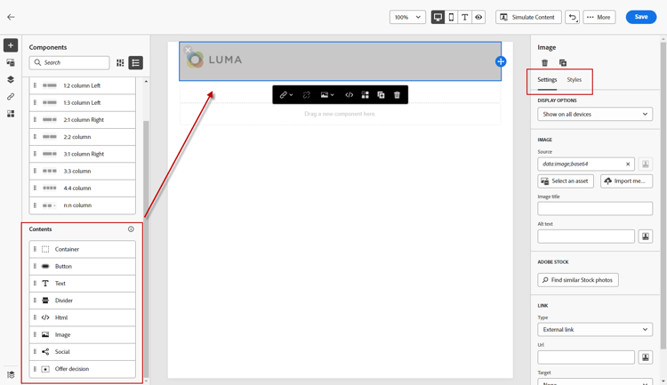

# Criação de conteúdo - Componentes

1. Para começar a criar ou modificar conteúdo, arraste e solte um item de Estruturas na tela. Edite suas configurações no painel à direita.

   >[!TIP]
   >
   >Selecione o componente de coluna n:n para definir o número de colunas de sua escolha (entre três e 10). Você também pode definir a largura de cada coluna movendo as setas abaixo dela.

   

   >[!NOTE]
   >
   >Cada tamanho de coluna não pode ser menor que 10% da largura total do componente de estrutura. Somente colunas vazias podem ser removidas.

1. Na seção Conteúdo, arraste sobre os itens desejados e solte-os em um ou mais componentes da estrutura.

   

1. Cada componente pode ser personalizado por meio das guias Configurações ou Estilo. Altere a fonte, o estilo do texto, a margem e muito mais.
