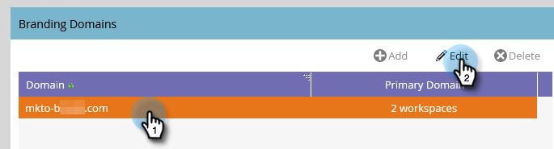

# Etapas de configuração {#setup-steps}

**Damos as boas-vindas ao Adobe Marketo Engage.**

Antes de mergulhar no uso do Marketo, há algumas etapas que você precisa concluir.

Essas etapas incluem:

* Alguma configuração básica de conta
* Adição de uma marca aos URLs da sua página de aterrissagem e links de email para melhorar a confiança e a capacidade de entrega
* Sincronizar o CRM
* Adicionar código de rastreamento ao site corporativo

>[!NOTE]
>
>Você só precisará concluir essas etapas se sua empresa for **nova no Marketo**. Caso contrário, a configuração pode já ter sido feita.

Algumas etapas exigem a ajuda da equipe de TI.

>[!TIP]
>
>Se você [imprimir esta lista de verificação](/help/marketo/getting-started/initial-setup/setup-checklist.md){target="_blank"}, poderá desmarcá-los ao concluí-los.

## Fazer logon e criar usuários adicionais do Marketo {#log-in-and-create-additional-marketo-users}

>[!IMPORTANT]
>
>Se sua assinatura do Marketo foi criada em/após 31 de julho de 2023 ou já foi migrada para o [Adobe Identity Management](/help/marketo/product-docs/administration/marketo-with-adobe-identity/adobe-identity-management-overview.md){target="_blank"}, as etapas para adicionar um usuário descritas abaixo não se aplicam a você. Em vez disso, consulte [este artigo](/help/marketo/product-docs/administration/marketo-with-adobe-identity/add-or-remove-a-user.md){target="_blank"}.

Faça logon no Marketo [aqui](https://app.marketo.com/){target="_blank"} usando as credenciais recebidas por email.

Parabéns! Agora você está no Marketo e pode começar a explorar. Convite seus colegas da equipe de marketing para se juntarem a você. Você pode fazer isso adicionando novos usuários.

Vá para a área **[!UICONTROL Administrador]**.

>[!TIP]
>
>Enquanto estiver aqui, você pode clicar em **[!UICONTROL Minha conta]** para alterar as configurações de conta e local, bem como definir um novo nome de assinatura.

>[!NOTE]
>
>**Permissões de administrador são necessárias**

Clique em **[!UICONTROL Usuários e funções]**.

Clique em **[!UICONTROL Convidar novo usuário]**.

Preencha o endereço de email do colega, nome e sobrenome. _A definição de uma data de expiração de acesso é opcional_. Clique em **[!UICONTROL Avançar]**.

>[!TIP]
>
>Uma data de expiração é ótima para participantes externos ou consultores de curto prazo que precisam apenas de acesso à Marketo por um curto período.

>[!NOTE]
>
>Quando a data de expiração chegar, o usuário receberá uma notificação de expiração e a conta será bloqueada.

Selecione uma função e clique em **[!UICONTROL Avançar]**. Usuários padrão têm acesso a todas as áreas, exceto Admin.

>[!NOTE]
>
>Além das cinco funções integradas, você também pode criar funções personalizadas. Saiba mais sobre [Gerenciamento de funções e permissões de usuário](/help/marketo/product-docs/administration/users-and-roles/managing-user-roles-and-permissions.md){target="_blank"}.

Fique à vontade para ajustar o texto do convite. Clique em **Enviar**.

O novo usuário agora está listado na guia **[!UICONTROL Usuários]** e deve receber um email com um link para criar uma senha e um logon. Próxima etapa!

## Configurar os contatos de suporte autorizados {#set-up-your-authorized-support-contacts}

Talvez você tenha recebido um email do Suporte da Marketo informando que é o administrador do Suporte ao cliente da Marketo da sua empresa. Em caso afirmativo, você pode configurar **contatos de suporte autorizados** para sua equipe. Somente contatos de suporte autorizados podem entrar em contato diretamente com o Suporte ao Cliente da Marketo através do [Portal de Suporte da Marketo](https://support.marketo.com){target="_blank"}.

>[!NOTE]
>
>O número de contatos de suporte que você pode criar é determinado pelo pacote que você adquiriu. Esse limite é especificado em seu email no Suporte da Marketo.

Os documentos do Contato de suporte autorizado foram movidos para a Comunidade da Marketo. Consulte [este artigo](https://nation.marketo.com/t5/Knowledgebase/Managing-Authorized-Support-Contacts/ta-p/254341){target="_blank"}.

>[!NOTE]
>
>Somente as pessoas que fizeram logon na Comunidade da Marketo aparecem na lista. Se não conseguir encontrar a pessoa, primeiro faça logon na Comunidade.

## Personalizar os URLs da página de destino com um CNAME {#customize-your-landing-page-urls-with-a-cname}

>[!NOTE]
>
>Você é cliente Launch Pack? Você pode ignorar esta etapa. Seu consultor fornecerá um documento de instruções de configuração de TI durante a chamada inicial.

>[!NOTE]
>
>**Permissões de administrador são necessárias**

Escolha um CNAME para as páginas de destino. Alguns exemplos:

    * **go**.[dominiodaempresa].com
    * **www2**.[dominiodaempresa].com
    * **lp**.[dominiodaempresa].com

>[!TIP]
>
>Seja breve. URLs mais curtos são mais fáceis de lembrar. Sugerimos “go” como o domínio.

A primeira parte (em negrito) é o `[LandingPageCNAME]`. Você vai precisar dele na Etapa 5.

Para recuperar a Munchkin ID que você substituirá pela sua página de aterrissagem CNAME, vá para a área de Administrador.

Clique em **Minha conta**.

Copie a [!UICONTROL String da conta] das configurações da página de destino.

Esta é a `[Munchkin ID]`. Salve-o. Você precisará fornecê-lo à equipe de TI na Etapa 5.

Defina as configurações de domínio para que as páginas de destino utilizem o domínio da sua empresa em vez do domínio do Marketo (onde estão hospedadas).

## Garanta a capacidade de entrega de email {#ensure-email-deliverability}

>[!NOTE]
>
>Você é cliente Launch Pack? Você pode ignorar esta etapa. Seu consultor fornecerá um documento de instruções de configuração de TI durante a chamada inicial.

Há várias medidas que você pode tomar para garantir que os emails cheguem ao maior número de pessoas possível.

* **Crie uma marca nos links de rastreamento**. Você pode escolher um CNAME para usar seu próprio domínio (em vez do Marketo) nos links incluídos em emails do Marketo. Isso reforça a identidade visual do seu domínio e aumenta a confiança e a capacidade de entrega junto aos seus destinatários.
* **Adicione o Marketo ao seu incluo na lista de permissões de email corporativo.** É uma prática recomendada enviar emails de teste para suas contas de teste antes de enviar emails para pessoas reais. Ao adicionar o Marketo à lista de permissões, você pode impedir que esses emails de teste sejam bloqueados ou sinalizados como spam.
* **Configurar SPF e DKIM.** Essas tecnologias garantem aos recipients que os emails do Marketo não são spam. Para ajudar a impedir que os filtros de spam dos destinatários rejeitem seus emails do Marketo, siga estas etapas para [Configurar uma SPF e um DKIM para sua capacidade de entrega de email](/help/marketo/product-docs/email-marketing/deliverability/set-up-spf-and-dkim-for-your-email-deliverability.md).
* **Configure um registro MX para o seu domínio.** Um registro MX permite que você receba emails no domínio de onde está enviando o email, para processar respostas e respostas automáticas. Se estiver enviando do domínio corporativo, provavelmente você já tem essa configuração. Caso contrário, geralmente é possível configurá-lo para mapear para o registro MX do domínio corporativo.
* **Configurações recomendadas para o endereço do remetente.** Você deve usar um domínio de email válido, existente e em funcionamento no Endereço do remetente em todas as campanhas de email. Pode ser útil configurar um subdomínio do domínio corporativo em vez de enviar do domínio. Isso garantirá que problemas no fluxo de emails corporativo não afetem o fluxo de emails do Marketo e vice-versa. Além disso, o envio de emails de `something@nonexistentdomain.com` fará com que emails sejam filtrados ou bloqueados. Qualquer domínio usado no endereço “De” do remetente deve ter uma conta postmaster@ e abuse@ válida e funcional.

Se você usa o Google Apps para hospedar seu email corporativo, não poderá criar endereços de email abuse@ ou postmaster@ em seu domínio. Para contornar isso, você precisa criar grupos chamados “abuse” e “postmaster”. Os usuários membros desses grupos receberão emails enviados para esses endereços (por exemplo, <postmaster@domain.com>). Instruções detalhadas para a criação de grupos podem ser encontradas [aqui](https://support.google.com/a/answer/33343#adminconsole){target="_blank"}.

Escolha um CNAME para links de rastreamento de email (escolha um que seja _diferente_ do CNAME da página de destino que você escolheu na Etapa 3). Alguns exemplos:

* go2.[dominiodaempresa].com
* em.[dominiodaempresa].com
* uau.[dominiodaempresa].com

A primeira parte é o CNAME de rastreamento de email, `[EmailTrackingCNAME]`. Você precisará fornecê-lo à TI na Etapa 5.

>[!CAUTION]
>
>Os CNAMEs de email e de página de destino devem ser diferentes. Além disso, evite CNAMEs como “track” ou “link”. Geralmente eles são sinalizados como spam

Para encontrar o link de rastreamento do Marketo, acesse a área **[!UICONTROL Administração]**.

Clique em **[!UICONTROL Email]**.

Copie o [!UICONTROL Link de rastreamento] das configurações de email.

O [!UICONTROL Link de rastreamento] está no formato: `mkto-[a-z][4 digits].com`.

Este é o seu `[MktoTrackingLink]`. Salve-o. Você precisará fornecê-lo à equipe de TI na Etapa 5.

Colete domínios “De”. Faça uma lista de todos os domínios “De” (como em `[Sender]@[FromDomain].com`) que você planeja usar para enviar emails do Marketo. Para a maioria, há apenas um.

Por exemplo, “marketo.com,” “info.marketo.com,”. Eles são `[FromDomain1]`, `[FromDomain2]`, etc. Salve-os. Você precisará fornecê-los à equipe de TI na Etapa 5.

Agora você tem todas as informações necessárias para enviar sua solicitação ao departamento de TI.

## Peça à equipe de TI para configurar protocolos {#ask-it-to-configure-protocols}

>[!NOTE]
>
>Você é cliente Launch Pack? Você pode ignorar esta etapa. Seu consultor fornecerá um documento de instruções de configuração de TI durante a chamada inicial.

Depois de coletar todas as informações necessárias, você estará pronto para enviar uma solicitação para a equipe de TI. Você pode usar o texto abaixo como modelo, substituindo o texto em negrito pelas suas próprias informações.

[Inclua um link para este artigo](/help/marketo/getting-started/initial-setup/configure-protocols-for-marketo.md).

Cole esse texto no email e substitua os espaços reservados em negrito:

>[!NOTE]
>
>Consulte as Etapas 3 e 4 acima para determinar o texto para substituir os espaços reservados. Lembre-se de que o `[LandingPageCNAME]` e o `[EmailTrackingCNAME]` devem ser diferentes.

`----------------------------------------------`

Prezado excelente administrador de TI,

Agora, nossa equipe de marketing está usando a plataforma Marketo para se comunicar com nosso pessoal. Para garantir uma excelente capacidade de entrega de email, precisamos fazer as seguintes alterações:

`1)` Para as páginas de destino, adicione uma Entrada de DNS (CNAME) para **[LandingPageCNAME]**.**[dominiodaempresa]**.com, apontando para **[Munchkin ID]**.mktoweb.com.

`2)` Para os links de rastreamento no email, adicione uma entrada DNS (CNAME) para **[EmailTrackingCNAME]**.**[dominiodaempresa]**.com, apontando para **[MktoTrackingLink]**.

`3)` Inclua o Marketo na lista de permissões.

    * Se usarmos endereços IP em nossa lista de permissões de email, adicione os IPs listados abaixo:
    199.15.212.0/22
    
    192.28.144.0/20
    
    192.28.160.0/19
    
    185.28.196.0/22
    
    130.248.172.0/24
    
    130.248.173.0/24
    
    94.236.119.0/26

>[!NOTE]
>
>Entre em contato com o suporte do Marketo se quiser que uma lista resumida de IPs seja adicionada à lista de permissões específica do seu ambiente.

    * Se nosso sistema antisspam usa Domínios From, adicione estes:

**`[FromDomain1]`**
**`[FromDomain2]`**

`4)` Precisamos configurar a SPF e o DKIM para que o Marketo possa enviar emails assinados em nosso nome.

`a.` Para configurar a SPF, adicione a seguinte linha às entradas de DNS:

IN  TXT **[Domínio From]**:  v=spf1 mx ip4:**[IP(s) corporativos]**
 include: mktomail.com ~all

Se você já tiver um registro SPF na entrada DNS, basta adicionar o seguinte a ele:

include:mktomail.com

`[`Substitua o **Domínio From** pelo Domínio from do email (ex: empresa.com) e **CorpIP** pelo endereço IP do servidor de email corporativo (ex: 255.255.255.255).  Se você for enviar emails de vários domínios pelo Marketo, peça à equipe de TI para adicionar esta linha para cada domínio (em uma única linha).`]`

`b.` Para o DKIM, crie registros de recursos de DNS para cada domínio que gostaria de configurar. Abaixo estão os registros do host e valores TXT para cada domínio que assinaremos:

**`[DKIMDomain1]`**: O Registro do Host é **`[HostRecord1]`** e o Valor TXT é **[TXTValue1]**.

**`[DKIMDomain2]`**: o Registro do Host é **`[HostRecord2]`** e o Valor TXT é **`[TXTValue2]`**.

`[`Copie o **HostRecord** e o **TXTValue** para cada **DKIMDomain** configurado após seguir as [instruções aqui](/help/marketo/product-docs/email-marketing/deliverability/set-up-a-custom-dkim-signature.md). Não se esqueça de verificar cada domínio em **Admin > Email > DKIM** depois que a equipe de TI concluir esta etapa.`]`

`5)` Precisamos garantir que haja um registro MX válido para nossos domínios FROM **[FromDomain1]**, **[FromDomain2]** etc. Você pode confirmar? Caso contrário, configure para mapear para o registro MX do nosso domínio corporativo. Isso garantirá que possamos processar respostas/respostas automáticas para nossas correspondências do Marketo.

Avise-me quando tiver concluído esses passos, para que eu possa finalizar o processo de configuração com o Marketo.

Obrigado! Você é o melhor.

Amor,

**`[Your Name]`**

`----------------------------------------------`

Envie o email para a equipe de TI. Sabemos que pode levar algum tempo para que a equipe de TI conclua essas tarefas. Você pode continuar na Etapa 7, mas lembre-se de retornar a Etapa 6 para concluir a configuração do Marketo.

## Termine a configuração do Marketo após a conclusão da equipe de TI {#complete-your-marketo-setup-after-it-finishes}

Depois que a equipe de TI concluir as tarefas, siga estas etapas para adicionar CNAMEs de página de destino e email e para ativar a assinatura do DKIM.

Acesse a área **[!UICONTROL Administração]** para adicionar o CNAME da página de destino

Selecione Páginas de destino e clique em **[!UICONTROL Editar]** na área [!UICONTROL Configurações].

Insira o novo nome de domínio no campo **[!UICONTROL Nome do domínio para páginas de destino]**. Deve estar no formato:

`[LandingPageCNAME].[CompanyDomain].com`

No campo **[!UICONTROL Fallback]** da página, insira o URL para o qual você deseja que as pessoas sejam direcionadas caso uma página de destino esteja indisponível. Você pode usar a página inicial da sua empresa se não tiver uma página de fallback. No campo **[!UICONTROL Página inicial]**, digite o site da empresa.

Na área [!UICONTROL Administração], selecione **[!UICONTROL Email]** para adicionar o CNAME de email

Role a tela para baixo até [!UICONTROL Domínios de marca]. Selecione o domínio e clique em **[!UICONTROL Editar]**.

No campo Domínio, insira o domínio de rastreamento de email. Deve estar no formato:

`[EmailTrackingCNAME].[CompanyDomain].com`. Clique em **[!UICONTROL Salvar]**.

## Integrar o CRM {#integrate-your-crm}

Esta é provavelmente a etapa mais emocionante da sua configuração - é hora de encher o Marketo com todos esses leads e contatos que você armazenou em seu CRM!

Escolha uma das opções a seguir, dependendo do CRM que sua empresa usa.

    * [Integrar o Marketo com [!DNL Salesforce.com]](/help/marketo/product-docs/crm-sync/salesforce-sync/understanding-the-salesforce-sync.md)
    * [Integrar o Marketo com [!DNL Microsoft Dynamics]](/help/marketo/product-docs/crm-sync/microsoft-dynamics-sync/understanding-the-microsoft-dynamics-sync.md)

>[!NOTE]
>
>Você precisa da assistência do administrador do CRM da sua empresa para concluir estas etapas.

## Adicionar código de rastreamento ao seu site {#add-tracking-code-to-your-website}

>[!NOTE]
>
>Você é cliente do [!DNL Launch Pack]? Você pode ignorar esta etapa. O seu consultor fornecerá instruções de código do [!DNL Munchkin] no seu documento de instruções de configuração de TI.

O Marketo tem JavaScript de rastreamento personalizado (chamado [!DNL Munchkin]) que você pode usar para rastrear atividades de pessoas em qualquer página da Web. O [!DNL Munchkin] é necessário para integrar o seu site ao Marketo. Siga estas etapas para [Adicionar [!DNL Munchkin] código de rastreamento ao seu site](/help/marketo/product-docs/administration/additional-integrations/add-munchkin-tracking-code-to-your-website.md){target="_blank"}.

>[!NOTE]
>
>É necessária experiência com o HTML para adicionar o código de rastreamento.

## Expectativas de desempenho {#performance-expectations}

O que você pode esperar do Marketo em termos de desempenho? Pode variar, dependendo do tamanho e da complexidade das suas campanhas de marketing. Porém, você pode esperar níveis de desempenho iguais aos descritos na coluna “Padrão” em várias tabelas encontradas na [Descrição do produto Marketo Engage](https://helpx.adobe.com/br/legal/product-descriptions/adobe-marketo-engage---product-description.html){target="_blank"}. As colunas “Desempenho” e “Desempenho adicional” referem-se a pacotes de nível de desempenho que fornecem [níveis de desempenho mais altos](https://nation.marketo.com/t5/product-documents/marketo-engage-performance-tiers/ta-p/328835){target="_blank"}.

Todas as etapas de configuração foram concluídas. A única coisa que resta é mergulhar e usar o Marketo!
