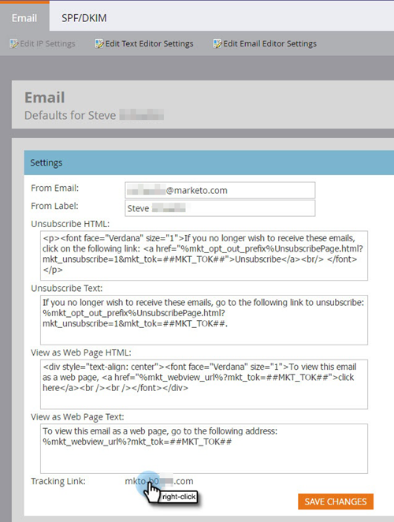

# Etapas de configuração {#setup-steps}

**Bem-vindo ao Adobe Marketo Engage!**

Antes de mergulhar, há algumas etapas que você precisa concluir.

Essas etapas incluem:

* Adicione marcas aos URLs da sua landing page e links de email para melhorar a confiança e a capacidade de entrega
* Configuração de protocolos para o Marketo Engage
* Sincronizando seu CRM
* Adicionar código de rastreamento ao site corporativo

>[!NOTE]
>
>Você só precisará fazer essas etapas se sua empresa for **nova no Marketo**. Caso contrário, a configuração pode já ter sido feita.

Algumas etapas exigem a ajuda da sua equipe de TI.

## Garantir a capacidade de entrega de e-mails {#ensure-email-deliverability}

>[!NOTE]
>
>Você é cliente do Launch Pack? Você pode ignorar esta etapa. O consultor fornecerá um documento de instruções de configuração de TI durante a chamada inicial.

Há várias medidas que você pode tomar para garantir que os emails cheguem ao maior número de pessoas possível.

* **Crie uma marca nos links de rastreamento**. Você pode escolher um CNAME para usar seu próprio domínio (em vez do Marketo) nos links incluídos em emails do Marketo. Isso reforça a marca do seu domínio e aumenta a confiança e a capacidade de entrega dos seus recipients.
* **Adicionar o Marketo ao seu email corporativo incluir na lista de permissões**. É uma prática recomendada enviar emails de teste para suas contas de teste antes de enviar emails para pessoas reais. Incluir na lista de permissões Com o ➡ Marketo, você pode impedir que esses emails de teste sejam bloqueados ou sinalizados como spam.
* **Configurar SPF e DKIM**. Essas tecnologias garantem aos recipients que os emails do Marketo não são spam. Para ajudar a impedir que os filtros de spam dos destinatários rejeitem seus emails do Marketo, siga estas etapas para [Configurar um SPF e um DKIM para sua capacidade de entrega de email](/help/marketo/product-docs/email-marketing/deliverability/set-up-spf-and-dkim-for-your-email-deliverability.md).
* **Configure um registro MX para o seu domínio.** Um registro MX permite que você receba emails do domínio do qual você está enviando emails para processar respostas e respostas automáticas. Se estiver enviando do domínio corporativo, provavelmente você já tem essa configuração. Caso contrário, geralmente é possível configurar o para mapear para o registro MX do domínio corporativo.
* **Configurações Recomendadas para o Endereço do Remetente.** Você deve usar um domínio de email válido, existente e em funcionamento no Endereço do remetente em todas as campanhas de email. Pode ser útil configurar um subdomínio do domínio corporativo em vez de enviar a partir desse domínio. Isso garantirá que os problemas no fluxo de correio corporativo não afetem o fluxo de correio da Marketo e vice-versa. Além disso, o envio de emails de `something@nonexistentdomain.com` fará com que emails sejam filtrados ou bloqueados. Qualquer domínio usado no endereço &quot;De&quot; do remetente deve ter uma conta postmaster@ e abuse@ válida e funcional.

Se você estiver usando os aplicativos Google para hospedar emails corporativos, não será possível criar emails de abuso@ ou postmaster@ no seu domínio. Para contornar isso, você precisa criar grupos chamados &quot;abuso&quot; e &quot;postmaster&quot;. Os usuários membros desses grupos receberão emails enviados para esses endereços (por exemplo, <postmaster@domain.com>). Instruções detalhadas para a criação de grupos podem ser encontradas [aqui](https://support.google.com/a/answer/33343#adminconsole){target="_blank"}.

Escolha um CNAME para links de rastreamento de email (escolha um que seja _diferente_ do CNAME da página de aterrissagem que você escolheu na Etapa 3). Alguns exemplos:

* go2[DomínioDaEmpresa].com
* em.[DomínioDaEmpresa].com
* uau.[DomínioDaEmpresa].com

A primeira parte é o rastreamento de email CNAME, `[EmailTrackingCNAME]`. Você precisará fornecê-lo à TI.

>[!CAUTION]
>
>Os CNAMEs de email e de páginas iniciais devem ser diferentes. Além disso, evite CNAMEs como &quot;track&quot; ou &quot;link&quot;. Geralmente é sinalizado como spam

Para encontrar o link de rastreamento do Marketo, vá para a área **[!UICONTROL Administrador]**.

Clique em **[!UICONTROL Email]**.

Copie o [!UICONTROL Link de Acompanhamento] das configurações de email.

O [!UICONTROL Link de Rastreamento] está no formato: `mkto-[a-z][4 digits].com`.

Este é o seu `[MktoTrackingLink]`. Salve. Você precisará fornecê-lo à TI na Etapa 5.

Colete domínios &quot;From&quot;. Faça uma lista de todos os domínios &quot;From&quot; (como em `[Sender]@[FromDomain].com`) que você planeja usar para enviar emails do Marketo. Para a maioria, há apenas um.

Por exemplo, &#39;marketo.com,&#39; &#39;info.marketo.com,&#39;. Estes são `[FromDomain1]`,`[FromDomain2]`, etc. Salve-os. Você precisará fornecê-las à TI na Etapa 5.

Agora você tem todas as informações necessárias para enviar sua solicitação ao departamento de TI.

## Personalizar os URLs da página de destino com um CNAME {#customize-your-landing-page-urls-with-a-cname}

>[!NOTE]
>
>Você é cliente do Launch Pack? Você pode ignorar esta etapa. O consultor fornecerá um documento de instruções de configuração de TI durante a chamada inicial.

>[!NOTE]
>
>**Permissões de administrador necessárias**

Escolha um CNAME para suas landing pages. Alguns exemplos:

    * **ir**.[DomínioDaEmpresa].com
    * **www2**.[DomínioDaEmpresa].com
    * **lp**.[DomínioDaEmpresa].com

>[!TIP]
>
>Mantenha curto! URLs mais curtos são mais fáceis de lembrar. Sugerimos &quot;go&quot; como o domínio.

A primeira parte (em negrito) é o `[LandingPageCNAME]`. Você vai precisar na Etapa 5.

Para recuperar a Munchkin ID que você substituirá pela sua página de aterrissagem CNAME, vá para a área **Administrador**.

Clique em **Minha conta**.

Copie a [!UICONTROL Cadeia de caracteres da conta] das configurações da página de aterrissagem.

Este é o `[Munchkin ID]`. Salve. Você precisará fornecê-lo à TI na Etapa 5.

Defina as configurações de domínio para que as páginas de aterrissagem usem o domínio de sua empresa em vez do da Marketo (onde estão hospedadas).

## Peça à TI para configurar protocolos {#ask-it-to-configure-protocols}

>[!NOTE]
>
>Você é cliente do Launch Pack? Você pode ignorar esta etapa. O consultor fornecerá um documento de instruções de configuração de TI durante a chamada inicial.

Depois de coletar todas as informações necessárias, você estará pronto para enviar uma solicitação para a TI. Você pode usar o texto abaixo como um modelo, substituindo o texto em negrito com suas próprias informações.

[Incluir um link para este artigo](/help/marketo/getting-started/initial-setup/configure-protocols-for-marketo.md).

Cole esse texto no email e substitua os espaços reservados em negrito:

>[!NOTE]
>
>Consulte as Etapas 3 e 4 acima para determinar o texto para substituir os espaços reservados. Lembre-se de que `[LandingPageCNAME]` e `[EmailTrackingCNAME]` devem ser diferentes.

`----------------------------------------------`

Prezado administrador de TI,

Agora, nossa Equipe de marketing está usando a plataforma Marketo para se comunicar com nosso pessoal. Para garantir uma excelente capacidade de delivery de email, precisamos fazer as seguintes alterações:

`1)` Para suas páginas de aterrissagem, adicione uma Entrada de DNS (CNAME) para **[LandingPageCNAME]**.**[CompanyDomain]**.com, apontando para **[Munchkin ID]**.mktoweb.com.

`2)` Para os links de rastreamento no email, adicione uma Entrada DNS (CNAME) para **[EmailTrackingCNAME]**.**[CompanyDomain]**.com, indicando **[MktoTrackingLink]**.

`3)` Incluir na lista de permissões Marketo.

    * Se usarmos endereços IP em nossa Inclui na lista de permissões por email, adicione os IPs listados abaixo:
    199.15.212.0/22
    
    192.28.144.0/20
    
    192.28.160.0/19
    
    185.28.196.0/22
    
    130.248.172.0/24
    
    130.248.173.0/24
    
    103.237.104.0/22
    
    94.236.119.0/26

>[!NOTE]
>
>Entre em contato com o Suporte da Marketo incluir na lista de permissões se desejar obter uma lista abreviada de IPs para resolver problemas específicos de seu ambiente.

    * Se nosso sistema antisspam usa Domínios From, adicione estes:

**`[FromDomain1]`**
**`[FromDomain2]`**

`4)` Precisamos configurar o SPF e o DKIM para que a Marketo esteja autorizada a enviar emails assinados em nosso nome.

`a.` Para configurar o SPF, adicione a seguinte linha às suas entradas de DNS:

IN TXT **[Do Domínio]**: v=spf1 mx ip4:**[IP(s) Corporativo(s)]**
 incluir: mktomail.com ~all

Se já tivermos um registro SPF existente em nossa entrada DNS, basta adicionar o seguinte a ele:

include:mktomail.com

`[`Substituir **Do Domínio** pelo Email do Domínio (ex: company.com) e **CorpIP** pelo endereço IP do servidor de email corporativo (ex: 255.255.255.255).  Se você for enviar emails de vários domínios por meio do Marketo, peça à sua equipe de TI para adicionar essa linha para cada domínio (em uma linha).`]`

`b.` Para o DKIM, crie Registros de Recursos de DNS para cada domínio que gostaríamos de configurar. Abaixo estão os Registros do host e Valores TXT para cada domínio que estaremos assinando:

**`[DKIMDomain1]`**: o Registro do Host é **`[HostRecord1]`** e o Valor TXT é **`[TXTValue1]`**.

**`[DKIMDomain2]`**: o Registro do Host é **`[HostRecord2]`** e o Valor TXT é **`[TXTValue2]`**.

`[`Copie o **HostRecord** e o **TXTValue** para cada **DKIMDomain** configurado após seguir as [instruções aqui](/help/marketo/product-docs/email-marketing/deliverability/set-up-a-custom-dkim-signature.md). Não se esqueça de verificar cada domínio em **Admin > Email > DKIM** depois que sua equipe de TI concluir esta etapa.`]`

`5)` Precisamos garantir que haja um registro MX válido para nossos domínios FROM **`[FromDomain1]`**, **`[FromDomain2]`**, etc. Você pode confirmar? Caso contrário, configure o para mapear para nosso registro MX de domínio corporativo. Isso garantirá que possamos processar respostas/respostas automáticas para nossas correspondências do Marketo.

Avise-me quando você concluir essas etapas, para que eu possa concluir o processo de configuração com o Marketo.

Obrigado! Você é o melhor!

Atenciosamente,

**`[Your Name]`**

`----------------------------------------------`

Envie o e-mail para TI. Sabemos que pode levar algum tempo para que a TI conclua essas tarefas. Você pode continuar com a próxima etapa, mas lembre-se de retornar a essa etapa para concluir a configuração do Marketo Engage.

## Conclua a configuração do Marketo após a conclusão da TI {#complete-your-marketo-setup-after-it-finishes}

Depois que a equipe de TI concluir as tarefas, siga estas etapas para adicionar CNAMEs de página de aterrissagem e email e para ativar a assinatura do DKIM.

Vá para a área **[!UICONTROL Administrador]** para Adicionar sua página de aterrissagem CNAME

Selecione Landing Pages e clique em **[!UICONTROL Editar]** na área [!UICONTROL Configurações].

Insira o novo nome de domínio no campo **[!UICONTROL Nome do Domínio para Páginas de Aterrissagem]**. Isso deve estar no formato:

`[LandingPageCNAME].[CompanyDomain].com`

No campo de página **[!UICONTROL Fallback]**, insira a URL para a qual você deseja que as pessoas acessem se uma página de aterrissagem não estiver disponível. Você pode usar a home page de sua empresa se não tiver uma página de fallback. No campo **[!UICONTROL Página inicial]**, digite o site da empresa.

Na área [!UICONTROL Administrador], selecione **[!UICONTROL Email]** para adicionar seu CNAME de email

Role para baixo até [!UICONTROL Domínios de marca]. Selecione seu domínio e clique em **[!UICONTROL Editar]**.

No campo Domain, insira o domínio de rastreamento de email. Isso deve estar no formato:

`[EmailTrackingCNAME].[CompanyDomain].com`. Clique em **[!UICONTROL Salvar]**.

## Integrar seu CRM {#integrate-your-crm}

Essa é provavelmente a parte mais interessante da sua configuração. É hora de encher o Marketo com todos esses leads e contatos armazenados em seu CRM!

Escolha uma das opções a seguir, dependendo do CRM que sua empresa usa.

* [Integrar o Marketo Engage com o  [!DNL Salesforce.com]](/help/marketo/product-docs/crm-sync/salesforce-sync/understanding-the-salesforce-sync.md)
* [Integrar o Marketo Engage com o  [!DNL Microsoft Dynamics]](/help/marketo/product-docs/crm-sync/microsoft-dynamics-sync/understanding-the-microsoft-dynamics-sync.md)

  >[!NOTE]
  >
  >Você precisa da assistência do administrador de CRM da sua empresa para concluir essas etapas.

## Adicionar código de rastreamento ao seu site {#add-tracking-code-to-your-website}

>[!NOTE]
>
>Você é cliente do [!DNL Launch Pack]? Você pode ignorar esta etapa. O consultor fornecerá a você [!DNL Munchkin] instruções de código em seu documento de instruções de configuração de TI.

O Marketo Engage tem JavaScript de rastreamento personalizado (chamado [!DNL Munchkin]) que você pode usar para rastrear atividades de pessoas em qualquer página da Web. O [!DNL Munchkin] é necessário para integrar seu site à Marketo. Siga estas etapas para [Adicionar [!DNL Munchkin] Código de Rastreamento ao seu Site](/help/marketo/product-docs/administration/additional-integrations/add-munchkin-tracking-code-to-your-website.md){target="_blank"}.

>[!NOTE]
>
>É necessária experiência com o HTML para adicionar o código de rastreamento.

## Expectativas de desempenho {#performance-expectations}

O que você pode esperar do Marketo em termos de desempenho? Pode variar, dependendo do tamanho e da complexidade de suas campanhas de marketing. Mas você pode esperar níveis de desempenho iguais aos descritos na coluna &quot;Padrão&quot; em várias tabelas encontradas na [Descrição do produto Marketo Engage](https://helpx.adobe.com/legal/product-descriptions/adobe-marketo-engage---product-description.html){target="_blank"}. As colunas &quot;Desempenho&quot; e &quot;Desempenho Adicional&quot; referem-se a pacotes de camada de desempenho que fornecem [níveis de desempenho mais altos](https://nation.marketo.com/t5/product-documents/marketo-engage-performance-tiers/ta-p/328835){target="_blank"}.

>[!MORELIKETHIS]
>
>* [Configurar Protocolos para o Marketo Engage](/help/marketo/getting-started/initial-setup/configure-protocols-for-marketo.md)
>
>* [Configuração de Usuário](/help/marketo/getting-started/initial-setup/user-setup.md)
