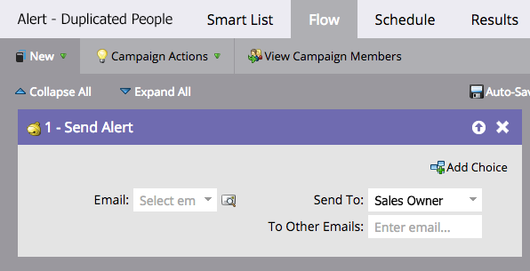

# Automatizar um alerta para possíveis pessoas duplicadas {#automate-an-alert-for-possible-duplicate-people}

Deseja um alerta sempre que possível que uma pessoa duplicada seja criada? Veja como configurar uma Campanha inteligente para fazer isso.

1. [Criar uma nova campanha inteligente](/help/marketo/product-docs/core-marketo-concepts/smart-campaigns/creating-a-smart-campaign/create-a-new-smart-campaign.md){target=&quot;_blank&quot;}. Defina a seguinte lista inteligente:

* Acionador: **A pessoa é criada**
* Filtro: **Duplicar campos.** Nome do campo **é Nome Completo**

   

   >[!TIP]
   >
   >Seja criativo. Experimente com campos diferentes para obter melhores resultados de filtragem.

1. Na etapa de fluxo, escolha [Enviar alerta](/help/marketo/product-docs/core-marketo-concepts/smart-campaigns/flow-actions/send-alert.md)Ação de fluxo {target=&quot;_blank&quot;}.

   

   >[!TIP]
   >
   >Usar o [Enviar token de Informações de Alerta](/help/marketo/product-docs/email-marketing/general/using-tokens/use-the-send-alert-info-token.md){target=&quot;_blank&quot;} para incluir um link para a pessoa em seu CRM.

   >[!CAUTION]
   >
   >Se você importar uma lista grande, poderá receber vários desses alertas ao mesmo tempo!
   >
   >Além disso, duas pessoas com o mesmo nome não significam automaticamente que sejam a mesma pessoa.

1. Ative a campanha no **Agendar** guia .

   

Pronto! Essa campanha inteligente será acionada sempre que uma nova pessoa com um nome completo existente for criada no Marketo.

>[!MORELIKETHIS]
>
>[Localizar e mesclar pessoas duplicadas](/help/marketo/product-docs/core-marketo-concepts/smart-lists-and-static-lists/managing-people-in-smart-lists/find-and-merge-duplicate-people.md){target=&quot;_blank&quot;}
