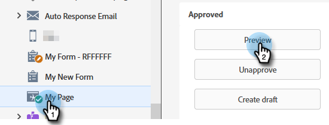

# Alertar o(a) representante de vendas {#alert-the-sales-rep}

## Missão: alertar o representante de vendas quando uma pessoa preencher um formulário no seu site {#mission-alert-the-sales-rep-when-a-person-fills-out-a-form-on-your-web-site}

Para enviar automaticamente e-mails de alerta aos representantes de vendas, você só precisa de um e-mail de alerta e uma campanha de e-mail. Veja como fazer isso.

>[!PREREQUISITES]
>
>[Página com formulário](/help/marketo/getting-started/quick-wins/landing-page-with-a-form.md){target="_blank"}

## Etapa 1: criar um email de alerta {#step-create-an-alert-email}

1. Acesse a área **[!UICONTROL Atividades de marketing]**.

   

1. Selecione **Meu programa**, que você criou na [Página de aterrissagem com um Formulário](/help/marketo/getting-started/quick-wins/landing-page-with-a-form.md){target="_blank"} de vitória rápida, e em **[!UICONTROL Novo]**, clique em **[!UICONTROL Novo ativo local]**.

   

1. Clique em **[!UICONTROL Email]**.

   

1. **Nomeie** o email &quot;Meu Alerta por Email&quot;, selecione um modelo e clique em **[!UICONTROL Criar]**.

   

1. Insira o **Nome da Origem**, **Email**, **[!UICONTROL Responder para]** e **[!UICONTROL Assunto]** que você deseja que sua equipe de vendas veja.

   

1. Clique duas vezes para editar o texto do email.

   

1. Digite o conteúdo do email.

   

1. Coloque o cursor onde deseja inserir as informações de contato da pessoa e clique no ícone **Inserir token**.

   

1. Localize e selecione o `{{SP_Send_Alert_Info}}` **[!UICONTROL Token]** e clique em **[!UICONTROL Inserir]**.

   

   >[!NOTE]
   >
   >{{SP_Send_Alert_Info}} é um token especial para emails de alerta. Consulte [Usar o Token de Informações de Alerta de Envio](/help/marketo/product-docs/email-marketing/general/using-tokens/use-the-send-alert-info-token.md){target="_blank"}{target="_blank"} para saber mais.

1. Clique em **[!UICONTROL Salvar]**.

   

1. Clique no menu suspenso **[!UICONTROL Ações de email]** e selecione **[!UICONTROL Aprovar e fechar]**.

   

## Etapa 2: criar uma campanha de acionamento de alerta {#step-create-an-alert-trigger-campaign}

1. Selecione **Meu programa** criado anteriormente e, em **[!UICONTROL Novo]**, clique em **[!UICONTROL Nova Campanha Inteligente]**.

   

1. **Nomeie** a campanha &quot;Minha campanha de alerta&quot; e clique em **[!UICONTROL Criar]**.

   

1. Na guia **[!UICONTROL Smart List]**, localize e arraste o acionador **[!UICONTROL Preencher formulário]** para a tela.

   

1. Selecione o formulário que criamos anteriormente.

   

1. Na guia **[!UICONTROL Fluxo]**, localize e arraste a ação de fluxo **[!UICONTROL Enviar Alerta]** para a tela.

   

1. Selecione **[!UICONTROL Meu email de alerta]** criado anteriormente e deixe **[!UICONTROL Enviar para]** como **[!UICONTROL Proprietário de vendas]**.

   

1. Digite seu endereço de email no campo **[!UICONTROL Para Outros Emails]**.

   

1. Vá para a guia **[!UICONTROL Agendar]** e clique no botão **[!UICONTROL Ativar]**.

   

   >[!TIP]
   >
   >Defina as **[!UICONTROL Regras de qualificação]** para **[!UICONTROL sempre]** (editando a Campanha Inteligente) para permitir que a mesma pessoa acione alertas várias vezes.

1. Clique em **[!UICONTROL Ativar]** na tela de confirmação.

   

## Etapa 3: Faça Um Teste! {#step-test-it-out}

1. Selecione sua página de aterrissagem e clique em **[!UICONTROL Exibir Página Aprovada]**.

   

   >[!NOTE]
   >
   >Não se esqueça de aprovar landing pages; elas não entrarão no ar até serem aprovadas.

1. Preencha o formulário e clique em **[!UICONTROL Enviar]**.

   

1. Você deve receber seu e-mail em breve. Depois de verificar que tudo funciona como deveria, remova seu endereço de email do fluxo Enviar alerta (consulte a etapa 2.7 acima).

   >[!NOTE]
   >
   >Clique na guia **[!UICONTROL Informações da pessoa]** no Marketo para ver as informações de contato.

## Missão cumprida! {#mission-complete}

  

[◄ Missão 7: Personalizar um e-mail](/help/marketo/getting-started/quick-wins/personalize-an-email.md)

[Missão 9: Atualizar Dados Da Pessoa ►](/help/marketo/getting-started/quick-wins/update-person-data.md)
