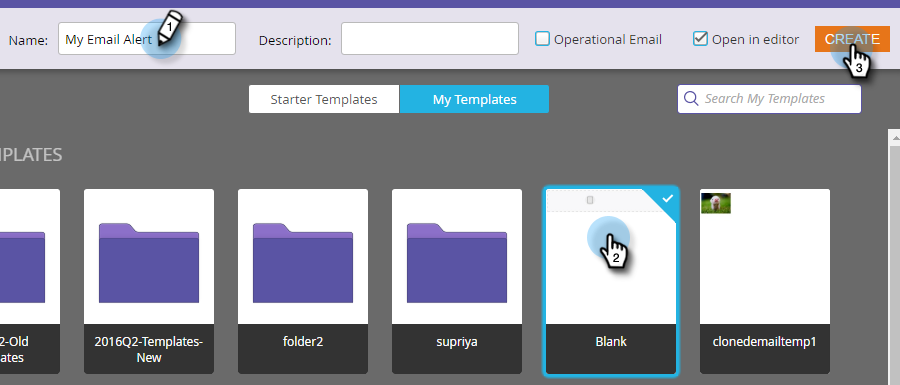

# Alertar o representante de vendas {#alert-the-sales-rep}

## Missão: alertar o representante de vendas quando uma pessoa preencher um formulário no seu site {#mission-alert-the-sales-rep-when-a-person-fills-out-a-form-on-your-web-site}

Para enviar automaticamente e-mails de alerta aos representantes de vendas, você só precisa de um e-mail de alerta e uma campanha de e-mail. Veja como fazer isso.

>[!PREREQUISITES]
>
>[Página com formulário](/help/marketo/getting-started/quick-wins/landing-page-with-a-form.md){target="_blank"}

## Etapa 1: criar um email de alerta {#step-create-an-alert-email}

1. Vá para a **[!UICONTROL Atividades de marketing]** área.

   

1. Selecionar **Meu programa** que você criou na [Página de aterrissagem com um formulário](/help/marketo/getting-started/quick-wins/landing-page-with-a-form.md){target="_blank"} vitória rápida, em seguida, em **[!UICONTROL Novo]** click **[!UICONTROL Novo ativo local]**.

   

1. Clique em **[!UICONTROL E-mail]**.

   

1. **Nome** o e-mail &quot;Meu alerta por e-mail&quot;, selecione um modelo e clique em **[!UICONTROL Criar]**.

   

1. Insira o **Do nome**, **Do e-mail**, **[!UICONTROL Responder para]**, e **[!UICONTROL Assunto]** que você deseja que sua equipe de vendas veja.

   

1. Clique duas vezes para editar o texto do e-mail.

   

1. Digite o conteúdo do email.

   

1. Coloque o cursor onde deseja inserir as informações de contato da pessoa e clique no **Inserir token** ícone.

   

1. Localize e selecione o `{{SP_Send_Alert_Info}}` **[!UICONTROL Token]** e clique em **[!UICONTROL Inserir]**.

   

   >[!NOTE]
   >
   >{{SP_Send_Alert_Info}} O é um token especial para emails de alerta. Consulte [Usar o token de envio de informações de alerta](/help/marketo/product-docs/email-marketing/general/using-tokens/use-the-send-alert-info-token.md){target="_blank"}{target="_blank"} para saber mais.

1. Clique em **[!UICONTROL Salvar]**.

   

1. Clique em **[!UICONTROL Ações de email]** e selecione **[!UICONTROL Aprovar e fechar]**.

   

## Etapa 2: criar uma campanha de acionamento de alerta {#step-create-an-alert-trigger-campaign}

1. Selecionar **Meu programa** criado anteriormente, depois em **[!UICONTROL Novo]** click **[!UICONTROL Nova campanha inteligente]**.

   

1. **Nome** a campanha &quot;Minha campanha de alerta&quot; e clique em **[!UICONTROL Criar]**.

   

1. No **[!UICONTROL Lista inteligente]** , localize e arraste o **[!UICONTROL Preenche o formulário]** acione para a tela.

   

1. Selecione o formulário que criamos anteriormente.

   

1. No **[!UICONTROL Fluxo]** , localize e arraste o **[!UICONTROL Enviar alerta]** ação de fluxo para a tela.

   

1. Selecionar **[!UICONTROL Meu email de alerta]** criado anteriormente e sair **[!UICONTROL Enviar para]** as **[!UICONTROL Proprietário de vendas]**.

   

1. Digite seu endereço de e-mail no campo **[!UICONTROL Para outros e-mails.]**

   

1. Vá para a **[!UICONTROL Agendar]** e clique na guia **[!UICONTROL Ativar]** botão.

   

   >[!TIP]
   >
   >Defina o **[!UICONTROL Regras de qualificação]** para **[!UICONTROL sempre]** (editando a Campanha inteligente) para permitir que a mesma pessoa acione alertas várias vezes.

1. Clique em **[!UICONTROL Ativar]** na tela de confirmação.

   

## Etapa 3: Faça Um Teste! {#step-test-it-out}

1. Selecione a landing page e clique em **[!UICONTROL Visualizar página aprovada]**.

   

   >[!NOTE]
   >
   >Não esqueça de aprovar as páginas, pois elas só são disponibilizadas após a aprovação.

1. Preencha o formulário e clique em **[!UICONTROL Enviar]**.

   

1. Você deve receber seu e-mail em breve. Depois de verificar se tudo está funcionando como deveria, remova seu endereço de e-mail do fluxo Enviar alerta (veja a etapa 2.7 acima).

   >[!NOTE]
   >
   >Clique em **[!UICONTROL Informações da pessoa]** no Marketo para ver as informações de contato.

## Missão cumprida! {#mission-complete}

  

[◄ Missão 7: personalizar um e-mail](/help/marketo/getting-started/quick-wins/personalize-an-email.md)

[Missão 9: Atualizar Dados Pessoais ►](/help/marketo/getting-started/quick-wins/update-person-data.md)
