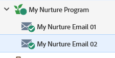

# Estímulo gota a gota {#drip-drip-nurture}

## Missão: Cuidar das pessoas que participaram de sua recente feira de negócios {#mission-nurture-the-people-who-attended-your-recent-tradeshow}

Você pode criar facilmente um sistema de nutrição avançado e sofisticado no Marketo. Veja como!

>[!PREREQUISITES]
>
>* [Configurar e adicionar uma pessoa](/help/marketo/getting-started/quick-wins/get-set-up-and-add-a-person.md){target="_blank"}
>* [Importar uma Lista de Pessoas](/help/marketo/getting-started/quick-wins/import-a-list-of-people.md){target="_blank"}

## Etapa 1: &#x200B;criar um programa de envolvimento {#step-create-an-engagement-program}

1. Acesse a área **[!UICONTROL Atividades de marketing]**.

   

1. Selecione a pasta **Aprendizado**, clique no menu suspenso **[!UICONTROL Novo]** e selecione **[!UICONTROL Novo programa]**.

   

1. Insira um **[!UICONTROL Nome]** e selecione **[!UICONTROL Envolvimento]** para o **[!UICONTROL Tipo de Programa]**.

   

1. Verifique se o campo **[!UICONTROL Canal]** é **[!UICONTROL Fomento]** e clique em **[!UICONTROL Criar]**.

   

   Você acaba de criar um programa de envolvimento.

## Etapa 2: &#x200B;criar um e-mail {#step-create-an-email}

1. Selecione seu programa de engajamento, clique em **[!UICONTROL Novo]** e selecione **[!UICONTROL Novo ativo local]**.

   

1. Clique em **[!UICONTROL Email]**.

   

1. Digite um **[!UICONTROL Nome]**, selecione o **[!UICONTROL Modelo]** que deseja usar e clique em **[!UICONTROL Criar]**.

   

   >[!NOTE]
   >
   >Não está vendo o editor de e-mail? Seu navegador provavelmente bloqueou a janela. Habilite os pop-ups de `app.marketo.com` no seu navegador e clique em **[!UICONTROL Editar Rascunho]** na barra de menu superior.

1. Insira um assunto.

   

1. Selecione a área do email que deseja editar, clique no ícone de engrenagem e selecione **[!UICONTROL Editar]**.

   

1. Edite seu email e clique em **[!UICONTROL Salvar]**.

   

1. Em **[!UICONTROL Ações de email]**, clique em **[!UICONTROL Aprovar e Fechar]**.

   

   >[!NOTE]
   >
   >Lembre-se de aprovar seus emails ou você não poderá ativá-los mais tarde.

1. Agora, crie outro email repetindo as ações das Etapas 2 a 7.

   

## Etapa 3: adicionar conteúdo a seu fluxo {#step-add-content-to-your-stream}

Agora é hora de criar um fluxo de conteúdo para seu programa de envolvimento usando os e-mails que criou.

1. Selecione seu programa de engajamento e clique na guia **[!UICONTROL Fluxos]**.

   

1. Clique no botão **[!UICONTROL Adicionar conteúdo]** no fluxo.

   

   >[!TIP]
   >
   >Você também pode usar o ícone **+**.

1. Deixe o tipo &quot;Email&quot; selecionado. Localize e selecione os dois emails criados.

   

## Etapa 4: ativar o conteúdo do fluxo {#step-activate-stream-content}

1. Ative todo o conteúdo de uma só vez clicando no ícone de engrenagem do fluxo e clique em **[!UICONTROL Ativar todo o conteúdo]**.

   

   >[!NOTE]
   >
   >Você não pode ativar o conteúdo sem primeiro o aprovar.

   Ótimo! Mais uma etapa, e o programa de envolvimento estará pronto.

## Etapa 5: definir a cadência do fluxo {#step-set-the-stream-cadence}

1. Clique em **[!UICONTROL Definir Cadência de Fluxo]**.

   

1. Edite as configurações de acordo com o agendamento desejado e clique em **[!UICONTROL Salvar]**.

   

   Seu programa de envolvimento está pronto. Agora vamos adicionar uma pessoa de teste ao seu programa.

   >[!NOTE]
   >
   >A pessoa de teste é a pessoa que verifica se o programa de engajamento está correto antes de enviar para os clientes.

## Etapa 6: adicionar uma pessoa de teste ao programa de envolvimento {#step-add-a-test-person-to-your-engagement-program}

1. Acesse a área **[!UICONTROL Banco de dados]**.

   

1. Procure pela pessoa de teste.

   

   >[!NOTE]
   >
   >Certifique-se de que a pessoa de teste tenha um endereço de email válido para que você possa confirmar o recebimento de emails ao testar.

1. Clique com o botão direito do mouse na pessoa e clique em **[!UICONTROL Programas]** e **[!UICONTROL Adicionar ao Programa de Participação...]**.

   

1. Selecione seu **[!UICONTROL Programa]** e **[!UICONTROL Fluxo]** e clique em **[!UICONTROL Executar Agora]**.

   

1. Missão cumprida!

1. Você deve receber um email na hora e cadência especificadas.

   >[!NOTE]
   >
   >Saiba mais sobre [Programas de envolvimento](/help/marketo/product-docs/email-marketing/drip-nurturing/creating-an-engagement-program/understanding-engagement-programs.md){target="_blank"}.

## Missão cumprida! {#mission-complete}

  

[◄ Missão 5: Importar uma Lista de Pessoas](/help/marketo/getting-started/quick-wins/import-a-list-of-people.md)

[Missão 7: Personalizar um email ►](/help/marketo/getting-started/quick-wins/personalize-an-email.md)
