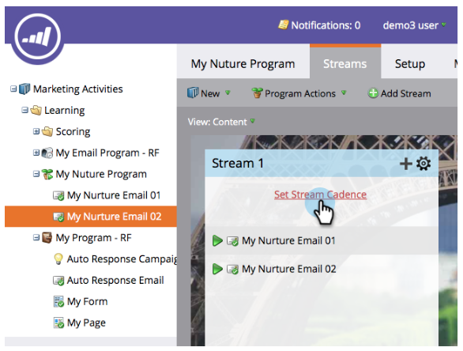

# Derramamento, Derramamento, Enfermeira {#drip-drip-nurture}

## Missão: Enfermeira as pessoas que compareceram à sua apresentação comercial recente {#mission-nurture-the-people-who-attended-your-recent-tradeshow}

Você pode criar facilmente um sistema de criação avançado e sofisticado em Marketo. Veja como!

>[!PREREQUISITES]
>
>* [Configurar e adicionar uma pessoa](/help/marketo/getting-started/quick-wins/get-set-up-and-add-a-person.md)
>* [Importar uma Lista de pessoas](/help/marketo/getting-started/quick-wins/import-a-list-of-people.md)

## Etapa 1: Criar um Programa de envolvimento {#step-create-an-engagement-program}

1. Vá para a área **Marketing Atividade** .

   

1. Selecione a pasta **Learning** , clique no menu suspenso **New (Novo** ) e selecione **New Programa**(Novo).

   

1. Digite um **Nome** e selecione **Envolvimento** para o Tipo **de** Programa.

   

1. Verifique se o campo **Canal** é **Nurture** e clique em **Create (Criar)**.

   

   Agora você criou um programa de envolvimento.

## Etapa 2: Criar um email {#step-create-an-email}

1. Selecione seu programa de envolvimento, clique em **Novo** e selecione **Novo ativo** local.

   

1. Clique em **Email**.

   

1. Insira um **Nome**, selecione o **Modelo** que deseja usar e clique em **Criar**.

   

   >[!NOTE]
   >
   >Não vê o editor de email? Seu navegador provavelmente bloqueou a janela. Ative pop-ups de [app.marketo.com](https://app.marketo.com) no seu navegador e clique em **Editar rascunho** na barra de menus superior.

1. Insira um assunto.

   

1. Selecione a área do email que deseja editar, clique no ícone de engrenagem e selecione **Editar**.

   

1. Edite seu email e clique em **Salvar**.

   

1. Feche a guia/janela do editor de email.

   

1. Em Ações **de** email, clique em **Aprovar**.

   

   >[!NOTE]
   >
   >Não se esqueça de aprovar seus emails ou não poderá ativá-los mais tarde.

1. Agora, crie outro email repetindo as ações da Etapa 2.

   

## Etapa 3: Adicionar conteúdo ao seu fluxo {#step-add-content-to-your-stream}

1. Agora é hora de criar um fluxo de conteúdo para seu programa de envolvimento usando os emails criados.

1. Selecione seu programa de envolvimento e clique na guia **Streams** .

   

1. Arraste os dois emails criados para a tela direita.

   

   >[!TIP]
   >
   >Você também pode usar o botão **Adicionar conteúdo** ou o ícone de fluxo **+** .

## Etapa 4: Ativar conteúdo de fluxo {#step-activate-stream-content}

1. Ative todo o conteúdo de uma só vez clicando no ícone de engrenagem de fluxo e, em seguida, clique em **Ativar todo o conteúdo**.

   

   >[!NOTE]
   >
   >Não é possível ativar o conteúdo sem aprová-lo primeiro.

   Ótimo trabalho! Mais uma etapa e o programa de envolvimento está pronto.

## Etapa 5: Definir a cadência do fluxo {#step-set-the-stream-cadence}

1. Clique em **Definir cadência** de fluxo.

   

1. Edite as configurações para que correspondam ao agendamento desejado e clique em **Salvar**.

   

   Seu programa de envolvimento está pronto. Agora vamos adicionar uma pessoa de teste ao seu programa.

   >[!NOTE]
   >
   >A pessoa de teste é a pessoa que verifica seu programa de envolvimento para testar se está correto antes de enviar aos clientes.

## Etapa 6: Adicionar uma pessoa de teste ao seu Programa de envolvimento {#step-add-a-test-person-to-your-engagement-program}

1. Vá para a área **Banco de Dados** .

   

1. Procure sua pessoa de teste.

   

   >[!NOTE]
   >
   >Certifique-se de que a pessoa de teste tenha um endereço de email válido para que você possa confirmar o recebimento de emails ao testar.

1. Clique com o botão direito do mouse na pessoa e, em seguida, clique em Programas e em Adicionar ao Programa de envolvimento.

   

1. Selecione seu **Programa** e **Stream** e clique em **Executar agora**.

   

1. Missão concluída!

1. Você deve receber e-mail no momento e cadência especificados.

   >[!NOTE]
   >
   >Saiba mais sobre os Programas [de](/help/marketo/product-docs/email-marketing/drip-nurturing/creating-an-engagement-program/understanding-engagement-programs.md)envolvimento.

  

[◄ Missão 5: Importar uma Lista de clientes potenciais](/help/marketo/getting-started/quick-wins/import-a-list-of-people.md)

[Missão 7: Personalizar um email ►](/help/marketo/getting-started/quick-wins/personalize-an-email.md)
