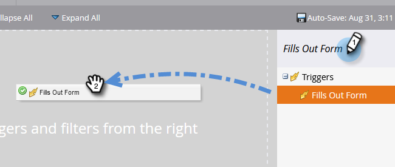
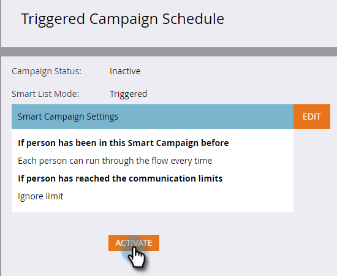

# Resposta automática por email {#email-auto-response}

## Missão: enviar um email de agradecimento quando uma pessoa preencher um formulário {#mission-send-out-a-thank-you-email-when-a-person-fills-out-a-form}

>[!PREREQUISITES]
>
>* [Configurar e adicionar uma pessoa](/help/marketo/getting-started/quick-wins/get-set-up-and-add-a-person.md){target="_blank"}
>* [Página com formulário](/help/marketo/getting-started/quick-wins/landing-page-with-a-form.md){target="_blank"}

## Etapa 1: &#x200B;criar um e-mail {#step-create-an-email}

1. Acesse a área [!UICONTROL Atividades de marketing].

   

1. Selecione seu programa no menu esquerdo, clique no menu suspenso **[!UICONTROL Novo]** e selecione **[!UICONTROL Novo ativo local]**.

   

1. Selecione **[!UICONTROL Email]**.

   

1. Nomeie seu email como “Email de resposta automática”, escolha um modelo e clique em **[!UICONTROL Criar]**.

   

   O editor de email será aberto em uma nova janela ou guia. Se os pop-ups estiverem bloqueados, clique em **[!UICONTROL Editar rascunho]** na página de resumo do ativo para acessar o email.

1. Insira uma linha de assunto e clique duas vezes na área editável do email.

   

   _Um editor de rich text será aberto sobre o editor de email._

1. Selecione o conteúdo do email existente.

   

1. Digite seu conteúdo de email e clique em **[!UICONTROL Salvar]**.

   

1. Clique no menu suspenso **[!UICONTROL Ações de email]** e selecione **[!UICONTROL Aprovar e fechar]**.

   

## Etapa 2: criar uma campanha inteligente {#step-create-a-smart-campaign}

1. Selecione seu programa, clique no menu suspenso **[!UICONTROL Novo]** e selecione **[!UICONTROL Nova campanha inteligente]**.

   

1. **Nomeie** a campanha inteligente como “Campanha de resposta automática” e clique em **[!UICONTROL Criar]**.

   

1. Acesse a guia **[!UICONTROL Lista inteligente]**.

   

   Estamos configurando esta campanha para ser executada sempre que uma pessoa preencher o formulário que você criou em [**Página de destino com um formulário**](/help/marketo/getting-started/quick-wins/landing-page-with-a-form.md){target="_blank"}.

1. Localize e arraste o acionador **[!UICONTROL Preencheu o formulário]** para a tela.

   

1. Selecione **[!UICONTROL Meu formulário]** no menu suspenso. Em seguida, clique na guia **[!UICONTROL Fluxo]**.

   

1. Arraste a ação de fluxo **[!UICONTROL Enviar email]** para a tela esquerda.

   

1. Selecione o **Email de resposta automática**. Em seguida, clique na guia **[!UICONTROL Cronograma]**.

   

1. Clique em **[!UICONTROL Editar]**.

   

1. Selecione **[!UICONTROL Toda vez]** e clique em **[!UICONTROL Salvar]**.

   

1. Clique em **[!UICONTROL Ativar]**.

   

1. Clique em **[!UICONTROL Ativar]** na tela de confirmação.

   

>[!NOTE]
>
>Uma vez ativa, esta campanha será executada sempre que uma pessoa preencher o formulário especificado. A campanha continuará em execução até ser desativada.

## Etapa 3: preencher o formulário {#step-fill-out-the-form}

1. Selecione **Minha página** (isso foi criado na missão rápida [Página de destino com um formulário](/help/marketo/getting-started/quick-wins/landing-page-with-a-form.md){target="_blank"}) e clique em **[!UICONTROL Pré-visualizar]**.

   

   _A página de destino “Teste gratuito” será aberta em uma nova guia._

1. Preencha o formulário com seu nome, sobrenome, endereço de email e clique em **[!UICONTROL Enviar]**.

   

>[!NOTE]
>
>Use seu endereço de e-mail verdadeiro para poder receber a mensagem de e-mail.

## Missão cumprida {#mission-complete}

Em apenas alguns minutos, você deverá ver o email de resposta automática na sua caixa de entrada.

[◄ Missão 3: pontuação simples](/help/marketo/getting-started/quick-wins/simple-scoring.md)

[Missão 5: importar uma lista de pessoas ►](/help/marketo/getting-started/quick-wins/import-a-list-of-people.md)
