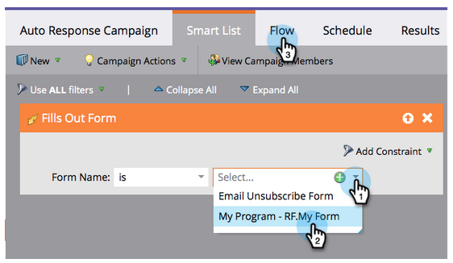

# Resposta automática por email {#email-auto-response}

## Missão: Enviar um email de agradecimento quando uma pessoa preencher um formulário {#mission-send-out-a-thank-you-email-when-a-person-fills-out-a-form}

>[!PREREQUISITES]
>
>* [Configurar e adicionar uma pessoa](/help/marketo/getting-started/quick-wins/get-set-up-and-add-a-person.md)
>* [landing page com um formulário](/help/marketo/getting-started/quick-wins/landing-page-with-a-form.md)

## Etapa 1: Criar um email {#step-create-an-email}

1. Vá para a área Atividades de marketing.

   

1. Selecione Meu Programa no menu esquerdo, clique no menu suspenso Novo e selecione Novo ativo local.

   

1. Clique em Email.

   

1. Nomeie seu email como &quot;Email de resposta automática&quot;, escolha um modelo e clique em Criar.

   

   Um editor de email será aberto em uma nova janela ou guia. Se as pop-ups estiverem bloqueadas, clique em **Editar rascunho** na página de resumo do ativo para acessar o email.

1. Digite uma linha de assunto e clique com o duplo na área editável do e-mail.

   

   _Um editor de Rich Text será aberto sobre o editor de email._

1. Realce o conteúdo do email existente.

   

1. Digite seu conteúdo de email e clique em Salvar.

   

1. Suas alterações são salvas automaticamente. Feche a guia/janela do editor de email.

   

1. Selecione seu novo email. Em Ações de email, clique em Aprovar.

   

## Etapa 2: Criar uma Campanha inteligente {#step-create-a-smart-campaign}

1. Clique com o botão direito do mouse em **Meu Programa** e clique em **Nova Campanha** inteligente.

   

1. **Dê um nome** à sua campanha inteligente &quot;Campanha de resposta automática&quot; e clique em **Criar**.

   

1. Vá para a guia **Lista** inteligente.

   

   Estamos configurando essa campanha para ser executada sempre que uma pessoa preencher o formulário criado em [**Landing page com um Formulário**](/help/marketo/getting-started/quick-wins/landing-page-with-a-form.md).

1. Localize e arraste o acionador de formulário **** Preenchimentos para fora até a tela esquerda.

   

1. Selecione **Meu formulário** no menu suspenso. Clique na guia **Fluxo** .

   

1. Arraste a ação de fluxo de **Enviar e-mail** para a tela esquerda.

   

1. Selecione seu Email **de resposta** automática e vá para a guia **Agendamento** .

   

1. Clique em **Editar**.

   

1. Selecione **sempre** e clique em **Salvar**.

   

1. Clique em **Ativar**.

   

1. Clique em **Ativar** na tela de confirmação.

   

>[!NOTE]
>
>Uma vez ativa, essa campanha será executada sempre que uma pessoa preencher o formulário especificado. A campanha continuará funcionando até ser desativada.

## Etapa 3: Preencha o formulário {#step-fill-out-the-form}

1. Selecione **Minha página**. Isso foi criado na [Landing page com uma vitória rápida do Formulário](/help/marketo/getting-started/quick-wins/landing-page-with-a-form.md) .

   

1. Clique em **Visualização da página** aprovada.

   

   Sua landing page &quot;Avaliação gratuita&quot; será aberta em uma nova guia.

1. Preencha o formulário com seu nome, sobrenome e endereço de email e clique em **Enviar**.

   

>[!NOTE]
>
>Certifique-se de usar seu endereço de email para obter o email.

## Missão concluída {#mission-complete}

Em apenas alguns minutos você deverá ver o e-mail de resposta automática na sua caixa de entrada. Ótimo trabalho!

  

[◄ Missão 3: Pontuação simples](/help/marketo/getting-started/quick-wins/simple-scoring.md)

[Missão 5: Importe uma Lista de clientes potenciais ►](/help/marketo/getting-started/quick-wins/import-a-list-of-people.md)
