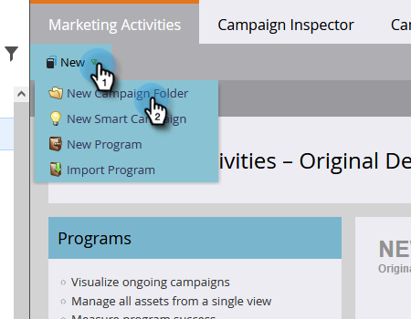
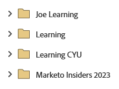
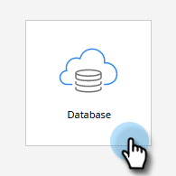
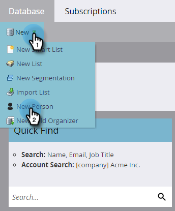
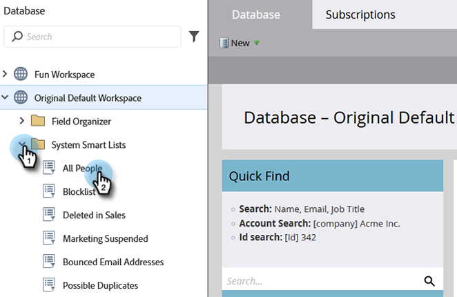

# Configurar e adicionar uma pessoa {#get-set-up-and-add-a-person}

Há algumas coisas a se fazer antes de começar as missões.

## Etapa 1: fazer logon no Marketo Engage {#step-log-in-to-marketo}

1. [Faça logon no Marketo Engage](https://app.marketo.com){target="_blank"} usando as credenciais recebidas por email.

   

## Etapa 2: criar uma pasta de aprendizado {#step-create-a-learning-folder}

Vamos criar uma pasta para armazenar tudo o que você fará nas missões.

1. Acesse a área **[!UICONTROL Atividades de marketing]**.

   

1. Clique no menu suspenso **[!UICONTROL Novo]** e selecione **[!UICONTROL Nova pasta de campanha]**.

   

1. Nomeie a pasta como “Aprendizado” e clique em **[!UICONTROL Criar]**.

   

1. Você verá essa nova pasta no menu à esquerda.

   

## Etapa 3: adicionar-se como uma pessoa {#step-add-yourself-as-a-person}

Adicione a si mesmo(a) como uma pessoa no Marketo para que possa enviar emails de teste para si mais tarde.

1. Acesse a área **[!UICONTROL Banco de dados]**.

   

1. Clique no menu suspenso **[!UICONTROL Novo]** e selecione **[!UICONTROL Nova pessoa]**.

   

1. Digite seu nome, sobrenome, endereço de email e nome da empresa e clique em **[!UICONTROL Criar]** para adicionar-se como uma pessoa.

   

   >[!CAUTION]
   >
   >* Verifique se os endereços de email contêm apenas caracteres ASCII.
   >
   >* O Marketo **não** permite o uso de endereços de email que contêm emojis.

1. Para exibir as pessoas, abra as [!UICONTROL listas inteligentes do sistema] no menu esquerdo e clique em **[!UICONTROL Todas as pessoas]**.

   

1. Clique na guia **[!UICONTROL Pessoas]**: Você deve se ver no banco de dados.

   

## Configuração concluída {#set-up-complete}

Você está pronto para começar sua primeira missão!

  

[Missão 1: enviar um email em massa ►](/help/marketo/getting-started/quick-wins/send-an-email.md)
