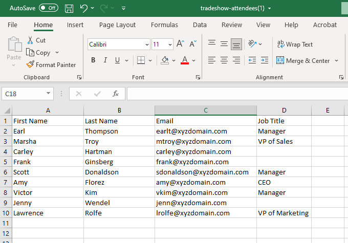
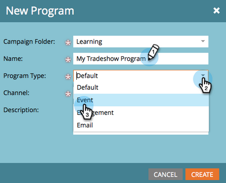
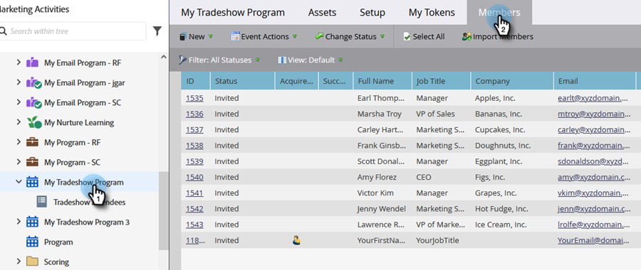

# Importar uma lista de pessoas {#import-a-list-of-people}

## Missão: importar a lista de uma planilha de participantes de um evento comercial para seu banco de dados {#mission-import-a-spreadsheet-list-of-trade-show-attendees-into-your-database}

>[!PREREQUISITES]
>
>[Configure e adicione uma pessoa](/help/marketo/getting-started/quick-wins/get-set-up-and-add-a-person.md){target="_blank"}

Neste tutorial, você aprenderá a importar pessoas de um arquivo de planilha para o Marketo.

## Etapa 1: baixar e editar uma planilha {#step-download-and-edit-a-spreadsheet}

1. Para iniciar, baixe nosso arquivo de planilha de prática ([**tradeshow-attendees.csv**](/help/marketo/getting-started/assets/tradeshow-attendees.csv){target="_blank"}) no seu computador.

   

   >[!NOTE]
   >
   >Ao importar uma data, use este formato: **9/21/20** (Mês/Dia/Ano).

   >[!NOTE]
   >
   >Qualquer campo de data/hora que for importado será tratado como Hora central. Se você tiver campos de data/hora em um fuso horário diferente, poderá usar uma fórmula do Excel para transformá-la na Hora Central (América/Chicago).

1. Adicione seu próprio nome, sobrenome, endereço de email real (para que você possa receber os emails de incentivo que enviará na próxima missão) e cargo. Salve o arquivo no computador.

   

   >[!CAUTION]
   >
   >* Verifique se os endereços de email contêm apenas caracteres ASCII.
   >
   >* A Marketo **não** oferece suporte a endereços de email que contêm emojis.
   >
   >* A importação de valores de `NULL` por meio de CSV pode gerar um &quot;Valor de Dados de Alteração&quot; para campos numéricos no [log de atividades](/help/marketo/product-docs/core-marketo-concepts/smart-lists-and-static-lists/managing-people-in-smart-lists/locate-the-activity-log-for-a-person.md){target="_blank"}, _mesmo que os campos já estejam em branco_. Se você tiver [Campanhas inteligentes](/help/marketo/product-docs/core-marketo-concepts/smart-campaigns/understanding-smart-campaigns.md){target="_blank"} que usam o filtro &quot;Valor dos dados alterado&quot; ou o acionador &quot;Alterações do valor dos dados&quot;, isso poderá fazer com que as pessoas se qualifiquem para essas campanhas, mesmo que os dados não estejam realmente mudando. Você pode usar [restrições](/help/marketo/product-docs/core-marketo-concepts/smart-lists-and-static-lists/using-smart-lists/add-a-constraint-to-a-smart-list-filter.md){target="_blank"} para garantir que ninguém se qualifique para essas campanhas após a importação.

## Etapa 2: &#x200B;criar um programa {#step-create-a-program}

1. Vá para a área **[!UICONTROL Atividades de marketing]**.

   

1. Selecione a pasta **Aprendizado** e, em **[!UICONTROL Novo]**, clique em **[!UICONTROL Novo Programa]**.

   

1. **Nomeie** o programa &quot;Meu programa de feiras&quot; e selecione &quot;Evento&quot; para o **[!UICONTROL Tipo de Programa]**.

   

1. Selecione **[!UICONTROL Tradeshow]** para o **[!UICONTROL Channel]** e clique em **[!UICONTROL Create]**.

   

>[!NOTE]
>
>Os programas de eventos ocorrem em datas específicas. Saiba mais sobre [**Eventos**](/help/marketo/product-docs/demand-generation/events/understanding-events/understanding-event-programs.md){target="_blank"}.

## Etapa 3: importar sua planilha para o Marketo {#step-import-your-spreadsheet-into-marketo}

1. Em **Meu programa de feiras**, clique em **[!UICONTROL Novo]** e selecione **[!UICONTROL Novo ativo local]**.

   

1. Selecione **[!UICONTROL Lista]**.

   

1. **Nomeie** a lista &quot;Participantes de eventos&quot; e clique em **[!UICONTROL Criar]**.

   

1. Na sua lista **[!UICONTROL Participantes da Feira]**, clique em **[!UICONTROL Ações da Lista]** e selecione **[!UICONTROL Importar Lista]**.

   

   >[!CAUTION]
   >
   >Se você estiver usando seu próprio arquivo CSV, verifique se ele está codificado como UTF-8, UTF-16, Shift-JIS ou EUC-JP.

   >[!NOTE]
   >
   >O limite de tamanho para arquivos CSV é 100 MB.

1. **[!UICONTROL Navegue]** até o arquivo de planilha do **tradeshow-attendees.csv** em seu computador e clique em **[!UICONTROL Avançar]**.

   

   >[!NOTE]
   >
   >No Modo de Importação de Lista, escolher **[!UICONTROL Ignorar novas pessoas e atualizações]** significa que você não afetará os registros de pessoas existentes nem registrará atividades. Use esse modo se desejar uma lista estática rápida e pré-filtrada das pessoas existentes para uso em suas atividades de marketing. Selecionar este modo irá:
   >
   > * Ignorar criação de nova pessoa
   > * Ignorar atualizações de campos de pessoas
   > * Ignorar registro de atividade

1. Mapeie os campos da [!UICONTROL Coluna da Lista] para o respectivo Campo do Marketo e clique em **[!UICONTROL Avançar]**.

   

   >[!TIP]
   >
   >Os cabeçalhos de coluna devem sempre corresponder exatamente ao campo (diferencia maiúsculas de minúsculas) para obter os melhores resultados de mapeamento automático. Se você estiver usando campos personalizados e não os vir na lista suspensa, volte e [crie-os](/help/marketo/product-docs/administration/field-management/create-a-custom-field-in-marketo.md){target="_blank"} para que eles se tornem opções.

   >[!NOTE]
   >
   >Se houver campos que você não queira importar, selecione **Ignorar** no menu suspenso Campo do Marketo.

1. Selecione **Meu programa de feiras** para o **[!UICONTROL Programa de aquisição]** e clique em **[!UICONTROL Importar]**.

   

1. Aguarde até que seus funcionários importem e feche a janela pop-up de progresso da importação.

   

1. De volta ao **Meu programa de feiras**, clique na guia **[!UICONTROL Membros]**. Você verá todas as pessoas que acabou de importar.

   

>[!NOTE]
>
>Para analisar o sucesso de seu programa, acompanhe os membros a ele associados. Saiba mais sobre [**Programas**](/help/marketo/product-docs/core-marketo-concepts/programs/creating-programs/understanding-programs.md){target="_blank"}.

## Missão cumprida {#mission-complete}

Agora os participantes de seu evento comercial são membros de seu programa do Marketo!

  

[Missão 4: Resposta automática de e-mail](/help/marketo/getting-started/quick-wins/email-auto-response.md)

[Missão 6: Gotejamento, Gotejamento, Alimentação ►](/help/marketo/getting-started/quick-wins/drip-drip-nurture.md)
