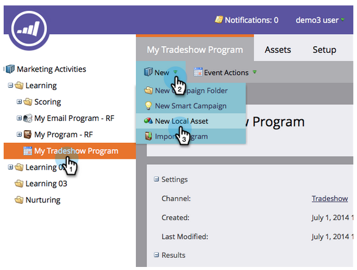

# Importar uma Lista de pessoas {#import-a-list-of-people}

## Missão: Importe uma lista de planilha de participantes do programa comercial para seu banco de dados {#mission-import-a-spreadsheet-list-of-trade-show-attendees-into-your-database}

>[!NOTE]
>
>**FYI**
>
>O Marketo agora está padronizando o idioma em todas as subscrições, portanto você pode ver o lead/lead na sua subscrição e a pessoa/pessoas em docs.marketo.com. Estes termos significam a mesma coisa. isso não afeta as instruções do artigo. Há outras mudanças também. [Saiba mais](http://docs.marketo.com/display/DOCS/Updates+to+Marketo+Terminology).

>[!NOTE]
>
>**Pré-requisitos**
>
>* [Configurar e adicionar uma pessoa](get-set-up-and-add-a-person.md)

>

`   
`  Neste tutorial, você aprenderá a importar pessoas de um arquivo de planilha para o Marketo.

## Etapa 1: Baixar e editar uma planilha {#step-download-and-edit-a-spreadsheet}

1. Para o start, descarregue nosso arquivo de planilha (*** [tradeshow-attendees.csv](http://docs.marketo.com/display/docs/assets/tradeshow-attendees.csv)**) em seu computador.

   

   >[!NOTE]
   >
   >**Lembrete**
   >
   >
   >Ao importar uma data, use este formato: **21/9/15** (Mês/Dia/Ano).

   >[!NOTE]
   >
   >Todos os campos de data/hora que estão sendo importados são tratados como Hora Central. Se você tiver campos de data/hora em um fuso horário diferente, poderá usar uma fórmula do Excel para transformá-la em Hora Central (América/Chicago).

1. Adicione seu próprio nome, sobrenome, endereço de e-mail e cargo e salve o arquivo no computador.

   

>[!NOTE]
>
>Insira seu endereço de email real no arquivo CSV para que você possa receber os emails de preparação que você enviará na próxima missão.

## Etapa 2: Criar um Programa {#step-create-a-program}

1. Vá para a área **Marketing Atividade** .

   

1. Selecione sua pasta **Learning** e, em **New (Novo** ), clique em **New (Novo Programa**).

   

1. **Nomeie** o programa como &quot;Meu Programa de shows de vendas&quot; e selecione &quot;Evento&quot; para o Tipo de **Programa.**

   

1. Selecione **Transmissão** para o **Canal** e clique em **Criar**.

   

>[!NOTE]
>
>**Mergulho profundo**
>
>Programas de eventos ocorrem em datas específicas. Saiba mais sobre [**Eventos**](http://docs.marketo.com/display/docs/events).

## Etapa 3: Importar sua planilha para o Marketing {#step-import-your-spreadsheet-into-marketo}

1. Em **Meu Programa** de shows de vendas, clique em **Novo** e selecione **Novo ativo** local.

   

1. Clique em **Lista**.

   

1. **Nomeie** a lista como &quot;Participantes da apresentação comercial&quot; e clique em **Criar**.

   

1. Na sua lista de **Participantes** da apresentação comercial, clique em Ações **de** Lista e selecione **Importar Lista**.

   

   >[!CAUTION]
   >
   >Se você estiver usando seu próprio arquivo CSV, verifique se ele está codificado em UTF-8, UTF-16, Shift-JIS ou EUC-JP.

   >[!NOTE]
   >
   >O limite de tamanho para arquivos CSV é de 100 MB.

1. **Navegue** até o arquivo de planilha **tradeshow-attendees.csv** no computador e clique em **Avançar**.

   

   >[!NOTE]
   >
   >No Modo de importação de Lista, escolher **Ignorar novas pessoas e atualizações** significa que você não afetará os registros pessoais existentes ou registrará quaisquer atividades. Use este modo se desejar uma lista estática rápida e pré-filtrada de pessoas existentes para uso em suas atividades de marketing. Selecionar este modo irá:
   >
   >    
   >    
   >    * Ignorar a criação de nova pessoa
   >    * Ignorar atualizações de campo de pessoa
   >    * Ignorar registro de atividades

1. Mapeie os campos Coluna da Lista para o respectivo Campo de marketing e clique em **Avançar**.

   

   >[!TIP]
   >
   >Os cabeçalhos de coluna devem sempre corresponder ao campo exatamente (diferenciando maiúsculas de minúsculas) para obter os melhores resultados de mapeamento automático. Se você estiver usando campos personalizados e não os vir no menu suspenso, volte e [crie-os](http://docs.marketo.com/display/DOCS/Create+a+Custom+Field+in+Marketo) para que eles se tornem opções.

   >[!NOTE]
   >
   >Se houver campos que você não deseja importar, selecione **Ignorar** no menu suspenso Campo de marketing.

1. Selecione **Meu Programa** de show de vendas para o Programa **de** aquisição e clique em **Importar**.

   

1. Aguarde a importação das pessoas e, em seguida, feche o pop-up de progresso da importação.

   

1. De volta ao **Meu Programa** de shows de vendas, clique na guia **Membros** . Você verá todas as pessoas que acabou de importar.

   

>[!NOTE]
>
>**Mergulho profundo**
>
>Você pode analisar o sucesso do seu programa rastreando a associação ao programa. Saiba mais sobre [**Programas**](http://docs.marketo.com/display/docs/programs).

## Missão concluída {#mission-complete}

Seus participantes de shows de negócios agora são membros do seu programa de marketing!

  

[◄ Missão 4: Enviar](email-auto-response.md) Missão de Resposta [Automática por Email 6: Depressão, Depressão, Enfermagem ►](drip-drip-nurture.md)