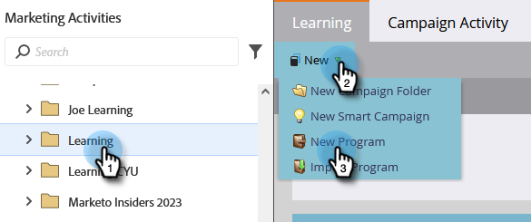

# Página com formulário {#landing-page-with-a-form}

## Missão: criar uma página de aterrissagem com um formulário para adquirir novas pessoas. {#mission-create-a-landing-page-with-a-form-to-acquire-new-people}

>[!PREREQUISITES]
>
>[Configurar e adicionar uma pessoa](/help/marketo/getting-started/quick-wins/get-set-up-and-add-a-person.md)

## ETAPA 1: Criar um programa {#step-create-a-program}

1. Vá para a **[!UICONTROL Atividades de marketing]** área.

   

1. Selecione o **Aprendizado** pasta criada no [vitória rápida anterior](/help/marketo/getting-started/quick-wins/send-an-email.md){target="_blank"}. Em **[!UICONTROL Novo]**, clique em **[!UICONTROL Novo programa]**.

   

1. Inserir um programa **[!UICONTROL Nome]**, selecione um **[!UICONTROL Canal]** e clique em **[!UICONTROL Criar]**.

   

   >[!TIP]
   >
   >Inclua suas iniciais no final do nome do programa para torná-lo exclusivo.

   >[!NOTE]
   >
   >Um programa é uma iniciativa de marketing específica. A variável **channel** deve ser o mecanismo de entrega, como Webinar, Patrocínio ou Anúncio online. Você pode ver diferentes opções de canal no menu suspenso, dependendo do que está disponível em sua própria instância. Também é possível [criar seu próprio canal](/help/marketo/product-docs/administration/tags/create-a-program-channel.md){target="_blank"}.

Muito bem! Agora que criamos um programa, vamos criar conteúdo.

## ETAPA 2: Criar um formulário {#step-create-a-form}

1. Com seu programa selecionado, clique no botão **[!UICONTROL Novo]** e selecione **[!UICONTROL Novo ativo local]**.

   

1. Selecionar **[!UICONTROL Formulário]**.

   

1. Insira um formulário **[!UICONTROL Nome]** e clique em **[!UICONTROL Criar]**.

   

   >[!NOTE]
   >
   >Verifique se **[!UICONTROL Abrir no editor]** está marcada. Se não estiver, clique no link **[!UICONTROL Editar formulário]** guia.

   >[!TIP]
   >
   >Não está vendo o editor de formulários? Seu navegador provavelmente bloqueou a janela. Ativar pop-ups de `app.marketo.com` no navegador e clique em Editar rascunho na barra de menu superior.

1. Selecione o **[!UICONTROL Endereço de e-mail]** campo e verificação **[!UICONTROL É Obrigatório]**.

   

1. Clique em **[!UICONTROL Próxima]**.

   

1. Clique nas setas para percorrer os temas. Selecione um.

   

1. Clique em **[!UICONTROL Próxima]**.

   

1. Na seção Página de agradecimento, selecione **[!UICONTROL URL externo]** para **[!UICONTROL Acompanhar com]**.

   

1. Insira o URL.

   

   >[!NOTE]
   >
   >A página de acompanhamento é o local para onde o visitante é redirecionado após preencher o formulário. O URL externo é uma opção, mas há mais. Consulte [Definir um formulário da página de agradecimento](/help/marketo/product-docs/demand-generation/forms/creating-a-form/set-a-form-thank-you-page.md){target="_blank"}.

1. Clique em **[!UICONTROL Concluir]**.

   

1. Clique em **[!UICONTROL Aprovar e fechar]**.

   

   Ótimo! Agora você tem um programa com um formulário nele. Vamos criar uma página.

## ETAPA 3: Criar uma página de aterrissagem e adicionar o formulário {#step-create-a-landing-page-and-add-your-form}

1. Com seu programa selecionado, clique no botão **[!UICONTROL Novo]** e selecione **[!UICONTROL Novo ativo local]**.

   

1. Selecionar **[!UICONTROL Landing Page]**.

   

1. Insira uma página **[!UICONTROL Nome]**, selecione um modelo e clique em **[!UICONTROL Criar]**.

   >[!NOTE]
   >
   >Você pode ter um modelo diferente do que o da nossa captura de tela, tudo bem, basta escolher um e continuar.

   

1. Quando o editor de landing page for aberto, arraste a [!UICONTROL Formulário] elemento na tela.

   

1. Localize e selecione o formulário e clique em **[!UICONTROL Inserir]**.

   

1. Arraste o formulário para o local desejado.

   

1. Todas as alterações são salvas automaticamente. Feche a guia/janela do editor de formulários.

   

   Excelente trabalho! Agora você tem uma página de aterrissagem com um formulário. Vamos aprovar sua página para torná-la disponível.

## ETAPA 4: Aprovar a landing page {#step-approve-your-landing-page}

1. Selecione a landing page e clique em **[!UICONTROL Aprovar rascunho]**.

   

   >[!NOTE]
   >
   >A aprovação da landing page a tornará ativa e disponível para acesso na Internet.

   Perfeita! Você vê a marca verde nele?

   

## ETAPA 5: Testar o formulário {#step-test-your-form}

1. Selecione a landing page e clique em **[!UICONTROL Visualizar página aprovada]**.

   

1. Preencha o formulário com as informações que você sabe que são exclusivas e clique em **[!UICONTROL Enviar]**.

   

1. Vá para a **[!UICONTROL Banco de dados]** área.

   

1. Procure o endereço de email exclusivo que você usou ao preencher o formulário.

   

   Aí está! Você criou uma nova página de aterrissagem com um formulário e a usou para gerar uma nova pessoa.

   

## Missão cumprida! {#mission-complete}

  

[◄ Missão 1: enviar e-mail por meio de programa de envio](/help/marketo/getting-started/quick-wins/send-an-email.md)

[Missão 3: pontuação simples ►](/help/marketo/getting-started/quick-wins/simple-scoring.md)
