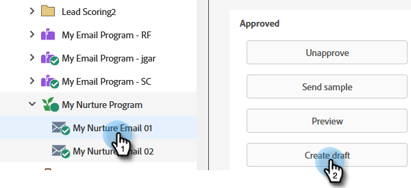
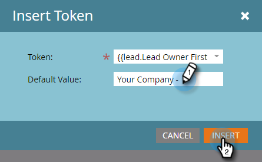
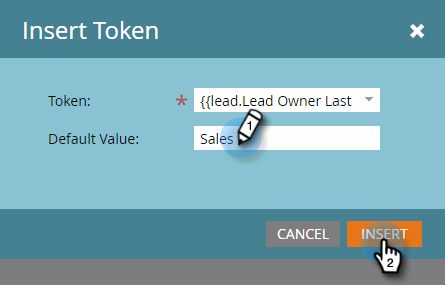

# Personalizar um email {#personalize-an-email}

## Missão: personalizar seus emails adicionando tokens de dados {#mission-make-your-emails-personal-by-adding-data-tokens}

>[!PREREQUISITES]
>
>* [Configurar e adicionar uma pessoa](/help/marketo/getting-started/quick-wins/get-set-up-and-add-a-person.md){target="_blank"}
>* [Enviar um email em massa](/help/marketo/getting-started/quick-wins/send-an-email.md){target="_blank"}
>* [Estímulo gota a gota](/help/marketo/getting-started/quick-wins/drip-drip-nurture.md){target="_blank"}

## Etapa 1: selecionar um email para personalizar {#step-select-an-email-to-personalize}

1. Selecione um dos emails de estímulo criados na [missão rápida anterior](/help/marketo/getting-started/quick-wins/drip-drip-nurture.md){target="_blank"} e clique em **[!UICONTROL Criar rascunho]**.

   

   >[!NOTE]
   >
   >Isso criará uma cópia do email como rascunho. Você deve aprovar o rascunho para que as alterações entrem em vigor.

Se você não tiver habilitado um bloqueador de pop-up, o editor de email será aberto em uma nova guia/janela. Caso contrário, clique duas vezes em **[!UICONTROL Criar rascunho]**.

## Etapa 2: definir o(a) vendedor(a) como remetente {#step-make-the-salesperson-the-sender}

1. Selecione o campo **[!UICONTROL De]**, destaque e **exclua** o nome atual.

   

1. Clique no ícone **Token** à direita do campo **[!UICONTROL De]**.

   

1. Localize e selecione o token **`{{lead.Lead Owner First Name}}`**.

   

1. Digite o nome da sua empresa e um hífen em **Valor padrão** para garantir que algo seja exibido caso o primeiro nome do(a) representante de vendas não esteja disponível. Clique em **Inserir**.

   

1. Pressione a barra de espaço no campo **[!UICONTROL De]**, certificando-se de que o cursor esteja piscando um espaço após o token que você acabou de inserir. Em seguida, clique novamente no ícone **Token**.

   

1. Localize e selecione o token **`{{lead.Lead Owner Last Name}}`**.

   

1. Digite “Vendas” no **Valor padrão** e clique em **Inserir**.

   

## Etapa 3: adicionar o nome do lead no email {#step-add-the-leads-name-to-the-email}

1. Selecione a seção editável superior, clique no ícone de engrenagem e selecione **[!UICONTROL Editar]**.

   

1. Adicione um espaço depois de “Olá” e coloque o cursor na frente da vírgula, depois clique no ícone **Inserir token**.

   

1. Localize e selecione o token **`{{lead.First Name}}`**.

   

1. Insira “Amigo(a)” (ou qualquer rótulo que desejar) no campo **[!UICONTROL Valor padrão]** e clique em **[!UICONTROL Inserir]**.

   

   >[!TIP]
   >
   >Sempre inclua um valor padrão para os tokens, pois isso garante que o valor padrão seja exibido no email caso faltem algumas das informações pessoais. 

1. Clique em **[!UICONTROL Salvar]**.

   

1. Clique em **[!UICONTROL Ações de email]** e selecione **[!UICONTROL Aprovar e fechar]**.

   

>[!TIP]
>
>Precisa de uma dica rápida para lembrar como enviar o email para si mesmo(a)? Consulte [Enviar um email em massa](/help/marketo/getting-started/quick-wins/send-an-email.md){target="_blank"}.

### Missão cumprida {#mission-complete}

Parabéns, você personalizou seu e-mail! 

  

[◄ Missão 6: estímulo gota a gota](/help/marketo/getting-started/quick-wins/drip-drip-nurture.md)

[Missão 8: alertar o(a) representante de vendas ►](/help/marketo/getting-started/quick-wins/alert-the-sales-rep.md)
