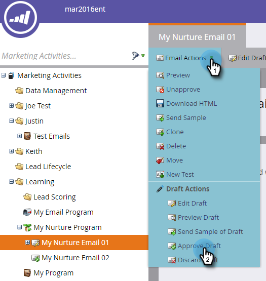

# Personalizar um email {#personalize-an-email}

## Missão: Torne seus emails pessoais adicionando tokens de dados {#mission-make-your-emails-personal-by-adding-data-tokens}

>[!NOTE]
>
>**FYI**
>
>O Marketo agora está padronizando o idioma em todas as subscrições, portanto você pode ver o lead/lead na sua subscrição e a pessoa/pessoas em docs.marketo.com. Estes termos significam a mesma coisa. isso não afeta as instruções do artigo. Há outras mudanças também. [Saiba mais](http://docs.marketo.com/display/DOCS/Updates+to+Marketo+Terminology).

>[!NOTE]
>
>**Pré-requisitos**
>
>* [Configurar e adicionar uma pessoa](get-set-up-and-add-a-person.md)
>* [Enviar uma Explosão de Email](send-an-email.md)
>* [Derramamento, Derramamento, Enfermeira](drip-drip-nurture.md)

## Etapa 1: Selecione um email para personalizar {#step-select-an-email-to-personalize}

1. Selecione um dos emails de criação criados na vitória [rápida](drip-drip-nurture.md) anterior e clique em **Editar rascunho**.

   

   >[!NOTE]
   >
   >Isso cria uma cópia do email como rascunho. Você deve aprovar o rascunho para que as alterações entrem em vigor.

   **Editar rascunho**

Se você não tiver ativado um bloqueador de pop-ups, o editor de e-mail será aberto em uma nova guia/janela. Caso contrário, clique duas vezes.

## Etapa 2: Transformar o vendedor no remetente {#step-make-the-salesperson-the-sender}

1. Selecione o campo **De** , realce e **exclua** o nome atual.

   

1. Clique no ícone **Token** à direita do campo **De** .

   

1. Localize e selecione o **`{{lead.Lead Owner First Name}}`** token.

   

1. Digite o nome da empresa e um traço para o Valor **** padrão para garantir que algo seja exibido caso o nome do representante de vendas não esteja disponível. Clique em **Inserir**.

   

1. Pressione a barra de espaço no campo **De** , certificando-se de que o cursor esteja piscando um espaço após o token inserido. Em seguida, clique novamente no ícone **Token** .

   

1. Localize e selecione o **`{{lead.Lead Owner Last Name}}`** token.

   

1. Digite &quot;Sales&quot; para o Valor **** padrão e clique em **Insert**.

   

## Etapa 3: Adicione o nome do cliente potencial ao email {#step-add-the-leads-name-to-the-email}

1. Selecione a seção editável superior, clique no ícone de engrenagem e selecione **Editar**.

   

1. Adicione um espaço depois de &quot;Hello&quot;, posicione o cursor na frente da vírgula e clique no ícone **Inserir token** .

   

1. Localize e selecione o **`{{lead.First Name}}`** token.

   

1. Digite &quot;Friend&quot; (ou qualquer rótulo que você gostaria) no campo Valor **** padrão e clique em **Inserir**.

   

   >[!TIP]
   >
   >Sempre incluir um valor padrão para tokens; isso garante que o valor padrão será exibido no email se alguma parte das informações pessoais estiver ausente.

1. Clique em **Salvar**.

   

1. Feche a guia/janela do editor de email.

   

1. Em Ações **de** email, selecione **Aprovar rascunho**.

   

>[!TIP]
>
>Precisa de uma atualização rápida sobre como enviar o e-mail para você mesmo? Consulte [Enviar uma explosão](send-an-email.md)de email.

### Assistir a um vídeo {#watch-a-video}

`<iframe width="630" height="470" src="//play.vidyard.com/iRnqxMyJg6VKyuPeuxmHFb.html?v=3.1.1" frameborder="0" allowfullscreen></iframe>`

### Missão concluída {#mission-complete}

Parabéns, você personalizou seu email!

  

[◄ Missão 6: Unidade, Perfuração,](drip-drip-nurture.md) Missão de Enfermeira [8: Alerte o representante de vendas ►](alert-the-sales-rep.md)