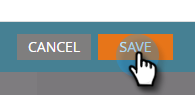

# Personalizar um e-mail {#personalize-an-email}

## Missão: personalizar seus e-mails adicionando tokens de dados {#mission-make-your-emails-personal-by-adding-data-tokens}

>[!PREREQUISITES]
>
>* [Configure e adicione uma pessoa](/help/marketo/getting-started/quick-wins/get-set-up-and-add-a-person.md){target="_blank"}
>* [Enviar e-mail por meio de programa de envio](/help/marketo/getting-started/quick-wins/send-an-email.md){target="_blank"}
>* [Drip, Drip, Nurture](/help/marketo/getting-started/quick-wins/drip-drip-nurture.md){target="_blank"}

## Etapa 1: selecionar um e-mail para personalizar {#step-select-an-email-to-personalize}

1. Selecione um dos emails de criação criados no [quick win anterior](/help/marketo/getting-started/quick-wins/drip-drip-nurture.md){target="_blank"} e clique em **[!UICONTROL Criar rascunho]**.

   

   >[!NOTE]
   >
   >Isso criará uma cópia do e-mail como rascunho. Lembre-se de aprovar o rascunho para que as alterações entrem em vigor.

Se você não tiver ativado um bloqueador de pop-ups, o editor de email será aberto em uma nova guia/janela. Caso contrário, clique duas vezes em **[!UICONTROL Criar rascunho]**.

## Etapa 2: Transformar o Vendedor no Remetente {#step-make-the-salesperson-the-sender}

1. Selecione o campo **[!UICONTROL De]**, destaque e **exclua** o nome atual.

   

1. Clique no ícone **Token** à direita do campo **[!UICONTROL De]**.

   

1. Localize e selecione o token **`{{lead.Lead Owner First Name}}`**.

   

1. Digite o nome da sua empresa e um traço para o **Valor padrão** para garantir que algo seja exibido caso o nome do representante de venda não esteja disponível. Clique em **Inserir**.

   

1. Pressione a barra de espaços no campo **[!UICONTROL De]**, certificando-se de que o cursor está piscando um espaço após o token que você acabou de inserir. Em seguida, clique novamente no ícone **Token**.

   

1. Localize e selecione o token **`{{lead.Lead Owner Last Name}}`**.

   

1. Digite &quot;Vendas&quot; para o **Valor Padrão** e clique em **Inserir**.

   

## Etapa 3: adicionar o nome do lead ao e-mail {#step-add-the-leads-name-to-the-email}

1. Selecione a seção editável superior, clique no ícone de engrenagem e selecione **[!UICONTROL Editar]**.

   

1. Adicione um espaço depois de &quot;Olá&quot;, coloque o cursor na frente da vírgula e clique no ícone **Inserir token**.

   

1. Localize e selecione o token **`{{lead.First Name}}`**.

   

1. Insira &quot;Friend&quot; (ou qualquer rótulo que desejar) no campo **[!UICONTROL Valor Padrão]** e clique em **[!UICONTROL Inserir]**.

   

   >[!TIP]
   >
   >Sempre inclua um valor padrão para tokens; isso garante que o valor padrão seja exibido no email se alguma parte das informações pessoais estiver ausente.

1. Clique em **[!UICONTROL Salvar]**.

   

1. Em **[!UICONTROL Ações de email]** e selecione **[!UICONTROL Aprovar e Fechar]**.

   

>[!TIP]
>
>Precisa de uma dica rápida para lembrar como enviar o e-mail para si mesmo? Consulte [Enviar um email Blast](/help/marketo/getting-started/quick-wins/send-an-email.md){target="_blank"}.

### Missão cumprida {#mission-complete}

Parabéns, você personalizou seu e-mail! 

  

[Missão 6: Gotejamento, Gotejamento, Alimentação](/help/marketo/getting-started/quick-wins/drip-drip-nurture.md)

[Missão 8: Alertar o Representante de Vendas ►](/help/marketo/getting-started/quick-wins/alert-the-sales-rep.md)
