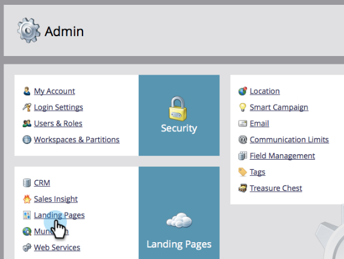

# Redirecionar uma página {#redirect-a-landing-page}

## Missão: redirecionar uma página para outra página da Web {#mission-redirect-a-landing-page-to-a-different-web-page}

>[!NOTE]
>
>**Permissões de administrador necessárias**

>[!PREREQUISITES]
>
>* [Página com formulário](/help/marketo/getting-started/quick-wins/landing-page-with-a-form.md){target="_blank"}
>* [Personalizar a URL da sua página de aterrissagem com um CNAME](/help/marketo/product-docs/demand-generation/landing-pages/landing-page-actions/customize-your-landing-page-urls-with-a-cname.md){target="_blank"}

## Etapa 1: iniciar uma nova regra de redirecionamento {#step-start-a-new-redirect-rule}

1. Vá para a área **[!UICONTROL Administrador]**.

   

1. Ir para **[!UICONTROL Páginas de Aterrissagem]**.

   

1. Clique na guia **[!UICONTROL Regras]** e em **[!UICONTROL Nova]** e **[!UICONTROL Nova Regra de Redirecionamento]**.

   

## Etapa 2: definir a regra de redirecionamento {#step-define-the-redirect-rule}

1. Clique no primeiro menu suspenso **[!UICONTROL URL Original]** e selecione seu CNAME do Marketo.

   

   >[!NOTE]
   >
   >Lembre-se: você só pode redirecionar páginas iniciadas com seu [CNAME](/help/marketo/product-docs/demand-generation/landing-pages/landing-page-actions/customize-your-landing-page-urls-with-a-cname.md){target="_blank"} do Marketo.

1. Clique na segunda lista suspensa **[!UICONTROL URL Original]** e selecione a página de aterrissagem que deseja redirecionar.

   

1. Para **[!UICONTROL Redirecionar URL]**, selecione a página para a qual deseja redirecionar e clique em **[!UICONTROL Criar]**.

   

## Missão cumprida {#mission-complete}

Parabéns! Você redirecionou uma página de aterrissagem com êxito.

  

[Ü Missão 9: Atualizar os dados de clientes em potencial](/help/marketo/getting-started/quick-wins/update-person-data.md)
