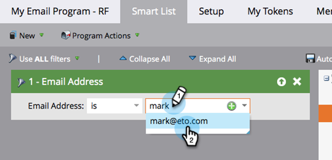
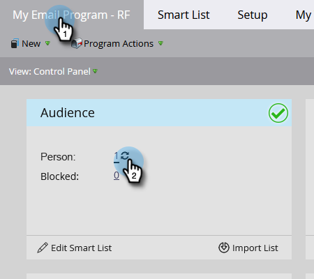

# Enviar um email {#send-an-email}

É a primeira coisa que todos querem fazer. Vamos enviar um email usando o Marketo

>[!PREREQUISITES]
>
>[Configurar e adicionar uma pessoa](/help/marketo/getting-started/quick-wins/get-set-up-and-add-a-person.md){target="_blank"}

## Criar um programa de email {#create-an-email-program}

1. Acesse a área **[!UICONTROL Atividades de marketing]**.

   

1. Selecione a pasta **[!UICONTROL Aprendizado]**. Clique no menu suspenso **[!UICONTROL Novo]** e selecione **[!UICONTROL Novo programa]**.

   

1. Insira um **[!UICONTROL Nome]** e selecione **[!UICONTROL Email]** em **[!UICONTROL Tipo de programa]**.

   >[!TIP]
   >
   >Adicione suas iniciais no final do nome do programa para torná-lo exclusivo.

   

1. Em **[!UICONTROL Canal]**, selecione **[!UICONTROL Envio de email]** e clique em **[!UICONTROL Criar]**.

   

## Defina seu público-alvo {#define-your-audience}

1. Clique em **[!UICONTROL Editar lista inteligente]** no bloco [!UICONTROL Público-alvo].

   

1. Localize o filtro [!UICONTROL Endereço de email] e arraste-o para a tela.

   

   >[!TIP]
   >
   >Use a função **[!UICONTROL Pesquisar]** para encontrar filtros com mais facilidade.

1. Localize e selecione o seu endereço de email.

   

   >[!NOTE]
   >
   >Se o email não for preenchido automaticamente, talvez você tenha esquecido de [configurar e adicionar um lead](/help/marketo/getting-started/quick-wins/get-set-up-and-add-a-person.md){target="_blank"}.

   >[!NOTE]
   >
   >Neste exemplo, vamos fazer com que o email seja enviado somente para você mesmo(a), mas é possível personalizar o público-alvo conforme desejar.

1. Volte para a guia principal do programa e clique no ícone de atualização de **[!UICONTROL Pessoa]**.

   

   Você deve ver a contagem de pessoas subir para 1. Essa pessoa é você.

## Criar um email {#create-an-email}

1. No bloco Email, clique em **[!UICONTROL Novo email]**.

   

1. Insira um **[!UICONTROL Nome]**, selecione um **Modelo** e clique em **[!UICONTROL Criar]**.

   

1. A janela do editor de email será aberta. Insira um assunto com 50 caracteres ou menos (recomendado).

   

   >[!NOTE]
   >
   >Caso tenha um bloqueador de pop-up, clique em **[!UICONTROL Editar rascunho]** para entrar no editor de email.

1. Selecione a área que deseja editar, clique no ícone de engrenagem à direita e escolha **[!UICONTROL Editar]** (também é possível clicar duas vezes na seção editável para editar).

   

1. Insira o conteúdo desejado e clique em **[!UICONTROL Salvar]**.

   

1. Clique no menu suspenso **[!UICONTROL Ações de email]** e selecione **[!UICONTROL Aprovar e fechar]**.

   

   >[!TIP]
   >
   >Deseja enviar a você mesmo(a) uma amostra rápida para ver a aparência do email antes de iniciar? Selecione **[!UICONTROL Enviar amostra]** no menu acima ou clique em **[!UICONTROL Ações de email]** e depois em [**[!UICONTROL Enviar amostra]**](/help/marketo/product-docs/email-marketing/general/creating-an-email/send-a-sample-email.md){target="_blank"}.

1. Selecione o programa de email na árvore à esquerda.

   

1. No bloco [!UICONTROL Cronograma], defina o dia de inicialização do email como **[!UICONTROL Hoje]**.

   

   >[!NOTE]
   >
   >Saiba mais sobre [Fuso horário do destinatário](/help/marketo/product-docs/email-marketing/email-programs/email-program-actions/scheduling-with-recipient-time-zone/schedule-email-programs-with-recipient-time-zone.md){target="_blank"} e [Início rápido](/help/marketo/product-docs/email-marketing/email-programs/email-program-actions/head-start-for-email-programs.md){target="_blank"}.

1. Selecione um horário que esteja pelo menos 15 minutos à frente.

   

   >[!TIP]
   >
   >O fuso horário padrão não é o seu? Saiba como [atualizá-lo aqui](/help/marketo/product-docs/administration/settings/select-your-language-locale-and-time-zone.md){target="_blank"}.

1. Clique em **[!UICONTROL Aprovar programa]** no bloco [!UICONTROL Aprovação] e pronto.

   

Você deve receber o email logo após o dia/hora agendados.

## Missão cumprida! {#mission-complete}

  

[◄ Configurar e adicionar uma pessoa](/help/marketo/getting-started/quick-wins/get-set-up-and-add-a-person.md)

[Missão 2: página de destino com um formulário ►](/help/marketo/getting-started/quick-wins/landing-page-with-a-form.md)
