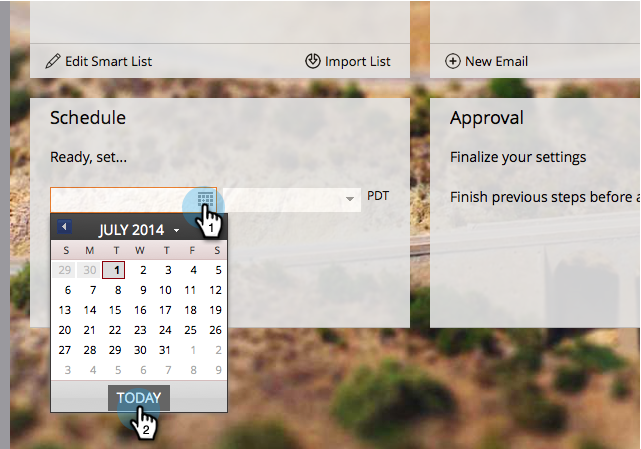

# Enviar um email {#send-an-email}

É a primeira coisa que todos querem fazer. Vamos enviar um e-mail para fora de Marketo!

>[!PREREQUISITES]
>
>[Configurar e adicionar uma pessoa](/help/marketo/getting-started/quick-wins/get-set-up-and-add-a-person.md)

## Criar um Programa de email {#create-an-email-program}

1. Vá para a área **Atividades de marketing**.

   

1. Selecione sua pasta **Learning**. Clique no menu suspenso **Novo** e selecione **Novo Programa**.

   

1. Digite um **Nome** e selecione **Email** para **Tipo de Programa.**

   >[!TIP]
   >
   >Adicione suas iniciais ao final do nome do programa para torná-lo exclusivo.

   

1. Em **Canal**, selecione **Enviar por email** e clique em **Criar**.

   

## Defina sua Audiência {#define-your-audience}

1. Clique em **Editar Lista inteligente** no bloco Audiência.

   

1. Localize e arraste o filtro Endereço de email para a tela.

   

   >[!TIP]
   >
   >Use **Pesquise** na parte superior da lista de Filtros para encontrar o filtro mais facilmente.

1. Localize e selecione seu endereço de email.

   

   >[!NOTE]
   >
   >Se o seu email não for preenchido automaticamente, você pode ter esquecido de [Configurar e Adicionar um cliente potencial.](/help/marketo/getting-started/quick-wins/get-set-up-and-add-a-person.md)

   >[!NOTE]
   >
   >Neste exemplo, você está mandando o email para você mesmo, mas pode personalizar a audiência como quiser.

1. Volte para a guia programa principal e clique no ícone de atualização para **Pessoa**.

   

   Você deve ver a contagem de pessoas aumentar para 1. É você!

## Criar um email {#create-an-email}

1. No bloco Email, clique em **Novo email**.

   

1. Digite um **Nome**, selecione um **Modelo** e clique em **Criar**.

   

1. A janela do editor de email será aberta. Insira um assunto com 50 caracteres ou menos (recomendado).

   

   >[!NOTE]
   >
   >Se você tiver um bloqueador de pop-ups, clique em **Editar rascunho** para entrar no editor de e-mail.

1. Selecione a área que deseja editar, clique no ícone de engrenagem à direita e selecione **Editar** (você também pode clicar com o duplo na seção editável para editar).

   

1. Digite o conteúdo desejado e clique em **Salvar**.

   

1. As alterações serão salvas automaticamente. Feche a guia/janela do editor.

   

1. Clique no menu suspenso **Ações de e-mail** e selecione **Aprovar**.

   

   >[!TIP]
   >
   >Quer enviar uma amostra rápida para ver a aparência do seu email antes de iniciar? Selecione **Enviar amostra** no menu acima, ou clique em **Ações de e-mail** e em [**Enviar amostra**](/help/marketo/product-docs/email-marketing/general/creating-an-email/send-a-sample-email.md).

1. Selecione o Programa Email na árvore esquerda.

   

1. No bloco Agendamento, defina o dia de inicialização do email como **Hoje.**

   

1. Selecione um horário que tenha pelo menos 15 minutos no futuro.

   

   >[!TIP]
   >
   >O fuso horário padrão não é seu? Saiba como [atualizá-lo aqui](/help/marketo/product-docs/administration/settings/select-your-language-locale-and-time-zone.md).

1. Clique em **Aprovar Programa** no bloco Aprovação e você está pronto!

   

Você deve receber o email logo após o dia/hora agendada.

  

[◄ Configure e adicione um cliente potencial](/help/marketo/getting-started/quick-wins/get-set-up-and-add-a-person.md)

[landing page com um formulário ►](/help/marketo/getting-started/quick-wins/landing-page-with-a-form.md)
