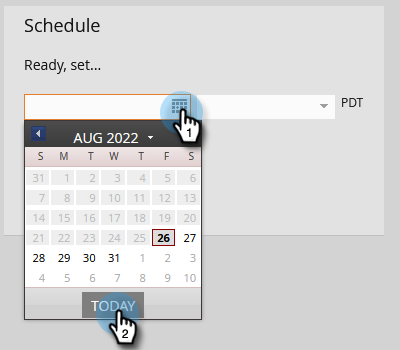

# Enviar um e-mail {#send-an-email}

É a primeira coisa que todos querem fazer. Vamos enviar um email do Marketo.

>[!PREREQUISITES]
>
>[Configurar e adicionar uma pessoa](/help/marketo/getting-started/quick-wins/get-set-up-and-add-a-person.md){target="_blank"}

## Criar um programa de email {#create-an-email-program}

1. Vá para a **[!UICONTROL Atividades de marketing]** área.

   

1. Selecione o **[!UICONTROL Aprendizado]** pasta. Clique em **[!UICONTROL Novo]** e selecione **[!UICONTROL Novo programa]**.

   

1. Insira um **[!UICONTROL Nome]** e selecione **[!UICONTROL E-mail]** para **[!UICONTROL Tipo de programa]**.

   >[!TIP]
   >
   >Adicione as iniciais ao final do nome do programa para torná-lo exclusivo.

   

1. Em **[!UICONTROL Canal]**, selecione **[!UICONTROL Envio de email]** e clique em **[!UICONTROL Criar]**.

   

## Definir o público-alvo {#define-your-audience}

1. Clique em **[!UICONTROL Editar lista inteligente]** no [!UICONTROL Público] bloco.

   

1. Localize e arraste o [!UICONTROL Endereço de e-mail] filtro na tela de desenho.

   

   >[!TIP]
   >
   >Use o **[!UICONTROL Pesquisar]** para encontrar filtros mais facilmente.

1. Localize e selecione seu endereço de email.

   

   >[!NOTE]
   >
   >Se o email não for preenchido automaticamente, talvez você tenha esquecido de [Configurar e adicionar um cliente potencial.](/help/marketo/getting-started/quick-wins/get-set-up-and-add-a-person.md){target="_blank"}

   >[!NOTE]
   >
   >Neste exemplo, estamos solicitando que você envie o email somente para você mesmo, mas você pode personalizar o público conforme desejar.

1. Volte para a guia principal do programa e clique no ícone de atualização para **[!UICONTROL Person]**.

   

   Você deve ver a contagem de pessoas subir para 1. É você!

## Criar um email {#create-an-email}

1. No bloco Email, clique em **[!UICONTROL Novo email]**.

   

1. Insira um **[!UICONTROL Nome]**, selecione um **Modelo** e clique em **[!UICONTROL Criar]**.

   

1. A janela do editor de email será aberta. Insira um assunto com 50 caracteres ou menos (recomendado).

   

   >[!NOTE]
   >
   >Se você tiver um bloqueador de pop-ups, clique em **[!UICONTROL Editar rascunho]** para entrar no editor de email.

1. Selecione a área que deseja editar, clique no ícone de engrenagem à direita e selecione **[!UICONTROL Editar]** (você também pode clicar duas vezes na seção editável para editar ).

   

1. Insira o conteúdo desejado e clique em **[!UICONTROL Salvar]**.

   

1. Clique em **[!UICONTROL Ações de email]** e selecione **[!UICONTROL Aprovar e fechar]**.

   

   >[!TIP]
   >
   >Deseja enviar uma amostra rápida para ver a aparência do email antes de iniciar? Selecionar **[!UICONTROL Enviar amostra]** no menu acima ou clique em **[!UICONTROL Ações de email]** depois [**[!UICONTROL Enviar amostra]**](/help/marketo/product-docs/email-marketing/general/creating-an-email/send-a-sample-email.md){target="_blank"}.

1. Selecione o Programa de email na árvore esquerda.

   

1. No [!UICONTROL Agendar] bloco, defina o dia de inicialização do email como **[!UICONTROL Hoje]**.

   

   >[!NOTE]
   >
   >Saiba mais sobre [Fuso horário do recipient](/help/marketo/product-docs/email-marketing/email-programs/email-program-actions/scheduling-with-recipient-time-zone/schedule-email-programs-with-recipient-time-zone.md){target="_blank"} and [Head Start](/help/marketo/product-docs/email-marketing/email-programs/email-program-actions/head-start-for-email-programs.md){target="_blank"}.

1. Selecione uma hora que seja de pelo menos 15 minutos no futuro.

   

   >[!TIP]
   >
   >O fuso horário padrão não é seu? Saiba como [atualize aqui](/help/marketo/product-docs/administration/settings/select-your-language-locale-and-time-zone.md){target="_blank"}.

1. Clique em **[!UICONTROL Aprovar programa]** no [!UICONTROL Aprovação] mosaico e pronto!

   

Você deve receber o email logo após o dia/hora agendados.

## Missão cumprida! {#mission-complete}

  

[} Configuração e Adição de uma Pessoa](/help/marketo/getting-started/quick-wins/get-set-up-and-add-a-person.md)

[Missão 2: página com formulário ►](/help/marketo/getting-started/quick-wins/landing-page-with-a-form.md)
