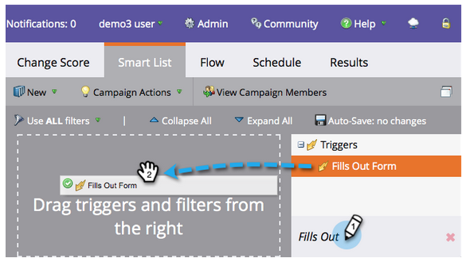
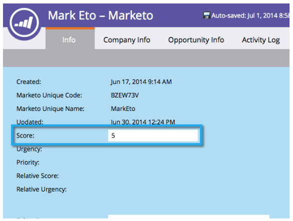

# Pontuação simples {#simple-scoring}

>[!PREREQUISITES]
>
>* [Configurar e adicionar uma pessoa](get-set-up-and-add-a-person.md)
>* [landing page com um formulário](landing-page-with-a-form.md)

## Etapa 1: Criar uma Campanha de Pontuação {#step-create-a-scoring-campaign}

1. Vá para a área **Marketing Atividade** .

   

1. Clique com o botão direito do mouse na pasta **Learning** e clique em **Nova pasta** de campanha.

   

1. Nomeie a pasta de campanha como &quot;Pontuação&quot;.

   

   >[!NOTE]
   >
   >Se você já tiver uma pasta de Pontuação, nomeie essa pasta como algo diferente, como Pontuação 1. Os nomes das pastas devem ser exclusivos.

1. Em seguida, clique com o botão direito do mouse na nova pasta **Pontuação** e selecione **Nova Campanha** inteligente.

   

1. **Nomeie** a campanha como &quot;Alterar pontuação&quot; e clique em **Criar**.

   

1. Clique na guia **Lista** inteligente.

   

   Queremos que essa campanha seja executada sempre que uma pessoa preencher seu Formulário **de solicitação de** avaliação.

1. Encontre e arraste o acionador de formulário **** Preenchimentos para fora para a tela esquerda.

   

1. Selecione **Meu formulário**.

   >[!NOTE]
   >
   >Se você concluiu a [Landing page com uma vitória rápida do formulário](/help/marketo/getting-started/quick-wins/landing-page-with-a-form.md) , é necessário ter o formulário. Se você usou um nome diferente para o formulário, selecione-o.

   

1. Clique na guia **Fluxo** .

   

1. Arraste a ação de fluxo **Alterar pontuação** para a tela esquerda.

   

1. Você pode digitar qualquer valor para adicionar à pontuação da pessoa. Insira &quot;+5&quot; no campo **Alterar** .

   

   >[!TIP]
   >
   >Boas campanhas de pontuação são fundamentais para fornecer pessoas de alta qualidade para o setor de Vendas. Leia [**o Guia Definitivo para Pontuação**](https://www.marketo.com/definitive-guides/lead-scoring/)de Chumbo.

1. Clique na guia **Agendamento** e no botão **Ativar** .

   

1. Clique em **Ativar** na tela de confirmação.

   

>[!NOTE]
>
>Uma vez ativa, essa campanha será executada sempre que uma pessoa preencher o formulário. A campanha continuará funcionando até ser desativada.

## Etapa 2: Preencha o formulário {#step-fill-out-the-form}

1. Selecione a landing page criada na [Landing page com uma vitória rápida do formulário](/help/marketo/getting-started/quick-wins/landing-page-with-a-form.md) .

   

1. Clique em **Visualização da página** aprovada. A landing page será aberta em uma nova guia.

   

1. Preencha o formulário com seu nome, sobrenome e endereço de email e clique em **Enviar**.

   

   >[!NOTE]
   >
   >Use o mesmo nome e endereço de email que você usou quando se inseriu pela primeira vez como pessoa para aplicar o aumento de pontuação &quot;+5&quot;.

## Etapa 3: Visualização das informações da pessoa {#step-view-the-person-info}

1. Vá para a área Banco de Dados.

   

1. Procure o endereço de email usado ao preencher o formulário.

   

1. Duplo clique em sua pessoa.

   

Os detalhes pessoais serão abertos em uma nova guia ou janela. Veja como sua pontuação aumentou em 5 pontos para preencher o formulário?!

**Parabéns!** Você criou uma campanha de pontuação.
[◄ Missão 2: landing page com um formulário](/help/marketo/getting-started/quick-wins/landing-page-with-a-form.md)

[Missão 4: Resposta automática por email ►](/help/marketo/getting-started/quick-wins/email-auto-response.md)
