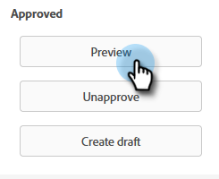

# Pontuação simples {#simple-scoring}

>[!PREREQUISITES]
>
>* [Configure e adicione uma pessoa](/help/marketo/getting-started/quick-wins/get-set-up-and-add-a-person.md){target="_blank"}
>* [Página com formulário](/help/marketo/getting-started/quick-wins/landing-page-with-a-form.md){target="_blank"}

## Etapa 1: &#x200B;criar uma campanha de pontuação {#step-create-a-scoring-campaign}

1. Vá para a área **[!UICONTROL Atividades de marketing]**.

   

1. Clique com o botão direito do mouse na pasta **Aprendizado** e clique em **[!UICONTROL Nova Pasta do Campaign]**.

   

1. Nomeie a pasta da campanha como &quot;Scoring&quot; e clique em **[!UICONTROL Criar]**.

   

   >[!NOTE]
   >
   >Se você já tiver uma pasta de pontuação, nomeie esta como algo diferente; por exemplo, Pontuação 1. Os nomes das pastas devem ser exclusivos.

1. Clique com o botão direito na pasta **Pontuação** e selecione **[!UICONTROL Nova Campanha Inteligente]**.

   

1. Nomeie a campanha como &quot;Alterar pontuação&quot; e clique em **[!UICONTROL Criar]**.

   

1. Clique na guia **[!UICONTROL Smart List]**.

   

   Queremos que esta campanha seja executada sempre que uma pessoa preencher o **Formulário de solicitação de avaliação**.

1. Localize e arraste o acionador **[!UICONTROL Preencher formulário]** para a tela esquerda.

   

1. Selecione **Meu Formulário**.

   

   >[!NOTE]
   >
   >Se você concluiu a [Página de Aterrissagem com um Formulário](/help/marketo/getting-started/quick-wins/landing-page-with-a-form.md){target="_blank"} de vitória rápida, deverá ter o formulário. Se você usou um nome diferente para o formulário, selecione-o.

1. Clique na guia **[!UICONTROL Fluxo]**.

   

1. Arraste a ação de fluxo **Alterar Pontuação** para a tela à esquerda.

   

1. Você pode digitar qualquer valor para adicionar à pontuação da pessoa. Vamos inserir &quot;+5&quot; no campo **[!UICONTROL Alterar]**.

   

   >[!TIP]
   >
   >As boas campanhas de pontuação são fundamentais para fornecer pessoas de alta qualidade às Vendas. Leia [**O Guia Definitivo para Pontuação de Cliente Potencial**](https://www.marketo.com/definitive-guides/lead-scoring/){target="_blank"}.

1. Clique na guia **[!UICONTROL Agendar]** e no botão **[!UICONTROL Ativar]**.

   

1. Clique em **[!UICONTROL Ativar]** na tela de confirmação.

   

>[!NOTE]
>
>Uma vez ativa, essa campanha será executada sempre que uma pessoa preencher o formulário. A campanha continuará em execução até ser desativada.

## Etapa 2: preencher o formulário {#step-fill-out-the-form}

1. Selecione a página de aterrissagem criada na [Página de aterrissagem com um Formulário](/help/marketo/getting-started/quick-wins/landing-page-with-a-form.md){target="_blank"} quick win.

   

1. Clique em **[!UICONTROL Visualizar]**. A landing page será aberta em uma nova guia.

   

1. Preencha o formulário com seu nome, sobrenome e endereço de email e clique em **[!UICONTROL Enviar]**.

   

   >[!NOTE]
   >
   >Use o mesmo nome e endereço de email que você usou quando inseriu a si mesmo como pessoa pela primeira vez para aplicar o aumento de pontuação &quot;+5&quot;.

## Etapa 3: Exibir as Informações de Pessoa {#step-view-the-person-info}

1. Vá para a área **[!UICONTROL Banco de Dados]**.

   

1. Procure o endereço de email que você usou ao preencher o formulário.

   

1. Clique duas vezes na pessoa.

   

Os detalhes da pessoa serão abertos em uma nova guia ou janela. Veja como sua pontuação aumentou em 5 pontos para preencher o formulário?

## Missão concluída! {#mission-complete}

  

[Ü Missão 2: Página de aterrissagem com um formulário](/help/marketo/getting-started/quick-wins/landing-page-with-a-form.md)

[Missão 4: Resposta automática de e-mail ►](/help/marketo/getting-started/quick-wins/email-auto-response.md)
