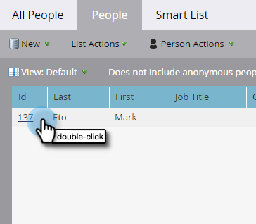

# Atualizar dados da pessoa {#update-person-data}

## Missão: atualizar as informações de contato de uma pessoa ou outros dados {#mission-update-a-persons-contact-info-or-other-data}

>[!PREREQUISITES]
>
>* [Configurar e adicionar uma pessoa](/help/marketo/getting-started/quick-wins/get-set-up-and-add-a-person.md){target="_blank"}
>* [Importar uma lista de pessoas](/help/marketo/getting-started/quick-wins/import-a-list-of-people.md){target="_blank"}

Imagine que, em sua recente feira de negócios, uma pessoa tenha fornecido informações adicionais de contato. Veja como atualizar os dados da pessoa.

## Encontre a pessoa que você precisa atualizar {#find-the-person-you-need-to-update}

1. Vá para o **[!UICONTROL Banco de dados]**.

   

1. Pesquise o nome ou endereço de email da pessoa.

   >[!TIP]
   >
   >Usar o endereço de email para pesquisar resultará em uma pesquisa mais rápida.

   

1. Clique duas vezes para abrir os detalhes da pessoa.

   

   >[!TIP]
   >
   >Há várias maneiras de atualizar dados pessoais no Marketo. Consulte [Importar uma lista de pessoas](/help/marketo/getting-started/quick-wins/import-a-list-of-people.md){target="_blank"} and [Change Data Value](/help/marketo/product-docs/core-marketo-concepts/smart-campaigns/flow-actions/change-data-value.md){target="_blank"}.

## Atualizar os dados da pessoa {#update-the-person-data}

1. Digite as novas informações recebidas e feche a guia.

>[!NOTE]
>
>Após a alteração dos dados, as listas e campanhas inteligentes reconhecerão imediatamente as novas informações.

## Missão cumprida {#mission-complete}

Excelente! Você atualizou seus dados pessoais.

  

[◄ Missão 8: alertar o representante de vendas](/help/marketo/getting-started/quick-wins/alert-the-sales-rep.md)

[Missão 10: &#x200B;redirecionar uma página ►](/help/marketo/getting-started/quick-wins/redirect-a-landing-page.md)
