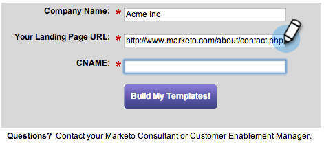

# Etapas de configuração {#setup-steps}

**Bem-vindo ao Marketo!**

Antes de começar a usar o Marketo, é necessário concluir algumas etapas.

Essas etapas incluem:

* alguma configuração básica de conta
* marcar seus URLs de landing page e links de email para melhorar a confiança e a entrega
* sincronização do CRM
* adicionar código de rastreamento ao site corporativo

>[!NOTE]
>
>Você só precisará fazer essas etapas se sua empresa for **nova no Marketo**. Caso contrário, a configuração pode já estar concluída.

Algumas etapas exigem ajuda da sua equipe de TI.

>[!TIP]
>
>Se você [imprimir essa lista](/help/marketo/getting-started/setup-steps/setup-checklist.md)de verificação, poderá desmarcar os itens ao concluí-los.

1. Fazer logon e criar usuários adicionais do Marketing

1. Faça logon no Marketo [aqui](https://app.marketo.com/) usando as credenciais recebidas por email.

   

Parabéns! Agora você está no Marketo e pode explorar start. Talvez você queira convidar seus colegas da equipe de marketing a se juntar a você. Você pode fazer isso adicionando novos usuários.

Vá para a área **Admin** .

>[!TIP]
>
>Enquanto estiver aqui, você pode clicar em **Minha conta** para alterar as configurações de sua conta e local, bem como definir um novo nome de subscrição.

>[!NOTE]
>
>**Permissões de administrador necessárias**

Clique em **Usuários e funções**.

Clique em **Convidar novo usuário**.

Preencha o endereço de e-mail, o nome e o sobrenome do seu colega.

Opcionalmente, informe um motivo para o convite e uma data de expiração de acesso, usando o seletor de calendário. Clique em **OK**.

Clique em **Avançar**.

>[!TIP]
>
>Uma data de expiração é excelente para consultores ou acionistas externos de curto prazo, que precisam que o Marketing acesse apenas por um breve período de tempo.

>[!NOTE]
>
>Quando a data de expiração chegar, o usuário receberá uma notificação de expiração e a conta será bloqueada.

Selecione uma função e clique em **Avançar**. Usuários padrão têm acesso a todas as áreas, exceto Administrador.

>[!NOTE]
>
>Além das cinco funções incorporadas, você também pode criar funções personalizadas. Saiba mais sobre como [gerenciar funções e permissões](/help/marketo/product-docs/administration/users-and-roles/managing-user-roles-and-permissions.md)do usuário.

Sinta-se à vontade para ajustar o texto do convite. Clique em **Enviar**.

O novo usuário agora está listado na guia Usuários e deve receber um email com um link para criar uma senha e um login. Próximo passo!

1. Configure seus contatos de suporte autorizados

   Você pode ter recebido um e-mail do Suporte de marketing afirmando que é o Administrador de suporte ao cliente de marketing para sua empresa. Em caso afirmativo, você pode configurar contatos **de suporte** autorizados para a sua equipe. Somente contatos de suporte autorizados podem entrar em contato com o Suporte ao cliente do Marketing Cloud diretamente pelo Portal [de suporte do](https://support.marketo.com)Marketingto.

   >[!NOTE]
   >
   >O número de contatos de suporte que você pode criar é determinado pelo pacote que você comprou. Esse limite é especificado no seu email pelo Suporte de marketing.

   Os documentos de contato de suporte autorizado foram transferidos para a Comunidade de marketing. Consulte [este artigo](https://nation.marketo.com/t5/Knowledgebase/Managing-Authorized-Support-Contacts/ta-p/254341).

   >[!NOTE]
   >
   >Somente as pessoas que fizeram logon na Comunidade de marketing aparecem na lista. Se não conseguir encontrar a pessoa, verifique se ela fez logon na Comunidade primeiro.

1. Personalize seus URLs de Landing page com um CNAME

   >[!NOTE]
   >
   >Você é um cliente do Launch Pack? Você pode pular esta etapa. O seu consultor fornecerá um documento de instruções de configuração de TI durante a sua chamada inicial.

   >[!NOTE]
   >
   >**Permissões de administrador necessárias**

   Escolha um CNAME para suas landings page. Alguns exemplos:

   * **vá**.[CompanyDomain].com
   * **www2**.[CompanyDomain].com
   * **to au**.[CompanyDomain].com

   >[!TIP]
   >
   >Seja breve! URLs mais curtos são mais fáceis de lembrar. Sugerimos &quot;ir&quot; como domínio.

   A primeira parte (a negrito) é a `[LandingPageCNAME]`. Você precisará dele na Etapa 5.

   Para recuperar a sequência de caracteres da conta que você substituirá por seu CNAME de landing page, vá para a área Admin.

   

   Clique em **Landing page**.

   

   Copie a string de conta das configurações de landing page.

   

   Este é o `[AccountString]`. Salve-o. Você precisará dá-lo à TI na Etapa 5.

Configure suas configurações de domínio para que o landing page use o domínio de sua empresa em vez do domínio do Marketing (onde eles estão hospedados).

1. Garantir a entrega por email

   >[!NOTE]
   >
   >Você é um cliente do Launch Pack? Você pode pular esta etapa. O seu consultor fornecerá um documento de instruções de configuração de TI durante a sua chamada inicial.

   Existem várias medidas que você pode tomar para garantir que os e-mails cheguem ao maior número possível de pessoas.

   1. **Marque seus links** de rastreamento. Você pode escolher um CNAME para usar seu próprio domínio (em vez de Marketo) nos links que você incluir nos emails do Marketo. Isso reforça a marca de seu domínio e aumenta a confiança e a capacidade de entrega com seus recipient.
   1. **Adicione o Marketing à sua lista de permissões de email corporativo.** É uma prática recomendada comum enviar emails de teste para suas contas de teste antes de enviar emails para pessoas reais. Ao incluir na lista de permissões do Marketo, você pode impedir que os emails de teste sejam bloqueados ou sinalizados como spam.
   1. **Configure SPF e DKIM.** Essas tecnologias garantem aos seus recipient que seus emails do Marketo não são spam. Para ajudar a impedir que os filtros de spam dos recipient rejeitem seus emails do Marketo, siga estas etapas para [Configurar um SPF e DKIM para sua entregabilidade](/help/marketo/product-docs/email-marketing/deliverability/set-up-spf-and-dkim-for-your-email-deliverability.md)de email.
   1. **Configure um registro MX para seu domínio.** Um registro MX permite que você receba emails para o domínio do qual você está enviando emails para processar respostas e respondedores automáticos. Se você estiver enviando de seu domínio corporativo, provavelmente já está configurado. Caso contrário, você pode configurar para mapear para o registro MX do domínio corporativo.
   1. **Configurações recomendadas para o endereço de origem.** Você deve usar um domínio de email válido, existente e em funcionamento no Endereço de origem em todas as campanhas de email. Pode ser útil configurar um subdomínio do seu domínio corporativo em vez de enviar do seu domínio corporativo. Isso garantirá que os problemas do seu fluxo de correio corporativo não afetem o seu fluxo de correio do Marketo e vice-versa. Além disso, o envio de emails de something@nonexistentdomain.com fará com que o email seja filtrado ou bloqueado. Qualquer domínio usado no Endereço de origem do remetente deve ter um postmaster@ válido e funcionando e uma conta de abuso@.
Se você estiver usando o Google Apps para hospedar seu email corporativo, não será possível criar emails abusivos@ ou postmaster@ sob seu domínio. Para contornar isso, você precisa criar grupos chamados &quot;abuso&quot; e &quot;postmaster&quot;. Os usuários que forem membros desses grupos receberão emails enviados para esses endereços (por exemplo, postmaster@domain.com). Instruções detalhadas para a criação de grupos podem ser encontradas [aqui](https://support.google.com/a/answer/33343#adminconsole).

   Escolha um CNAME para links de tracking de email (escolha um que seja _diferente_ do CNAME de landing page escolhido na Etapa 3). Alguns exemplos:

   * go2.[CompanyDomain].com
   * em.[CompanyDomain].com
   * uau.[CompanyDomain].com

   A primeira parte é o tracking de email CNAME, `[EmailTrackingCNAME]`. Você precisará fornecê-lo à TI na Etapa 5.

   >[!CAUTION]
   >
   >CNAMEs de email e Landing page devem ser diferentes. Além disso, evite CNAMEs como &quot;track&quot; ou &quot;link&quot;. Geralmente é sinalizado como spam

   Para localizar o link de rastreamento do Marketing to, vá para a área **Admin** .

   

   Clique em **Email**.

   

   Copie o link de rastreamento de suas configurações de email.

   O Link de rastreamento está no formato: `mkto-[a-z][4 digits].com`.

   

   Este é o seu `[MktoTrackingLink]`. Salve-o. Você precisará dá-lo à TI na Etapa 5.

   Colete domínios &quot;De&quot;. Faça uma lista de todos os domínios &quot;De&quot; (como em, `[Sender]@[FromDomain].com`) que você planeja usar para enviar emails do Marketo. Para a maioria, há apenas um.

   Por exemplo, &#39;marketo.com&#39;, &#39;info.marketo.com,&#39;. Estes são `[FromDomain1]`,`[FromDomain2]`etc. Salve-os. Você precisará fornecê-los à TI na Etapa 5.

   Agora você tem todas as informações necessárias para enviar sua solicitação à TI!

1. Solicitar à TI que configure protocolos

   >[!NOTE]
   >
   >Você é um cliente do Launch Pack? Você pode pular esta etapa. O seu consultor fornecerá um documento de instruções de configuração de TI durante a sua chamada inicial.

   Depois de coletar todas as informações necessárias, você estará pronto para enviar uma solicitação para a TI. Você pode usar o texto abaixo como um modelo, substituindo o texto em negrito por suas próprias informações.

   [Inclua um link para este artigo](/help/marketo/getting-started/setup-steps/configure-protocols-for-marketo.md).

   Cole esse texto no email e substitua os espaços reservados em negrito:

   >[!NOTE]
   >
   >Consulte as Etapas 3 e 4 acima para determinar o texto para substituir os espaços reservados. Lembre-se disso `[LandingPageCNAME]` e `[EmailTrackingCNAME]` deve ser diferente.

`---------------------------------------------`

Prezado administrador de TI,

Nossa equipe de marketing agora está usando a plataforma de marketing para se comunicar com nosso pessoal. Para garantir excelente entrega por email, precisamos fazer as seguintes alterações:

`1)` Para nossas landings page, adicione uma entrada DNS (CNAME) para **[LandingPageCNAME]**.**[CompanyDomain]**.com, apontando para **[AccountString]**.mktoweb.com.

`2)` Para nossos links de rastreamento no email, adicione uma entrada DNS (CNAME) para **[EmailTrackingCNAME]**.**[CompanyDomain]**.com, apontando para **[MktoTrackingLink]**.

`3)` lista de permissões Marketo.

    * Se usarmos endereços IP em nossa Lista de permissões de email, adicione os IPs listados abaixo:
    199.15.212.0/22
    
    192.28.144.0/20
    
    192.28.160.0/19
    
    185.28.196.0/22
    
    130.248.172.0/24
    
    130.248.173.0/24
    
    103.237.104.0/22
    
    94.236.119.0/26

NOTA: Entre em contato com o suporte de marketing se desejar uma lista abreviada de IPs para lista de permissões específico ao seu ambiente.

    * Se o sistema antisspam usar os domínios De, adicione estes:

**`[FromDomain1]`**
**`[FromDomain2]`**

`4)` Precisamos configurar o SPF e a DKIM para que a Marketo esteja autorizada a enviar emails assinados em nosso nome.

`a.` Para configurar o SPF, adicione a seguinte linha às nossas entradas DNS:

NO TXT **[Do Domínio]**:  v=spf1 mx ip4:IP(s)**[corporativo(s)]** incluem: mktomail.com ~all

Se já tivermos um registro SPF existente em nossa entrada DNS, basta adicionar o seguinte:

include:mktomail.com

`[`Substituir **do domínio** pelo seu email do domínio (ex: empresa.com) e **CorpIP** com o endereço IP do seu servidor de e-mail corporativo (por exemplo: 255.255.255.255).  Se você for enviar emails de vários domínios por meio do Marketo, sua equipe de TI deverá adicionar esta linha para cada domínio (em uma linha).`]`

`b.` Para o DKIM, crie Registros de recursos de DNS para cada domínio que gostaríamos de configurar. Abaixo estão os Registros do host e os Valores TXT para cada domínio que assinaremos:

**`[DKIMDomain1]`**: O Registro do host é **`[HostRecord1]`** e o Valor TXT é **[TXTValue1]**.

**`[DKIMDomain2]`**: O Registro de host é **`[HostRecord2]`** e o Valor TXT é **`[TXTValue2]`**.

`[`Copie o **HostRecord** e o **TXTValue** para cada **DKIMDomain** que você configurou depois de seguir as [instruções aqui](/help/marketo/product-docs/email-marketing/deliverability/set-up-a-custom-dkim-signature.md). Não se esqueça de verificar cada domínio em **Admin > Email > DKIM** depois que sua equipe de TI concluir esta etapa.`]`

`5)` Precisamos garantir que haja um registro MX válido para nossos domínios FROM **[FromDomain1]**, **[FromDomain2]** etc. Você pode confirmar? Caso contrário, configure para mapear para nosso registro MX de domínio corporativo. Isso garantirá que possamos processar respostas/autorrespondedores para nossas correspondências do Marketing.

Avise-me quando você tiver concluído essas etapas, para que eu possa concluir o processo de configuração com o Marketo.

Obrigado! Você é o melhor!

Amor,

**`[Your Name]`**

`---------------------------------------------`

Envie o email para TI. Entendemos que pode levar algum tempo para que a TI conclua essas tarefas. Você pode continuar com a Etapa 7, mas lembre-se de que deve retornar a Etapa 6 para concluir a configuração do Marketo.

1. Conclua a configuração do seu mercado após a conclusão da TI

   Depois que a TI concluir suas tarefas, siga estas etapas para adicionar sua landing page e enviar e-mails para CNAMEs e para ativar a assinatura DKIM.

   Vá para a área **Admin** para Adicionar seu CNAME de Landing page

   

   Selecione Landing page e clique em **Editar** na área Configurações.

   

   Insira seu novo nome de domínio no campo Nome de domínio do Landing page. Isso deve estar na forma:

   `[LandingPageCNAME].[CompanyDomain].com`

   

   No campo da página de fallback, digite o URL para o qual deseja que as pessoas acessem se uma landing page não estiver disponível. Você pode usar sua home page de empresa se não tiver uma página de fallback. No campo Página inicial, insira seu site de empresas.

   

   Na área Admin, selecione Email para adicionar seu CNAME de email

   

   Role para baixo e clique em **Editar**.

   

   No campo Domínio, insira o domínio do tracking de email. Isso deve estar na forma:

   `[EmailTrackingCNAME].[CompanyDomain].com`. Clique em **Salvar**.

   

1. Enviar um URL para modelos de Landing page e email

   Nossos designers criativos podem fornecer modelos personalizados de e-mail e landing page que tornam mais rápido e fácil o lançamento de seus programas de marketing. Você precisa fornecer algumas informações para que eles possam corresponder os modelos ao seu site e logotipo de empresa.

   >[!NOTE]
   >
   >Esses modelos personalizados estão disponíveis somente para clientes do Launch Pack.

   Vá para o design do modelo de [marketing e para o formulário de criação](http://pages2.marketo.com/CESubmit-URL-ForTemplates.html) . Preencha suas informações de empresa.

   

   Para o URL da sua Landing page, insira um URL de amostra do site da empresa que mostra as cores, o logotipo e o estilo da empresa. A maioria dos clientes usa uma página Entrar em contato conosco que inclui um formulário.

   

   Para CNAME, digite a landing page CNAME selecionada na Etapa 3 (`[LandingPageCNAME]`). Envie sua solicitação.

   

   >[!NOTE]
   >
   >Seus modelos não podem ser concluídos até que sua TI crie um registro DNS para sua landing page CNAME.

   É isso! Você deve ver seus novos modelos no Marketo Design Studio em 3 a 5 dias úteis.

1. Integrar seu CRM

   Esta é provavelmente a etapa mais excitante da sua configuração - é hora de preencher o Marketo com todos os clientes potenciais e contatos armazenados no seu CRM!

   Escolha uma das opções a seguir, dependendo do CRM que sua empresa usa.

   * [Integrar o Marketo ao Salesforce.com](/help/marketo/product-docs/crm-sync/salesforce-sync/understanding-the-salesforce-sync.md)
   * [Integrar o Marketing ao Microsoft Dynamics](/help/marketo/product-docs/crm-sync/microsoft-dynamics-sync/understanding-the-microsoft-dynamics-sync.md)

   >[!NOTE]
   >
   >Você precisa da assistência do administrador do CRM da sua empresa para concluir essas etapas.

## 9. Adicionar código de rastreamento ao seu site {#add-tracking-code-to-your-website}

>[!NOTE]
>
>Você é um cliente do Launch Pack? Você pode pular esta etapa. Seu consultor fornecerá instruções do código Munchkin no documento de instruções de configuração de TI.

O Marketo tem JavaScript de rastreamento personalizado (chamado Munchkin) que você pode usar para rastrear atividades pessoais em qualquer página da Web. Munchkin é necessário para integrar seu site ao Marketo. Siga estas etapas para [Adicionar código de rastreamento Munchkin ao seu site](/help/marketo/product-docs/administration/additional-integrations/add-munchkin-tracking-code-to-your-website.md).

>[!NOTE]
>
>Experiência com HTML necessária para adicionar o código de rastreamento.

Todas as etapas de configuração terminaram. Só resta mergulhar e usar Marketo!
