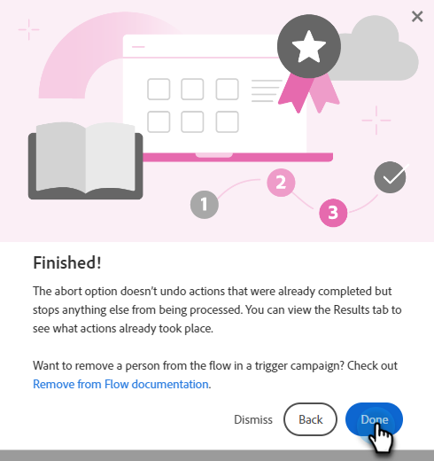

# Centro de ajuda {#help-center}

A Central de ajuda no Adobe Marketo Engage serve como um local centralizado para obter assistência. Além de se vincular a vários recursos (por exemplo, [documentação do produto](/help/marketo/home.md){target="_blank"}, [informações de versão](/help/marketo/release-notes/current.md){target="_blank"}, a [Comunidade da Nação de Marketing](https://nation.marketo.com/){target="_blank"}), você pode acessar apresentações úteis sobre o produto organizadas por nível de experiência.

## Como acessar {#how-to-access}

Depois de fazer logon no Marketo Engage, clique no ícone Ajuda.

### Guias {#guides}

Os guias servem como apresentações rápidas para recursos populares.

1. Clique no guia desejado para visualizá-lo.

   

1. Clique em **Introdução**.

   

1. Clique em **Avançar** para continuar.

   

1. Clique em **Concluído** para sair da apresentação.

   

   >[!TIP]
   >
   >Saia do manual a qualquer momento clicando em **Dispensar**.

### Novidades {#whats-new}

A guia Novidades contém todos os detalhes da versão mais recente do Marketo Engage.

>[!TIP]
>
>Clique no ícone de seta na parte inferior para exibir a página no Experience League.

### Recursos {#resources}

A guia Recursos fornece acesso rápido e direto a várias maneiras de obter ajuda adicional com a instância do Marketo Engage.

