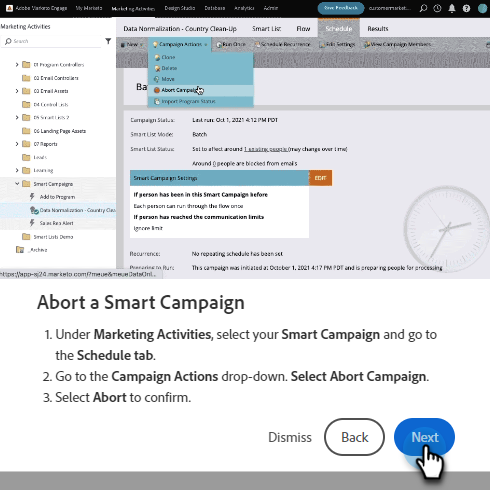
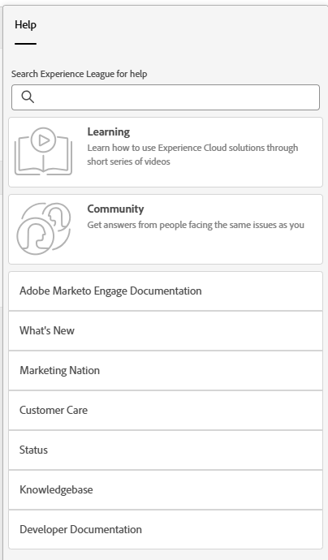

# Centro de ajuda {#help-center}

A Central de ajuda do Adobe Marketo Engage serve como um local centralizado para obter assistência. Além de estar vinculada a vários recursos (por exemplo, [documentações de produto](/help/marketo/home.md){target="_blank"}, [informações de lançamento](/help/marketo/release-notes/current.md){target="_blank"}, [comunidade da Marketing Nation](https://nation.marketo.com/){target="_blank"}), é possível acessar tutoriais úteis sobre o produto, organizados por nível de experiência.

## Como acessar {#how-to-access}

Há duas experiências diferentes, dependendo se sua assinatura já foi migrada para o sistema de gerenciamento de identidades (IMS) da Adobe.

### Antes da migração do Adobe IMS {#pre-adobe-ims-integration}

Estas etapas são para usuários do Marketo Engage que ainda _não_ foram migrados para o [Adobe IMS](/help/marketo/product-docs/administration/marketo-with-adobe-identity/adobe-identity-management-overview.md){target="_blank"}.

[Faça logon](https://login.marketo.com/){target="_blank"} no Marketo Engage e clique no ícone Ajuda.

#### Guias {#guides}

Os guias servem como apresentações rápidas para recursos populares.

1. Clique no guia desejado para visualizá-lo.

   

1. Clique em **Começar**.

   

1. Clique em **Avançar** para continuar.

   

1. Clique em **Concluído** para sair da apresentação.

   

   >[!TIP]
   >
   >Saia do guia a qualquer momento clicando em **Dispensar**.

#### Novidades {#whats-new}

A guia Novidades contém os detalhes da versão mais recente do Marketo Engage.

>[!TIP]
>
>Clique no ícone de seta na parte inferior para exibir a página na Experience League.

#### Recursos {#resources}

A guia Recursos fornece acesso rápido e direto a várias maneiras de obter ajuda adicional com a instância do Marketo Engage.

### Após a migração do Adobe IMS {#post-adobe-ims-integration}

Estas etapas são para usuários do Marketo Engage que já migraram para o [Adobe IMS](/help/marketo/product-docs/administration/marketo-with-adobe-identity/adobe-identity-management-overview.md){target="_blank"}.

[Faça logon](https://experience.adobe.com/){target="_blank"} no Marketo Engage e clique no ícone Ajuda.

A Central de ajuda é exibida. Clique em qualquer um dos recursos de ajuda listados para acessar sua respectiva área. Também é possível pesquisar por termos específicos.

Os guias (que eram parte da Central de ajuda antes da migração do Adobe IMS) agora estão na área de navegação à esquerda.

O Centro de guias tem duas abas: Guias e Novidades. Os guias servem como apresentações rápidas de recursos populares no Marketo Engage. Clique no guia desejado ou procure um específico.

A guia Novidades contém os detalhes da versão mais recente do Marketo Engage.

