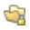

# Glossário de ícones do Marketo Engage {#icon-glossary}

Abaixo estão os ícones da interface atual do Adobe Marketo Engage. Se precisar dos ícones do Marketo Classic para referência, [consulte-os aqui](/help/marketo/getting-started/things-to-know/classic-icon-glossary.md).

## Ícones gerais {#general-icons}

<table>
 <tbody>
  <tr>
   <th style="width:25%">Ícone antigo</th>
   <th style="width:25%">Novo ícone</th>
   <th style="width:50%">Descrição</th>
  </tr>
  <tr>
   <td><strong>n/d</strong></td>
   <td></td>
   <td>Lista inteligente de contas</td>
  </tr>
  <tr>
   <td></td>
   <td></td>
   <td>Campanha em lote: ativa</td>
  </tr>
  <tr>
   <td></td>
   <td></td>
   <td>Campanha em lote: inativa</td>
  </tr>
  <tr>
   <td></td>
   <td></td>
   <td>Programa padrão</td>
  </tr>
  <tr>
   <td></td>
   <td></td>
   <td>Email</td>
  </tr>
  <tr>
   <td></td>
   <td></td>
   <td>Programa de email</td>
  </tr>
  <tr>
   <td></td>
   <td></td>
   <td>Modelo de e-mail</td>
  </tr>
  <tr>
   <td></td>
   <td></td>
   <td>Programa de engajamento</td>
  </tr>
  <tr>
   <td></td>
   <td></td>
   <td>Programa de eventos</td>
  </tr>
  <tr>
   <td></td>
   <td></td>
   <td>Campanha executável</td>
  </tr>
  <tr>
   <td></td>
   <td></td>
   <td>Organizador de campos</td>
  </tr>
  <tr>
   <td></td>
   <td></td>
   <td>Filtro</td>
  </tr>
  <tr>
   <td><strong>n/d</strong></td>
   <td></td>
   <td>Filtro: ativo</td>
  </tr>
  <tr>
   <td></td>
   <td></td>
   <td>Pasta</td>
  </tr>
  <tr>
   <td></td>
   <td></td>
   <td>Pasta: arquivada</td>
  </tr>
  <tr>
   <td></td>
   <td></td>
   <td>Pasta: compartilhada</td>
  </tr>
  <tr>
   <td></td>
   <td></td>
   <td>Pasta: bloqueada</td>
  </tr>
  <tr>
   <td></td>
   <td></td>
   <td>Formulário</td>
  </tr>
  <tr>
   <td></td>
   <td></td>
   <td>Imagens (e arquivos)</td>
  </tr>
  <tr>
   <td></td>
   <td></td>
   <td>Mensagens no aplicativo</td>
  </tr>
  <tr>
   <td></td>
   <td></td>
   <td>Programa no aplicativo</td>
  </tr>
  <tr>
   <td></td>
   <td></td>
   <td>Página de destino</td>
  </tr>
  <tr>
   <td></td>
   <td></td>
   <td>Modelo de página de destino</td>
  </tr>
  <tr>
   <td></td>
   <td></td>
   <td>Modelo</td>
  </tr>
  <tr>
   <td></td>
   <td></td>
   <td>Pesquisa</td>
  </tr>
  <tr>
   <td></td>
   <td></td>
   <td>Notificação por push</td>
  </tr>
  <tr>
   <td></td>
   <td></td>
   <td>Oferta de recomendação</td>
  </tr>
  <tr>
   <td></td>
   <td></td>
   <td>Relatório</td>
  </tr>
  <tr>
   <td><strong>n/d</strong></td>
   <td></td>
   <td>Pesquisa</td>
  </tr>
  <tr>
   <td></td>
   <td></td>
   <td>Segmentos</td>
  </tr>
  <tr>
   <td></td>
   <td></td>
   <td>Lista inteligente</td>
  </tr>
  <tr>
   <td></td>
   <td></td>
   <td>Lista inteligente: em cache</td>
  </tr>
  <tr>
   <td></td>
   <td></td>
   <td>Mensagem de SMS</td>
  </tr>
  <tr>
   <td></td>
   <td></td>
   <td>Snippets</td>
  </tr>
  <tr>
   <td></td>
   <td></td>
   <td>Botão de redes sociais</td>
  </tr>
  <tr>
   <td></td>
   <td></td>
   <td>Lista estática</td>
  </tr>
  <tr>
   <td></td>
   <td></td>
   <td>Sorteios</td>
  </tr>
  <tr>
   <td></td>
   <td></td>
   <td>Grupo de teste</td>
  </tr>
  <tr>
   <td></td>
   <td></td>
   <td>Acionador: ativo</td>
  </tr>
  <tr>
   <td><strong>n/d</strong></td>
   <td></td>
   <td>Acionador: inativo</td>
  </tr>
  <tr>
   <td></td>
   <td></td>
   <td>Espaço de trabalho</td>
  </tr>
  <tr>
   <td></td>
   <td></td>
   <td>Vídeo do YouTube</td>
  </tr>
 </tbody>
</table>

## Campanhas em lote {#batch-campaigns}

<table>
 <tbody>
  <tr>
   <th style="width:25%">Ícone antigo</th>
   <th style="width:25%"> Novo ícone</th>
   <th style="width:50%">Descrição</th>
  </tr>
  <tr>
   <td></td>
   <td></td>
   <td>Executado; sem execuções pendentes</td>
  </tr>
  <tr>
   <td></td>
   <td></td>
   <td>Inválido</td>
  </tr>
  <tr>
   <td></td>
   <td></td>
   <td>Nunca executado</td>
  </tr>
  <tr>
   <td></td>
   <td></td>
   <td>Executando; em fase de espera</td>
  </tr>
  <tr>
   <td></td>
   <td></td>
   <td>Agendado para execução</td>
  </tr>
  <tr>
   <td></td>
   <td></td>
   <td>Agendado para uma nova execução</td>
  </tr>
  <tr>
   <td></td>
   <td></td>
   <td>Usado para estímulo</td>
  </tr>
 </tbody>
</table>

## Campanhas com acionador {#trigger-campaigns}

<table>
 <tbody>
  <tr>
   <th style="width:25%">Ícone antigo</th>
   <th style="width:25%"> Novo ícone</th>
   <th style="width:50%">Descrição</th>
  </tr>
  <tr>
   <td></td>
   <td></td>
   <td>Ativo</td>
  </tr>
  <tr>
   <td></td>
   <td></td>
   <td>Foi solicitado</td>
  </tr>
  <tr>
   <td><strong>n/d</strong></td>
   <td></td>
   <td>Inativo</td>
  </tr>
  <tr>
   <td></td>
   <td></td>
   <td>Inválido</td>
  </tr>
 </tbody>
</table>

## Programas de email {#email-programs}

<table>
 <tbody>
  <tr>
   <th style="width:25%">Ícone antigo</th>
   <th style="width:25%"> Novo ícone</th>
   <th style="width:50%">Descrição</th>
  </tr>
  <tr>
   <td></td>
   <td></td>
   <td>Anulado</td>
  </tr>
  <tr>
   <td></td>
   <td></td>
   <td>Concluído</td>
  </tr>
  <tr>
   <td></td>
   <td></td>
   <td>Não aprovado</td>
  </tr>
  <tr>
   <td></td>
   <td></td>
   <td>Agendado</td>
  </tr>
 </tbody>
</table>

## Programas de engajamento {#engagement-programs}

<table>
 <tbody>
  <tr>
   <th style="width:25%">Ícone antigo</th>
   <th style="width:25%"> Novo ícone</th>
   <th style="width:50%">Descrição</th>
  </tr>
  <tr>
   <td></td>
   <td></td>
   <td>Desativado</td>
  </tr>
  <tr>
   <td></td>
   <td></td>
   <td>Ativado</td>
  </tr>
 </tbody>
</table>

## Programas no aplicativo {#in-app-programs}

<table>
 <tbody>
  <tr>
   <th style="width:25%">Ícone antigo</th>
   <th style="width:25%"> Novo ícone</th>
   <th style="width:50%">Descrição</th>
  </tr>
  <tr>
   <td></td>
   <td></td>
   <td>Aprovado</td>
  </tr>
  <tr>
   <td></td>
   <td></td>
   <td>Ainda não configurado</td>
  </tr>
  <tr>
   <td></td>
   <td></td>
   <td>Pausado</td>
  </tr>
  <tr>
   <td><strong>n/d</strong></td>
   <td></td>
   <td>Agendado</td>
  </tr>
  <tr>
   <td></td>
   <td></td>
   <td>Parado</td>
  </tr>
 </tbody>
</table>

## Ativos {#assets}

<table>
 <tbody>
  <tr>
   <th style="width:25%">Ícone antigo</th>
   <th style="width:25%"> Novo ícone</th>
   <th style="width:50%">Descrição</th>
  </tr>
  <tr>
   <td></td>
   <td></td>
   <td>Aprovado</td>
  </tr>
  <tr>
   <td></td>
   <td></td>
   <td>Rascunho</td>
  </tr>
  <tr>
   <td></td>
   <td></td>
   <td>Aprovado com rascunho</td>
  </tr>
 </tbody>
</table>

## Segmentos {#segments}

<table>
 <tbody>
  <tr>
   <th style="width:25%">Ícone antigo</th>
   <th style="width:25%"> Novo ícone</th>
   <th style="width:50%">Descrição</th>
  </tr>
  <tr>
   <td><strong>n/d</strong></td>
   <td></td>
   <td>Aprovado: calculando</td>
  </tr>
  <tr>
   <td><strong>n/d</strong></td>
   <td></td>
   <td>Aprovado: recalculando</td>
  </tr>
  <tr>
   <td><strong>n/d</strong></td>
   <td></td>
   <td>Rascunho: calculando</td>
  </tr>
 </tbody>
</table>
