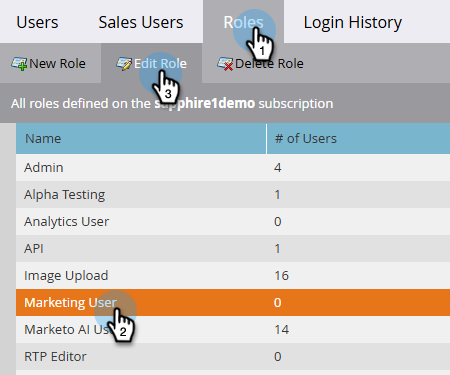

# Nova interface do Marketo Engage {#new-ui}

Obrigado por participar da Nova interface do usuário beta do Marketo Engage. Essa atualização moderniza o estilo do Marketo Engage e melhora a capacidade de resposta sem alterar a funcionalidade. A nova interface é acessada usando um menu suspenso que aparece no canto superior direito da maioria das páginas no Marketo Engage.

## Antes de começar {#before-starting}

Antes de acessar a nova interface do usuário, você deve ter:

* Foi fornecida com a permissão _Acessar nova interface_ para uma ou mais de suas Funções de usuário do Marketo Engage.

* Aceita os termos de teste beta aberto quando solicitado.

## Nova permissão de interface do usuário {#new-ui-permission}

Os administradores podem conceder permissão de _Acesso à Nova Interface do Usuário_ a uma ou mais funções de usuário.

1. Na área **Administrador**, selecione **Usuários e funções**.

   

1. Clique na guia **Funções**. Selecione a função desejada e clique em **Editar Função**.

   

>[!NOTE]
>
>Você também pode criar uma nova função.

1. Marque a caixa de seleção **Acessar novo tema** e clique em **Salvar**.

   

## Interface do usuário nova e clássica {#new-and-classic}

Para alternar para a nova interface, clique no menu suspenso de interface no canto superior direito e selecione **Novo (Beta)**.

Se precisar voltar por algum motivo, clique no menu suspenso da interface novamente e selecione **Clássico**.

## Envio de feedback {#feedback}

Seus comentários são bem-vindos. Se tiver problemas ao acessar ou usar a funcionalidade ao explorar a nova interface do usuário, ou se tiver sugestões ou preocupações, clique no botão **Comentários sobre a Interface do Usuário do Beta** no canto superior direito.

