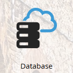

# Atualizações na terminologia do Marketo {#updates-to-marketo-terminology}

Estamos fazendo algumas alterações em nossa plataforma, o que alterará o nome de algumas coisas. Se você adquiriu uma nova instância do Marketo a partir de março de 2016, ou se sua empresa renovou após julho de 2016, você pode estar vendo a nova terminologia agora.

Embora seja possível ver terminologias diferentes na documentação do Marketo, sem falta atualizaremos cada artigo em breve para refletir essas alterações. Todas as instruções são iguais.

Então, o que mudou?

## Leads agora são Pessoas {#lead-is-now-person}

A maior mudança é a do termo “lead/leads” para “pessoa/pessoas”.

<table>
 <colgroup>
  <col>
  <col>
 </colgroup>
 <tbody>
  <tr>
   <td><strong>Antigo</strong></td>
   <td><strong>Novo</strong></td>
  </tr>
  <tr>
   <td>
    

     
    
</td>
   <td>
    

     
    
</td>
  </tr>
 </tbody>
</table>

Em alguns casos, a palavra “lead” foi simplesmente removida.

<table>
 <colgroup>
  <col>
  <col>
 </colgroup>
 <tbody>
  <tr>
   <td><strong>Antigo</strong></td>
   <td><strong>Novo</strong></td>
  </tr>
  <tr>
   <td>
    

     
    
</td>
   <td>
    

     

    
</td>
  </tr>
 </tbody>
</table>

Lead e pessoa **são a mesma coisa**.

## Tokens {#tokens}

Os tokens que contêm a palavra lead **não foram alterados**. Lamentamos qualquer confusão, no entanto, alterar todos os tokens para corresponder à nova terminologia prejudicaria vários tokens que estão sendo usados no momento. Portanto, você ainda verá tokens como “`{{lead.First Name}}`”. Não há tokens específicos para pessoas.

>[!NOTE]
>
>*Existe* um token chamado “Notas de pessoa”, no entanto esse token sempre esteve lá. Ele normalmente é usado para um campo de descrição no CRM, com pouca frequência.

## Gerenciamento de campos {#field-management}

Os campos que continham o termo lead foram substituídos por pessoa ou a palavra “lead” foi descartada. Uma exceção notável, no entanto, é o campo “Proprietário do lead”. Agora ele é conhecido como “Proprietário de vendas”.

<table>
 <colgroup>
  <col>
  <col>
 </colgroup>
 <tbody>
  <tr>
   <td><strong>Antigo</strong></td>
   <td><strong>Novo</strong></td>
  </tr>
  <tr>
   <td>
    

     
    
</td>
   <td>
    

     
    
</td>
  </tr>
 </tbody>
</table>

>[!NOTE]
>
>Para obter uma lista completa dos nomes de campos afetados, consulte este [artigo de suporte](https://nation.marketo.com/docs/DOC-4218#jive_content_id_Field_Names_and_Tokens){target="_blank"}.

## A personalização em tempo real (RTP) agora é conhecida como Personalização na web {#real-time-personalization-rtp-is-now-web-personalization}

<table>
 <colgroup>
  <col>
  <col>
 </colgroup>
 <tbody>
  <tr>
   <td><strong>Antigo</strong></td>
   <td><strong>Novo</strong></td>
  </tr>
  <tr>
   <td>
    

     
    
</td>
   <td>
    

     
    
</td>
  </tr>
 </tbody>
</table>

Além da alteração no nome, agora ela consiste em quatro aplicativos distintos:

| **[Personalização na web](https://docs.marketo.com/display/DOCS/Web+Personalization+-+RTP){target="_blank"}** | Tem seu próprio bloco na tela inicial |
|---|---|
| **[Marketing da web baseado em conta](https://docs.marketo.com/display/DOCS/Account-Based+Web+Marketing){target="_blank"}** | Acessível por meio do bloco Personalização na web |
| **[Redirecionamento personalizado](https://docs.marketo.com/display/DOCS/Website+Retargeting){target="_blank"}** | Acessível por meio do bloco Personalização na web |
| **[Conteúdo preditivo](https://docs.marketo.com/display/DOCS/Predictive+Content){target="_blank"}** | Tem seu próprio bloco na tela inicial |

>[!NOTE]
>
>Os blocos visíveis na tela inicial refletirão os módulos adquiridos.

Agradecemos sua paciência durante esta atualização.
