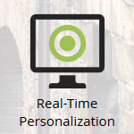

# Atualizações para a terminologia do Marketing {#updates-to-marketo-terminology}

Estamos fazendo algumas mudanças na nossa plataforma, que afetarão o que algumas coisas são chamadas. Se você tiver uma nova instância do Marketo em março de 2016, ou se a sua empresa for renovada após julho de 2016, talvez já esteja vendo a nova terminologia.

Embora você possa ver uma terminologia diferente na documentação do Marketo, tenha certeza de que todos os artigos serão atualizados em breve para refletir essas alterações. Todas as instruções são iguais.

Então, o que mudou?

## O cliente potencial agora é a pessoa {#lead-is-now-person}

A maior mudança é a renomeação de Lead/Leads para Pessoa/Pessoas.

<table> 
 <colgroup> 
  <col> 
  <col> 
 </colgroup> 
 <tbody> 
  <tr> 
   <td><strong>Antigo</strong></td> 
   <td><strong>Novo</strong></td> 
  </tr> 
  <tr> 
   <td> 
    
 
      
    
</td> 
   <td> 
    
 
      
    
</td> 
  </tr> 
 </tbody> 
</table>

Em alguns casos, a palavra &quot;Chumbo&quot; é simplesmente removida.

<table> 
 <colgroup> 
  <col> 
  <col> 
 </colgroup> 
 <tbody> 
  <tr> 
   <td><strong>Antigo</strong></td> 
   <td><strong>Novo</strong></td> 
  </tr> 
  <tr> 
   <td> 
    
 
      
    
</td> 
   <td> 
    
 
     

 
    
</td> 
  </tr> 
 </tbody> 
</table>

O cliente potencial e a Pessoa **são a mesma coisa**.

## Tokens {#tokens}

Os tokens com a palavra lead neles **não estão mudando**. Pedimos desculpas por qualquer confusão. entretanto, alterar todos os tokens para corresponder à nova terminologia quebraria um monte de tokens em uso no momento. Assim, você ainda verá tokens como &quot;`{{lead.First Name}}`.&quot; Não há tokens específicos da pessoa.

>[!NOTE]
>
>Ali *é* um token chamado &quot;Notas de pessoa&quot;, no entanto esse token sempre esteve presente. Normalmente, é usado para um campo de descrição em seu CRM, se for que é.

## Gerenciamento de campo {#field-management}

Os campos que continham o termo Lead foram substituídos por Pessoa ou a palavra Lead foi removida. No entanto, uma exceção notável é o campo &quot;Proprietário do cliente potencial&quot;. Agora é conhecido como &quot;Proprietário de vendas&quot;.

<table> 
 <colgroup> 
  <col> 
  <col> 
 </colgroup> 
 <tbody> 
  <tr> 
   <td><strong>Antigo</strong></td> 
   <td><strong>Novo</strong></td> 
  </tr> 
  <tr> 
   <td> 
    
 
      
    
</td> 
   <td> 
    
 
      
    
</td> 
  </tr> 
 </tbody> 
</table>

>[!NOTE]
>
>Para obter uma lista completa dos nomes de campo afetados, visite este [Artigo de suporte](https://nation.marketo.com/docs/DOC-4218#jive_content_id_Field_Names_and_Tokens).

## A personalização em tempo real (RTP) agora é personalização da Web {#real-time-personalization-rtp-is-now-web-personalization}

<table> 
 <colgroup> 
  <col> 
  <col> 
 </colgroup> 
 <tbody> 
  <tr> 
   <td><strong>Antigo</strong></td> 
   <td><strong>Novo</strong></td> 
  </tr> 
  <tr> 
   <td> 
    
 
      
    
</td> 
   <td> 
    
 
      
    
</td> 
  </tr> 
 </tbody> 
</table>

Além da alteração de nome, agora ela consiste em quatro aplicativos separados:

| ** [Personalização da Web](http://docs.marketo.com/display/DOCS/Web+Personalization+-+RTP)** | Possui mosaicos próprios em tela inicial |
|---|---|
| ** [Marketing Web baseado em conta](http://docs.marketo.com/display/DOCS/Account-Based+Web+Marketing)** | Acessível via mosaico de personalização da Web |
| ** [Redirecionamento Personalizado](http://docs.marketo.com/display/DOCS/Website+Retargeting)** | Acessível via mosaico de personalização da Web |
| ** [Conteúdo preditivo](http://docs.marketo.com/display/DOCS/Predictive+Content)** | Possui mosaicos próprios em tela inicial |

>[!NOTE]
>
>Os blocos visíveis na tela inicial refletirão os módulos comprados.

Obrigado pela sua paciência durante esta atualização.
