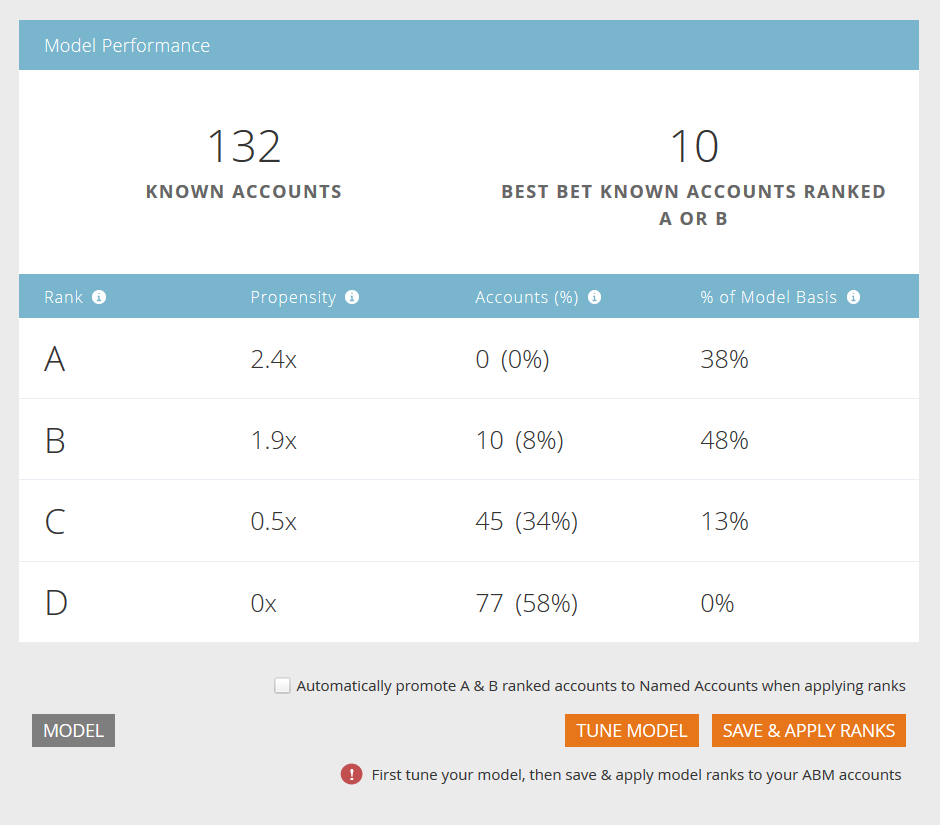

# Configuração de perfil de conta {#setting-up-account-profiling}

Siga estas etapas para start usando a Definição de perfil de conta.

1. Em Meu mercado, abra Marketing **baseado em** conta.

   

1. Clique na guia Perfil da conta.

   

1. A guia Modelo é aberta por padrão. Clique em **Introdução**.

   

1. Dê um nome ao seu modelo, escolha quem será incluído nos resultados e quem servirá de base para o ICP (Perfil de cliente ideal). Clique em **Criar modelo** quando terminar.

   

1. Seu modelo começará sua construção. Pode demorar um pouco, mas não se preocupe, você será notificado quando terminar.

   

1. Para ver os resultados do modelo, clique em **Ver Resultado** do Modelo.

   

   Seu modelo agora é criado.

   

   >[!TIP]
   >
   >Agora que seu modelo foi criado, saiba como ajustá-lo na Visão geral [de criação de perfil de](http://docs.marketo.com/x/NIDv)conta.

