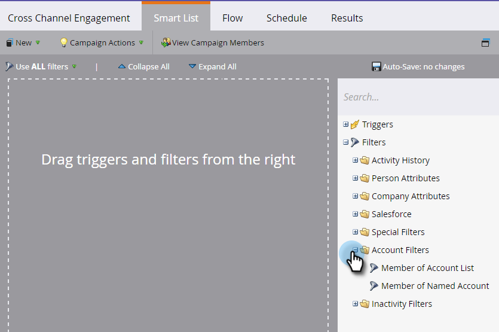

# Filtros de conta {#account-filters}

Identifique e envolva as Contas Nomeadas e as pessoas dentro delas usando novos filtros centrados em conta.

## FILTROS ABM {#abm-filters}

1. Selecione sua campanha inteligente e clique em **Lista inteligente**.

   

1. Clique em **+** para expandir a pasta **Filtros de conta**.

   

1. Arraste os filtros que deseja usar para a tela.

   

## Membro da Lista de conta {#member-of-account-list}

Para usar esse filtro, clique no menu suspenso lista da conta...

...e escolha as listas de conta desejadas.

>[!NOTE]
>
>Para o filtro Lista Membro da Conta, há apenas um qualificador: &quot;is&quot; - qualificadores adicionais (como &quot;is not&quot; e &quot;is any&quot;) não estão disponíveis.

## Membro da Conta Nomeada {#member-of-named-account}

1. Escolha um qualificador. É para uma conta nomeada específica ou é qualquer conta nomeada.

   

1. Clique no menu suspenso de conta nomeada.

   

1. Escolha sua(s) conta(s) nomeada(s) desejada(s).

   

1. Se você usar o qualificador &quot;is any&quot;, talvez queira utilizar [restrições](http://docs.marketo.com/display/DOCS/Add+a+Constraint+to+a+Smart+List+Filter) para restringir os resultados da pesquisa. Adicione quantos quiser!

   

1. Defina &quot;Incluir filhos&quot; como falso se quiser apenas membros da conta única de nível superior. Selecione true se quiser que os membros de todas as contas-filho sejam criados.

   

>[!MORELIKETHIS]
>
>* [Acionadores de conta](account-triggers.md)

