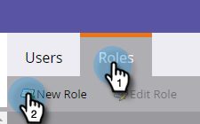
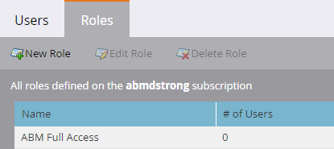

# Permissões {#permissions}

Você precisará configurar permissões para que os usuários possam usar o ABM. Veja como.

1. Clique em **Admin**.

   

1. Clique em **Usuários e funções**.

   

   >[!NOTE]
   >
   >Você pode adicionar permissões ABM para uma função existente ou criar uma nova. Este exemplo usa uma nova função.

1. Clique em **Funções** e, em seguida, em **Nova Função**.

   

1. Digite um Nome de função e clique no ícone **+** ao lado da caixa de seleção Acessar marketing baseado em conta.

   

1. Para selecionar *todas* as permissões, basta marcar a caixa de seleção **Acessar Marketing Baseado em Conta**.

   

   >[!NOTE]
   >
   >Você também tem a opção de selecionar apenas algumas das opções. Faça isso marcando cada caixa de seleção individualmente.

1. Clique em **+** para abrir o menu Admin de acesso. Marque a caixa de seleção **Acessar o ABM Admin**.

   \
   Sua nova função ABM está pronta para ser [atribuída a um usuário](http://docs.marketo.com/display/public/DOCS/Managing+User+Roles+and+Permissions#ManagingUserRolesandPermissions-AssignRolestoaUser)!

   

