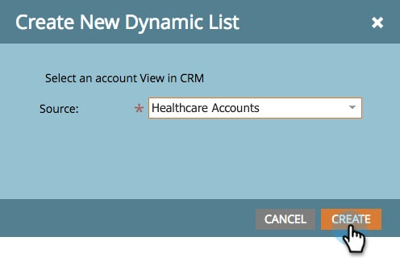

# Listas de conta {#account-lists}

Uma lista de conta é uma coleção de contas nomeadas que podem ser direcionadas juntas. As listas de conta permitem que você público alvo contas nomeadas por setor, local ou tamanho da empresa.

Além das listas de conta, você também pode criar listas de conta dinâmicas que são geradas a partir de Visualizações de conta CRM públicas. Uma Visualização de conta CRM é um conjunto de regras que funciona como um filtro ao exibir contas. Por exemplo, você pode usá-lo para localizar contas nas quais a Indústria é de Saúde *e* a Receita é superior a $100M.

>[!NOTE]
>
>As listas de conta criadas no Marketing baseado em conta do Marketing estão automaticamente disponíveis ao criar listas inteligentes e campanhas da Web em [Personalização da Web](http://docs.marketo.com/display/DOCS/RTP+Segments).

## Criar uma nova Lista de conta {#create-a-new-account-list}

1. Clique no menu suspenso **Novo** e selecione **Criar nova Lista de conta**.

   

1. Dê um nome à sua lista e clique em **Criar**.

   

1. Depois de criar sua lista de conta, comece em [adicionar contas nomeadas a ela](http://docs.marketo.com/display/DOCS/Add+an+Existing+Named+Account+to+an+Account+List)!

   >[!NOTE]
   >
   >O Marketo só exibirá insights para listas de conta com 2.000 ou menos contas nomeadas.

## Criar uma nova Lista de conta dinâmica {#create-a-new-dynamic-account-list}

1. Clique na lista suspensa **Novo** e selecione **Criar nova Lista dinâmica**.

   

1. Na caixa de diálogo, selecione uma **Visualização de Conta CRM** no menu suspenso ou digite o nome a ser procurado.

   

1. Clique em **Criar**.

   

   >[!NOTE]
   >
   >No Salesforce, certifique-se de fornecer permissões de Objeto de Visualização de Lista ao usuário de sincronização.

## Renomear uma Lista de conta {#rename-an-account-list}

>[!NOTE]
>
>Essas etapas se aplicam somente às listas de conta. *O* Dynamicaccount lista usa o nome de suas Visualizações de conta do CRM associadas.

1. Selecione a conta que deseja renomear, clique no menu suspenso **Ações de Lista da conta** e selecione **Renomear Lista da conta**.

   

1. Digite o novo nome e clique em **Renomear**.

   

   >[!NOTE]
   >
   >A Visualização de conta CRM sincroniza com a lista de conta dinâmica a cada 8 horas. Se ainda não estiverem sincronizados, o Marketo os sincronizará durante o próximo ciclo.

## Excluir uma Lista de conta {#delete-an-account-list}

>[!NOTE]
>
>Essas etapas são as mesmas para listas de conta e listas de conta dinâmicas.

1. Selecione a conta que deseja excluir, clique no menu suspenso **Ações de Lista da conta** e selecione **Excluir Lista da conta**.

   

1. Clique em **Excluir**.

   

>[!MORELIKETHIS]
>
>* [Adicionar uma conta nomeada existente a uma Lista de conta](named-accounts/add-an-existing-named-account-to-an-account-list.md)
>* [Insights da Lista da conta](../../../product-docs/account-based-marketing/measure/account-list-insights.md)

>

