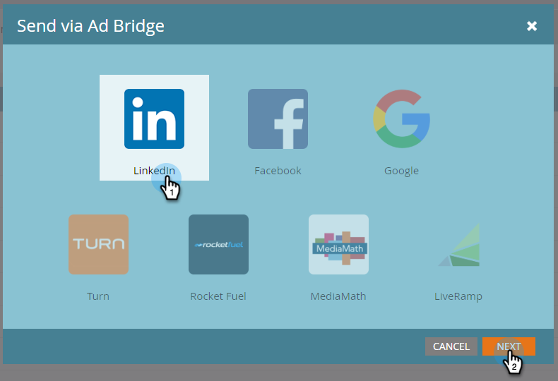

# Criar uma Audiência correspondente no LinkedIn {#create-a-matched-audience-on-linkedin}

Crie audiências correspondentes de suas Listas de conta ABM para direcionamento de anúncios do LinkedIn.

>[!PREREQUISITES]
>
>[Adicionar Audiências Correspondentes do LinkedIn como um Serviço do LaunchPoint](/help/marketo/product-docs/demand-generation/ad-network-integrations/add-linkedin-matched-audiences-as-a-launchpoint-service.md)

1. No ABM, clique na guia **Listas de conta**.

   

1. Escolha sua lista de conta desejada.

   

1. Clique no menu suspenso **Ações de Lista da conta** e selecione **Enviar via AdBridge**.

   

1. Escolha **LinkedIn** e clique em **Próximo**.

   

1. Clique no menu suspenso **Audiência**. Você pode selecionar uma audiência existente ou criar uma nova. Neste exemplo, criaremos uma nova (se você selecionar uma audiência existente, pule para a Etapa 7).

   

1. Clique no menu suspenso **Ad Account** e selecione a conta de anúncio do público alvo.

   

1. Dê um nome à sua audiência e clique em **Atualizar**.

   

   E é isso. Sua audiência foi empurrada para o LinkedIn.

>[!MORELIKETHIS]
>
>[Usar uma Lista de marketing ou uma Lista inteligente como um segmento de Audiência do LinkedIn](/help/marketo/product-docs/demand-generation/social/social-functions/use-a-marketo-list-or-smart-list-as-a-linkedin-audience-segment.md)
