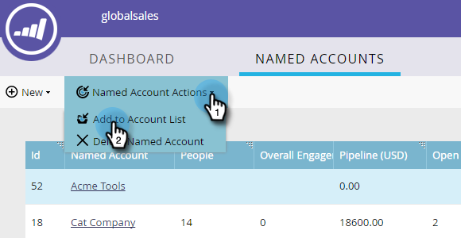
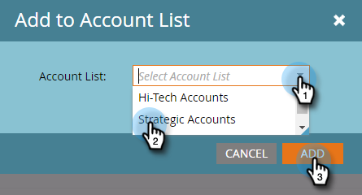

# Adicionar uma conta nomeada existente a uma Lista de conta {#add-an-existing-named-account-to-an-account-list}

Adicionar uma conta nomeada a uma lista de conta é simples.

>[!NOTE]
>
>Isso se aplica somente às Listas de conta, **não** Listas de conta dinâmicas.

1. Selecione a linha da conta nomeada à qual deseja adicionar.

   

1. Clique no menu suspenso **Ações de conta nomeada** e selecione **Adicionar à Lista de conta**.

   

1. Clique no menu suspenso **Lista de conta**, selecione a lista de conta desejada e clique em **Adicionar**.

   

   É isso!

>[!MORELIKETHIS]
>
>* [Criar uma conta nomeada](create-a-named-account.md)

>

