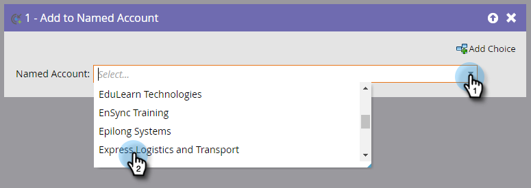

# Adicionar pessoas a uma conta nomeada {#add-people-to-a-named-account}

Há três maneiras diferentes de adicionar manualmente pessoas a uma conta nomeada no ABM.

## Ação de fluxo único {#single-flow-action}

1. Clique em **Banco de Dados**.

   

1. Insira o endereço de email da pessoa e pressione Enter.

   

1. Clique na pessoa para selecioná-la. Clique no menu suspenso Ações **da** pessoa, clique em **Marketing** e selecione **Adicionar à conta** nomeada.

   

1. Clique no menu suspenso Conta **** nomeada, selecione a Conta nomeada desejada e clique em **Executar agora**.

   

## Etapa do fluxo de Campanha inteligente {#smart-campaign-flow-step}

1. Selecione sua Campanha inteligente e clique em **Fluxo**.

   

1. Na caixa de pesquisa, digite &quot;Adicionar à conta nomeada&quot;.

   

1. Arraste o filtro até a tela de desenho.

   

1. Clique no menu suspenso Conta **** nomeada e selecione a Conta nomeada desejada.

   

   É isso! Em seguida, agende (ou ative) sua campanha inteligente e a etapa de fluxo será start para adicionar pessoas qualificadas à conta nomeada designada.

## Importação de lista {#list-import}

1. Selecione sua lista, clique no menu suspenso Ações **de** Lista e selecione **Importar Lista**.

   

1. Depois de escolher o arquivo e as configurações, clique em **Avançar**.

   

1. Mapeie os campos desejados. Verifique se o campo Conta **** nomeada está mapeado.

   

1. Escolha as configurações desejadas e clique em **Importar**.

   

>[!MORELIKETHIS]
>
>[Correspondência de cliente potencial para conta](/help/marketo/product-docs/account-based-marketing/target/named-accounts/lead-to-account-matching.md)
