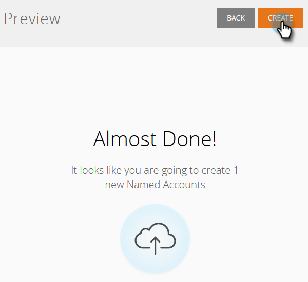

# Contas do Discover {#discover-accounts}

Use a opção Discover para identificar possíveis contas de públicos alvos.

## Discover CRM Accounts {#discover-crm-accounts}

Identifique possíveis contas de público alvo do seu CRM.

>[!NOTE]
>
>Depois de conectar seu CRM ao Marketing ABM, **Discover CRM Accounts** mostrará todas as contas CRM e informações relevantes para ajudá-lo a escolher as contas nomeadas certas. O Marketo adiciona informações adicionais sobre o que foi recebido do CRM.

**Pessoas**  (nas Empresas do Discover CRM e do Discover Marketing): Inclui Contatos e Clientes potenciais. Os clientes em potencial podem ser descobertos usando a [correspondência de cliente a conta do Marketo](http://docs.marketo.com/display/DOCS/Lead+to+Account+Matching). **Pessoas**  em potencial (nas Empresas do Discover CRM e do Discover Marketing): Mostra quantos clientes em potencial o Marketo encontrou que poderiam pertencer a uma conta do CRM.

**Campo**  CRM personalizado (somente em contas CRM do Discover): Isso o ajudará a alinhar sua organização de vendas e marketing para selecionar as contas de público alvo corretas. Depois que você [mapear o campo CRM personalizado](http://docs.marketo.com/x/1wnG) com o Marketo ABM, mostraremos os dados mapeados para ajudá-lo a identificar suas contas de públicos alvos.

1. Em Contas nomeadas, clique no menu suspenso **Novo** e selecione **Discover CRM Accounts**.

   

1. Uma nova janela/guia será aberta. Selecione as contas do CRM que deseja adicionar às suas Contas Nomeadas e clique em **Próximo**.

   

1. A tela pré-visualização confirma a quantidade de seleções. Clique em **Criar**.

   

   Isso é tudo que há nisso!

   

## Empresas de marketing do Discover {#discover-marketo-companies}

Identifique as empresas certas para definição de metas.

>[!NOTE]
>
>No Discover Marketing Empresa, você verá empresas de marketing que não vieram do seu CRM.

1. Em Contas nomeadas, clique no menu suspenso **Novo** e selecione **Discover Marketing Empresa**.

   

1. Uma nova janela/guia será aberta. Selecione as empresas que deseja adicionar às suas Contas Nomeadas e clique em **Próximo**.

   

   >[!NOTE]
   >
   >No Discover Marketing Empresa e no Discover CRM, o Marketing deve ser feito automaticamente:
   >
   > * Encontra pessoas do banco de dados do Marketo que têm essa empresa listada em seus registros. Se você vir vários valores para alguns dos atributos (por exemplo, Indústria), é porque o Marketo encontrou valores diferentes listados para essas pessoas individuais. O atributo com mais ocorrências vence
   >
   >Somente em **Discover CRM**, Marketo automaticamente:
   >
   > * Sincroniza e associa Contatos CRM à Conta Nomeada
   >
   >Somente em **Discover Marketing Empresa**, Marketo automaticamente:
   >
   > * Filtros a maioria dos Provedores de serviço da Internet e domínios públicos (por exemplo, [Yahoo.com](https://yahoo.com), [Gmail.com](https://gmail.com)) como nomes de empresa
      >
      > 
   * Deduz contas CRM. Se você tiver &quot;Acme&quot; em um registro e &quot;Acme Inc&quot; (ou qualquer um dos seguintes sufixos: Co, Corp, Corporation, Gmbh, Inc, Incorporated, LLC, LLP, LP, Ltd, PA, PC, PLC, PLLC), vamos fundi-los no ABM como apenas &quot;Acme&quot;
   >
   >Se você deseja que o Marketo reduza as contas por ID CRM ou Proprietário da conta em vez de por Nome da Empresa, entre em contato com [Suporte do Marketing](https://nation.marketo.com/t5/Support/ct-p/Support).

1. Clique na seta para baixo na coluna Conta nomeada para revelar o menu suspenso.

   

   >[!CAUTION]
   >
   >A partir de agora, quaisquer novas pessoas dessas empresas selecionadas serão automaticamente atribuídas às respectivas contas nomeadas. Verifique essas empresas com duplo e certifique-se de que estejam atribuídas à Conta nomeada correta.

1. Para selecionar uma Conta existente, clique no menu suspenso **Conta nomeada**, escolha a conta desejada e clique em **Próximo**.

   

   Você também tem a opção de criar uma nova Conta nomeada digitando o nome desejado diretamente na caixa suspensa. Clique fora da caixa quando terminar...

   

   ...e você verá sua nova conta nomeada. Nesse ponto, clique em **Next** como na Etapa 4.

   

1. Clique em **Criar**.

   

   Bom trabalho!

   

>[!NOTE]
>
>Se você estiver vendo uma incompatibilidade entre as contas CRM selecionadas e o que está na Grade do Discover CRM, isso provavelmente se deve a um ou mais dos seguintes:
>
>* Com contas CRM diferentes com nomes semelhantes que foram deduplicados
>* A próxima sincronização agendada ainda não ocorreu

>[!MORELIKETHIS]
>
>* [Correspondência de cliente potencial para conta](/help/marketo/product-docs/account-based-marketing/target/named-accounts/lead-to-account-matching.md)

