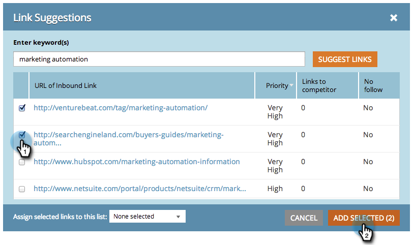

# SEO - Obter sugestões de links de entrada {#seo-get-inbound-link-suggestions}

O Marketo pode sugerir quais links de entrada são valiosos para sua [otimização fora da página](/help/marketo/product-docs/additional-apps/seo/understanding-seo/understanding-search-engine-optimization.md).

1. Vá para a seção **Links de entrada**.

   

1. Clique em **Obter Sugestões**.

   

1. Digite uma palavra-chave. Clique em **Sugerir links**.

   

1. Selecione os links. Clique em **Adicionar selecionados**.

   

   >[!TIP]
   >
   >Você sabia que pode [adicionar seu link a uma lista nova ou existente](/help/marketo/product-docs/additional-apps/seo/inbound-links/seo-add-remove-an-inbound-link-url-from-a-list.md)? Confira!

1. Incrível! Esses links adicionados agora serão rastreados.

   >[!NOTE]
   >
   >[Como entender links de entrada](/help/marketo/product-docs/additional-apps/seo/inbound-links/seo-understanding-inbound-links.md)
