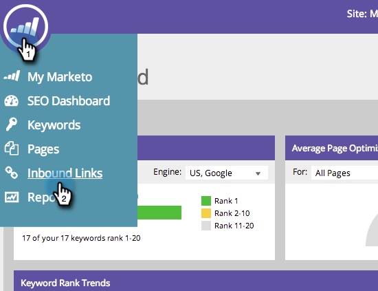

# SEO - Obter sugestões de links de entrada {#seo-get-inbound-link-suggestions}

A Marketo pode sugerir quais links de entrada são valiosos para o seu [otimização fora da página](/help/marketo/product-docs/additional-apps/seo/understanding-seo/understanding-search-engine-optimization.md).

1. Vá para a **[!UICONTROL Links de entrada]** seção.

   

1. Clique em **[!UICONTROL Obter sugestões]**.

   

1. Insira uma palavra-chave. Clique em **[!UICONTROL Sugerir links]**.

   

1. Selecione os links. Clique em **[!UICONTROL Adicionar selecionado]**.

   

   >[!TIP]
   >
   >Você sabia que pode  [adicionar seu link a uma lista nova ou existente](/help/marketo/product-docs/additional-apps/seo/inbound-links/seo-add-remove-an-inbound-link-url-from-a-list.md)? Dê uma olhada!

Ótimo! Esses links adicionados agora serão rastreados.

>[!NOTE]
>
>[Noções básicas sobre links de entrada](/help/marketo/product-docs/additional-apps/seo/inbound-links/seo-understanding-inbound-links.md)
