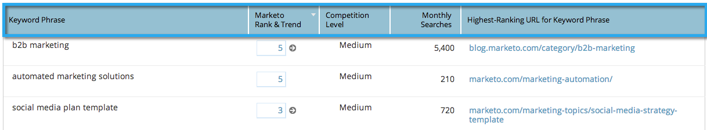

# SEO - Adicionar/remover colunas da sua Visualização de palavras-chave {#seo-add-remove-columns-from-your-keywords-view}

Você pode ajustar a visualização da sua palavra-chave para exibir os dados em que está mais interessado.

1. Vá para a seção **Palavras-chave** .

   

   Estas são as colunas padrão:

1. 

1. Clique no ícone de engrenagem.

   

1. Selecione ou desmarque as colunas que deseja ver. Clique em **SALVAR**.

   

   Incrível! Agora você personalizou sua visualização de palavra-chave.

   

   >[!NOTE]
   >
   >**Artigos relacionados**
   >
   >    
   >    
   >    * [Compreensão de palavras-chave - Visualização de resumo](seo-understanding-keywords.md)

