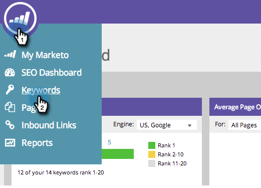

# SEO - Exportação de resultados de palavras-chave {#seo-exporting-keyword-results}

É possível exportar os resultados de palavras-chave para compartilhar com a equipe ou criar um relatório.

>[!IMPORTANT]
>
>Em 31 de março de 2026, o Marketo Engage [descontinuou o recurso de Otimização do Mecanismo de Pesquisa](https://nation.marketo.com/t5/product-blogs/marketo-engage-seo-feature-deprecation/ba-p/359060){target="_blank"}. [seo.marketo.com](https://seo.marketo.com/) ainda está disponível por um tempo limitado. Siga as etapas dos artigos abaixo para exportar dados.
>
>* [Exportar problemas](https://experienceleague.adobe.com/en/docs/marketo/using/product-docs/additional-apps/seo/pages/seo-export-issues-to-csv){target="_blank"}
>* [Exportar Resultados de Palavra-chave](https://experienceleague.adobe.com/en/docs/marketo/using/product-docs/additional-apps/seo/keywords/seo-exporting-keyword-results){target="_blank"}
>* [Exportar Tendências de Palavra-chave](https://experienceleague.adobe.com/en/docs/marketo/using/product-docs/additional-apps/seo/reports/seo-use-the-keyword-trends-report#exporting-data){target="_blank"}
>* [Exportar Tendências de Palavra-chave do Concorrente](https://experienceleague.adobe.com/en/docs/marketo/using/product-docs/additional-apps/seo/reports/seo-use-the-competitor-kw-trends-report#exporting-data){target="_blank"}

1. Vá para a seção **[!UICONTROL Palavras-chave]**.

   

1. Clique em **[!UICONTROL Exportar]**.

   
