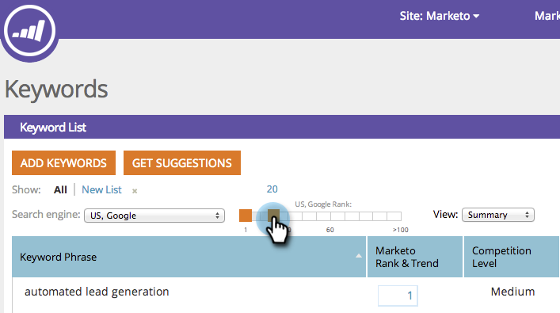

# SEO - Filtrar Resultados de Palavras-chave {#seo-filter-keyword-results}

Você pode ter muitas [palavras-chave](/help/marketo/product-docs/additional-apps/seo/keywords/seo-understanding-keywords.md). Estas são diferentes maneiras de filtrá-las:

## Filtrar por lista {#filter-by-list}

1. Vá para a seção **[!UICONTROL Palavras-chave]**.

   

1. Clique no nome da lista em que você está focalizado.

   

   >[!NOTE]
   >
   >Se você não vir nenhuma lista, [saiba como criar uma lista de palavras-chave](/help/marketo/product-docs/additional-apps/seo/understanding-seo/seo-managing-lists.md).

Doce! Agora você só verá palavras-chave nessa lista.

## Filtrar por classificação SERP {#filter-by-serp-rank}

1. Vá para a seção [!UICONTROL Palavras-chave].

   

   Os quadrados laranja definem os limites superior (esquerda) e inferior (direita). O filtro funciona na [classificação SERP](/help/marketo/product-docs/additional-apps/seo/understanding-seo/understanding-search-engine-optimization.md) da palavra-chave.

1. Deslize os quadrados laranja para a esquerda/direita para filtrar os resultados.

   

## Filtrar por pesquisa {#filter-by-search}

Você também pode encontrar as palavras-chave que procura usando o campo de pesquisa no canto superior direito.

1. Vá para a seção **[!UICONTROL Palavras-chave]**.

   

1. Insira sua palavra-chave no campo **[!UICONTROL Pesquisa]**.

   
