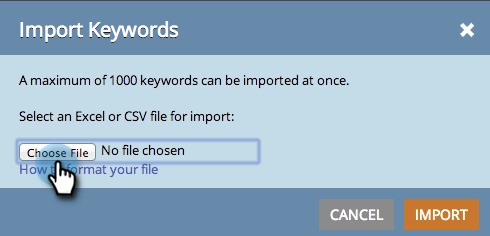

# SEO - Importação de palavras-chave com um CSV {#seo-importing-keywords-with-a-csv}

1. Você pode [adicionar palavras-chave](/help/marketo/product-docs/additional-apps/seo/keywords/seo-add-keywords.md) manualmente, [obter sugestões de palavras-chave](/help/marketo/product-docs/additional-apps/seo/keywords/seo-get-suggested-keywords.md) e até importar palavras-chave de um arquivo CSV. Veja como fazer a importação.

1. Vá para a seção **Palavras-chave**.

   

1. Clique em **Importar**.

   

1. Escolha um arquivo do Excel para importar.

   

1. Clique em **Escolher Arquivo**.

   

   >[!NOTE]
   >
   >Os limites de importação variam dependendo da sua assinatura. Entre em contato com seu representante de vendas para obter mais informações.

1. Clique em **Importar**.

   

   Você deve ver suas novas palavras-chave exibidas na lista de palavras-chave em ordem alfabética.

   

   Pode levar alguns minutos para carregar todos os dados associados a cada palavra-chave. Medita sobre o significado da vida.

   >[!MORELIKETHIS]
   >
   >* [Compreensão de palavras-chave (Visualização de resumo)](/help/marketo/product-docs/additional-apps/seo/keywords/seo-understanding-keywords.md)
   >* [Adicionar/remover palavras-chave de uma lista](/help/marketo/product-docs/additional-apps/seo/keywords/seo-add-remove-keywords-from-a-list.md)

