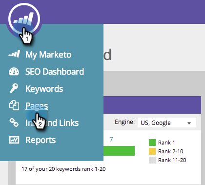

# SEO - Otimizar páginas específicas com palavras-chave direcionadas {#seo-optimize-specific-pages-with-targeted-keywords}

Algumas palavras-chave vão muito bem com determinadas páginas. É assim que você combina a palavra-chave perfeita com sua página perfeita. Isso fornecerá os dados mais precisos e as melhores recomendações para melhoria.

>[!IMPORTANT]
>
>Em 31 de março de 2026, o Marketo Engage descontinuará o recurso de Otimização do mecanismo de pesquisa. Exporte todos os dados relevantes até 30 de março. [Saiba mais](https://nation.marketo.com/t5/product-blogs/marketo-engage-seo-feature-deprecation/ba-p/359060){target="_blank"}.
>
>* [Exportar problemas](https://experienceleague.adobe.com/en/docs/marketo/using/product-docs/additional-apps/seo/pages/seo-export-issues-to-csv){target="_blank"}
>* [Exportar Resultados de Palavra-chave](https://experienceleague.adobe.com/en/docs/marketo/using/product-docs/additional-apps/seo/keywords/seo-exporting-keyword-results){target="_blank"}
>* [Exportar Tendências de Palavra-chave](https://experienceleague.adobe.com/en/docs/marketo/using/product-docs/additional-apps/seo/reports/seo-use-the-keyword-trends-report#exporting-data){target="_blank"}
>* [Exportar Tendências de Palavra-chave do Concorrente](https://experienceleague.adobe.com/en/docs/marketo/using/product-docs/additional-apps/seo/reports/seo-use-the-competitor-kw-trends-report#exporting-data){target="_blank"}

1. Vá para a seção **[!UICONTROL Páginas]**.

   

1. Clique na página da qual deseja ver detalhes.

   

1. Selecione para qual palavra-chave você está tentando otimizar sua página. Clique **[!UICONTROL Atualizar]**.

   >[!TIP]
   >
   >Recomendamos usar menos de três palavras-chave por página. Idealmente, apenas um.

   

Faça isso para o maior número de páginas e palavras-chave possível.
