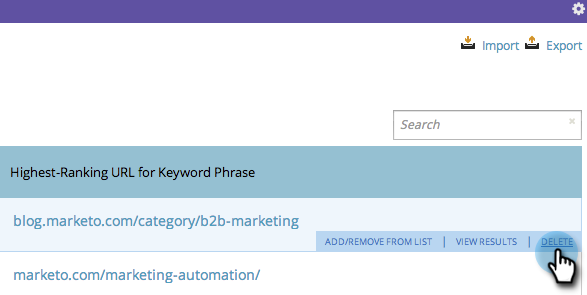

# SEO - Remover uma palavra-chave {#seo-remove-a-keyword}

Se você tiver uma palavra-chave para a qual não deseja continuar a otimização, veja a seguir como removê-la.

>[!IMPORTANT]
>
>Em 31 de março de 2026, o Marketo Engage descontinuará o recurso de Otimização do mecanismo de pesquisa. Exporte todos os dados relevantes até 30 de março. [Saiba mais](https://nation.marketo.com/t5/product-blogs/marketo-engage-seo-feature-deprecation/ba-p/359060){target="_blank"}.
>
>* [Exportar problemas](https://experienceleague.adobe.com/en/docs/marketo/using/product-docs/additional-apps/seo/pages/seo-export-issues-to-csv){target="_blank"}
>* [Exportar Resultados de Palavra-chave](https://experienceleague.adobe.com/en/docs/marketo/using/product-docs/additional-apps/seo/keywords/seo-exporting-keyword-results){target="_blank"}
>* [Exportar Tendências de Palavra-chave](https://experienceleague.adobe.com/en/docs/marketo/using/product-docs/additional-apps/seo/reports/seo-use-the-keyword-trends-report#exporting-data){target="_blank"}
>* [Exportar Tendências de Palavra-chave do Concorrente](https://experienceleague.adobe.com/en/docs/marketo/using/product-docs/additional-apps/seo/reports/seo-use-the-competitor-kw-trends-report#exporting-data){target="_blank"}

1. Clique para ir para a seção **[!UICONTROL Palavras-chave]**.

   

1. Passe o mouse sobre a palavra-chave que você gostaria de remover e clique em **[!UICONTROL Excluir]**.

   

1. Clique em **[!UICONTROL Excluir]** novamente para confirmar.

   
