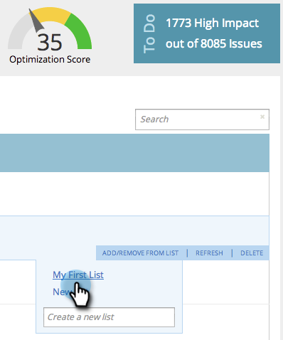

# SEO - Adicionar/remover página da lista {#seo-add-remove-page-from-list}

Gerencie facilmente suas páginas criando uma lista. Você pode usar listas para organizar páginas ou filtrar dados em painéis.

>[!IMPORTANT]
>
>Em 31 de março de 2026, o Marketo Engage descontinuará o recurso de Otimização do mecanismo de pesquisa. Exporte todos os dados relevantes até 30 de março. [Saiba mais](https://nation.marketo.com/t5/product-blogs/marketo-engage-seo-feature-deprecation/ba-p/359060){target="_blank"}.
>
>* [Exportar problemas](https://experienceleague.adobe.com/en/docs/marketo/using/product-docs/additional-apps/seo/pages/seo-export-issues-to-csv){target="_blank"}
>* [Exportar Resultados de Palavra-chave](https://experienceleague.adobe.com/en/docs/marketo/using/product-docs/additional-apps/seo/keywords/seo-exporting-keyword-results){target="_blank"}
>* [Exportar Tendências de Palavra-chave](https://experienceleague.adobe.com/en/docs/marketo/using/product-docs/additional-apps/seo/reports/seo-use-the-keyword-trends-report#exporting-data){target="_blank"}
>* [Exportar Tendências de Palavra-chave do Concorrente](https://experienceleague.adobe.com/en/docs/marketo/using/product-docs/additional-apps/seo/reports/seo-use-the-competitor-kw-trends-report#exporting-data){target="_blank"}

## Adicionar página a uma lista {#add-page-to-a-list}

1. Vá para a seção **[!UICONTROL Páginas]**.

   

1. Passe o mouse sobre a página que deseja adicionar a uma lista. Clique Em **[!UICONTROL Adicionar/Remover Da Lista]**.

   

1. Clique na lista à qual deseja adicionar a página.

   

   >[!TIP]
   >
   >Você também pode criar uma nova lista para a página. Basta digitar o nome desejado em [!UICONTROL Criar uma nova lista].

1. Clique na lista à qual você acabou de adicionar sua página.

   

Sim! Agora, você deve ver sua página adicionada à lista.

## Remover página de uma lista {#remove-page-from-a-list}

1. Vá para a seção **[!UICONTROL Páginas]**.

   

1. Na guia **[!UICONTROL Páginas]**, clique na lista que deseja limpar.

   

1. Passe o mouse sobre a página que deseja remover. Clique Em **[!UICONTROL Adicionar/Remover Da Lista]**.

   

1. Clique na lista da qual você deseja removê-la.

   >[!NOTE]
   >
   >Todas as listas às quais a palavra-chave pertence atualmente terão uma marca de seleção. Depois de removida da lista, a verificação desaparece.

   

Concluído. Sua página é removida da lista.
