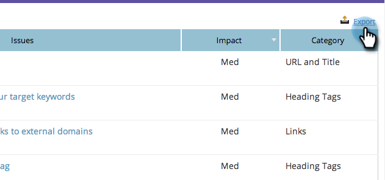

# SEO - Exportar problemas para um CSV {#seo-export-issues-to-csv}

Você pode exportar os dados de [problemas de página](/help/marketo/product-docs/additional-apps/seo/pages/seo-understanding-pages.md) para um arquivo CSV se quiser compartilhar essas informações com pessoas fora do Marketo. Veja como.

>[!IMPORTANT]
>
>Em 31 de março de 2026, o Marketo Engage descontinuará o recurso de Otimização do mecanismo de pesquisa. Exporte todos os dados relevantes até 30 de março. [Saiba mais](https://nation.marketo.com/t5/product-blogs/marketo-engage-seo-feature-deprecation/ba-p/359060){target="_blank"}.
>
>* [Exportar problemas](https://experienceleague.adobe.com/pt-br/docs/marketo/using/product-docs/additional-apps/seo/pages/seo-export-issues-to-csv){target="_blank"}
>* [Exportar Resultados de Palavra-chave](https://experienceleague.adobe.com/pt-br/docs/marketo/using/product-docs/additional-apps/seo/keywords/seo-exporting-keyword-results){target="_blank"}
>* [Exportar Tendências de Palavra-chave](https://experienceleague.adobe.com/pt-br/docs/marketo/using/product-docs/additional-apps/seo/reports/seo-use-the-keyword-trends-report#exporting-data){target="_blank"}
>* [Exportar Tendências de Palavra-chave do Concorrente](https://experienceleague.adobe.com/pt-br/docs/marketo/using/product-docs/additional-apps/seo/reports/seo-use-the-competitor-kw-trends-report#exporting-data){target="_blank"}

1. Vá para a seção **[!UICONTROL Páginas]**.

   

1. Clique na página da qual deseja ver detalhes.

   

   Este é o [Detalhamento de Página](/help/marketo/product-docs/additional-apps/seo/pages/seo-using-the-page-detail-drill-down.md). **[!UICONTROL Resultados da Otimização de Página]** é uma lista de todos os problemas com essa página específica.

   

1. Clique em **[!UICONTROL Exportar]**.

   

Perfeito! Agora você baixou todos os problemas desta página em um arquivo CSV.
