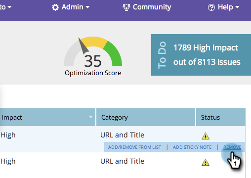

# SEO - Remover/excluir um problema de página {#seo-remove-delete-a-page-issue}

Nem todos os problemas de página podem ser úteis para você. Veja como remover um.

>[!IMPORTANT]
>
>Em 31 de março de 2026, o Marketo Engage descontinuará o recurso de Otimização do mecanismo de pesquisa. Exporte todos os dados relevantes até 30 de março. [Saiba mais](https://nation.marketo.com/t5/product-blogs/marketo-engage-seo-feature-deprecation/ba-p/359060){target="_blank"}.
>
>* [Exportar problemas](https://experienceleague.adobe.com/en/docs/marketo/using/product-docs/additional-apps/seo/pages/seo-export-issues-to-csv){target="_blank"}
>* [Exportar Resultados de Palavra-chave](https://experienceleague.adobe.com/en/docs/marketo/using/product-docs/additional-apps/seo/keywords/seo-exporting-keyword-results){target="_blank"}
>* [Exportar Tendências de Palavra-chave](https://experienceleague.adobe.com/en/docs/marketo/using/product-docs/additional-apps/seo/reports/seo-use-the-keyword-trends-report#exporting-data){target="_blank"}
>* [Exportar Tendências de Palavra-chave do Concorrente](https://experienceleague.adobe.com/en/docs/marketo/using/product-docs/additional-apps/seo/reports/seo-use-the-competitor-kw-trends-report#exporting-data){target="_blank"}

1. Vá para a seção **[!UICONTROL Páginas]**.

   

1. Na seção [!UICONTROL Páginas], clique em **[!UICONTROL Problemas]**.

   

1. Passe o mouse sobre o problema de página que deseja remover. Clique em **[!UICONTROL Remover]**.

   

1. Clicar em **[!UICONTROL Excluir]** removerá permanentemente esse problema de página.

   >[!CAUTION]
   >
   >Não é possível desfazer esta ação. Depois que um problema é removido, é possível recriá-los removendo a página e adicionando-a novamente.

   

Seu problema de página foi removido.
